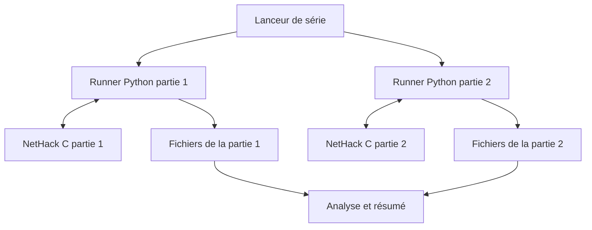
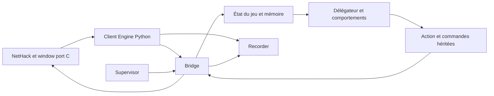

# Comprendre et expliquer BotHack 3.6.7

## Le guide de l'application réelle, du débutant à l'expert

**Date : 18 septembre 2026.** Application examinée : `bothack_3.6/claude`, avec vérification en lecture seule de la version en service dans `/home/roro/bothack36` sur `miniforum-worker`.

**L'idée en une phrase : cette application fait jouer automatiquement un personnage à NetHack, grâce à un programme de règles et de mémoire, pendant qu'un ensemble d'outils lance les parties, surveille les blocages et conserve leurs résultats.**

Ce document explique **ce qui existe et fonctionne actuellement**. Il est distinct du [document d'architecture de refonte](ULTIMATE_BOTHACK_3.6_ARCHITECTURE.md), qui décrit aussi des composants futurs. Ici, une proposition d'amélioration n'est jamais présentée comme une fonction déjà livrée.

Les explications « comme un joueur » sont des analogies pédagogiques. Le bot ne possède pas de conscience, de volonté ou de compréhension humaine ; les phrases « il veut », « il pense » et « il comprend » désignent des calculs et des règles.

Le guide dévoile des étapes importantes de NetHack, jusqu'à la victoire.

## Comment utiliser ce document

| Votre besoin | Lecture conseillée |
| --- | --- |
| Expliquer le projet en quelques phrases | 1 et 2 |
| Comprendre le jeu sans connaître NetHack | 3 à 6 |
| Comprendre les décisions du bot comme celles d'un joueur | 7 à 11 |
| Expliquer l'architecture à un développeur | 12 à 17 |
| Exploiter l'application ou discuter de ses résultats | 18 à 22 |
| Répondre aux questions difficiles | 23 et 24 |
| Préparer une présentation | 25 |
| Retrouver un terme ou une preuve | 26 et 27 |

Les trois niveaux désignent des profondeurs d'explication, pas trois versions du logiciel :

- **Débutant** : ce que fait le système et à quoi cela sert.
- **Confirmé** : les mécanismes de décision, les choix et les limitations.
- **Expert** : les processus, fonctions, protocoles, garanties et angles morts.

---

## 1. Présentations prêtes à dire

### 1.1 En quinze secondes

> « C'est un joueur automatique pour NetHack, un jeu d'exploration très complexe. Il explore, combat, utilise ses objets et cherche à terminer l'aventure. On peut lancer plusieurs parties et analyser précisément pourquoi il réussit ou se bloque. »

### 1.2 En trente secondes, avec le contexte actuel

> « Le projet adapte un ancien bot de NetHack à la version 3.6.7. Le jeu tourne en C et le joueur automatique est écrit en Python. Le bot utilise des règles, une mémoire du donjon et des calculs de déplacement. Pour développer sa progression, les parties actuelles utilisent des aides, notamment contre la mort et la faim. Le défi n'est donc pas seulement de survivre : il faut retrouver les objets indispensables, accomplir les étapes du jeu et éviter les boucles. »

### 1.3 En trois minutes

> « Imagine un joueur avec quatre outils : un carnet de cartes, une encyclopédie du jeu, une liste de priorités et une façon de taper les commandes. BotHack réunit ces quatre éléments.
>
> Le moteur NetHack applique les vraies règles : il crée le donjon, fait agir les monstres, modifie l'inventaire et décide si la partie est gagnée. Le bot reçoit des informations sur ce qui se passe et met à jour sa mémoire. Il consulte ensuite des comportements : une urgence, un combat, un objet intéressant, une étape à atteindre. Le premier comportement applicable selon les priorités choisit l'action.
>
> L'action peut demander plusieurs échanges. Utiliser une baguette signifie par exemple demander à l'utiliser, choisir laquelle, puis choisir une direction. Une interface spéciale fait communiquer le programme et le jeu sans dépendre d'un vrai terminal à lire image par image.
>
> Autour de cela, un lanceur démarre les parties et un superviseur repère les actions répétées ou l'absence de progrès. Des fichiers racontent ce qui a été joué et pourquoi la partie s'est arrêtée.
>
> Aujourd'hui, les parties observées sont assistées. Elles permettent d'étudier le parcours jusqu'à la victoire sans perdre chaque essai sur une erreur de survie. Mais l'invincibilité ne donne pas les objets de quête et ne résout pas les labyrinthes. Le bot doit encore accomplir ces tâches lui-même. »

### 1.4 Pour un développeur

> « C'est un agent symbolique Python, porté de BotHack en Clojure, qui pilote un processus NetHack 3.6.7 patché. Un window port C publie des requêtes structurées sur des pipes. Une passerelle reconstruit les représentations attendues par le bot historique et transforme ses commandes en réponses au moteur. Le modèle du monde est mis à jour par événements ; un délégateur ordonne des handlers de décision. Un harnais gère les seeds, les aides, les limites, les traces et le recoupement du verdict moteur avec le xlogfile. »

### 1.5 Pour un responsable de projet

> « Le produit est à la fois un joueur automatique et un laboratoire de tests. La difficulté principale est de faire tenir ensemble perception, mémoire, gestion des objets, décisions et dialogues sur une très longue partie. Les bons indicateurs sont la progression réellement accomplie, les causes d'échec, le taux de réussite dans un budget fixé et le coût par partie. Le nombre de parties lancées ne suffit pas à mesurer l'avancement. »

---

## 2. De quoi parle-t-on exactement ?

### 2.1 Les quatre éléments à ne pas confondre

| Élément | Rôle | Analogie |
| --- | --- | --- |
| NetHack | Le jeu et ses règles | Le plateau, les dés et l'arbitre |
| BotHack / `pybothack` | Le joueur automatique | Le joueur et son carnet |
| Interface `bot` et passerelle | Les échanges avec le jeu | Les yeux et les mains du joueur |
| Harnais `nhbot` et scripts | Lancement, surveillance et analyse | L'organisateur et le journal de partie |

L'application n'est pas simplement « un script qui appuie sur des touches ». Elle inclut un modèle du monde, une stratégie, une couche de dialogue et des outils d'expérimentation.

### 2.2 Le nom `claude` ne décrit pas le cerveau du bot

`claude` est le nom du répertoire de travail examiné. La boucle de jeu inspectée n'appelle pas un modèle de langage Claude pour décider à chaque tour. Elle exécute du Python, des données et des règles.

Un assistant de développement peut aider à écrire ou corriger le programme. Cela ne transforme pas le programme livré en modèle de langage. Il faut distinguer **l'outil qui aide à construire le joueur** et **le joueur qui prend les décisions pendant la partie**.

### 2.3 Est-ce une intelligence artificielle ?

Oui, au sens d'un système artificiel qui perçoit un environnement, mémorise des informations et choisit des actions pour atteindre un but. Le terme précis est **agent symbolique**, ou système fondé sur des règles et des heuristiques.

Il n'y a pas, dans la boucle examinée, d'entraînement automatique d'un réseau neuronal, d'apprentissage par renforcement ou de raisonnement conversationnel à chaque décision. Il existe en revanche une mémoire qui évolue pendant la partie : apprendre qu'une porte est fermée ou qu'une potion est identifiée n'est pas la même chose que réentraîner un modèle.

### 2.4 Est-ce NLE ?

Non : la version en service examinée utilise un **window port maison** ajouté à NetHack. NLE était une option discutée dans le document de refonte, pas le moteur d'intégration de cette campagne.

### 2.5 Est-ce une application graphique ?

Le fonctionnement principal examiné est en ligne de commande, avec des fichiers JSON, des logs et des outils de suivi textuel. Il ne dépend pas d'une interface web pour jouer. Un écran reconstitué existe à l'intérieur de la passerelle et dans certains diagnostics ; ce n'est pas la preuve qu'un navigateur pilote le bot.

---

## 3. NetHack expliqué à quelqu'un qui n'y a jamais joué

NetHack est un jeu d'aventure au tour par tour, organisé en cases et en niveaux. On déplace un personnage dans un donjon, on découvre des passages, on rencontre des créatures et on utilise des objets. La partie combine exploration, combat et gestion de ressources. Le manuel officiel présente le fonctionnement général, les commandes et les catégories d'objets. [Guidebook NetHack 3.6.7](https://www.nethack.org/v367/Guidebook.html).

### 3.1 Une carte simple, des règles complexes

Un affichage textuel peut utiliser `@` pour le héros, `.` pour le sol ou `<` et `>` pour des escaliers. Mais la difficulté du jeu ne tient pas au graphisme : elle tient aux conséquences des actions.

Une situation qui paraît simple peut combiner plusieurs problèmes : un objet est inaccessible parce que le personnage lévite ; il ne peut pas retirer son anneau parce qu'il est maudit ; descendre demande donc de résoudre l'équipement avant le déplacement.

Cette interaction entre domaines explique pourquoi un bon algorithme de déplacement ne suffit pas à faire un bon joueur.

### 3.2 Le temps du jeu

Le jeu avance lorsque des actions consomment du temps. Ouvrir certains menus ou répondre à une demande de sélection ne signifie pas nécessairement avancer d'un tour.

Il faut distinguer :

- le **tour du jeu**, qui fait évoluer les effets et les créatures ;
- la **commande du joueur**, qui demande une action ;
- les **réponses au dialogue**, qui précisent cette commande ;
- les **secondes réelles**, pendant lesquelles l'ordinateur calcule.

Exemple : « utiliser une baguette vers le nord » peut produire plusieurs échanges informatiques sans représenter autant de tours NetHack.

### 3.3 Le personnage possède plusieurs dimensions

| Information | Sens pour un joueur | Utilité pour le bot |
| --- | --- | --- |
| Points de vie | Capacité à encaisser des dégâts | Estimer l'urgence et la défense |
| Niveau d'expérience | Progression du personnage | Évaluer sa préparation et certaines conditions |
| Classe d'armure | Protection ; une valeur plus basse est généralement meilleure | Comparer les équipements |
| Faim | Besoin de nourriture | Manger ou chercher une solution |
| Charge transportée | Poids et encombrement | Choisir quoi garder ou ranger |
| États temporaires | Confusion, aveuglement, etc. | Corriger un handicap ou adapter l'action |
| Alignement | Relation avec les règles religieuses du jeu | Prières, autels et offrande |
| Inventaire | Objets disponibles | Déterminer quelles actions sont possibles |

Le bot ne peut donc pas décider uniquement à partir de « où est l'escalier ? ». Il doit aussi savoir s'il est capable de l'atteindre et de l'utiliser.

### 3.4 La carte est incomplète

Le joueur découvre progressivement les niveaux. Certains passages, objets ou monstres ne sont pas immédiatement visibles. La mémoire est indispensable : le héros peut revenir dans une branche visitée longtemps auparavant.

L'application doit distinguer ce qui existe réellement dans le moteur et ce qu'elle croit savoir. Une grande partie des bugs intéressants apparaît lorsque ces deux représentations divergent.

---

## 4. Gagner : une aventure avec des dépendances

### 4.1 Le but final

Le projet vise l'**ascension** : obtenir l'Amulette de Yendor et accomplir l'offrande finale appropriée sur le Plan Astral. Atteindre une grande profondeur ou obtenir beaucoup de points ne suffit pas.

On peut comprendre le parcours comme une chaîne de préparations : explorer, s'équiper, obtenir des objets clés, ouvrir l'accès final, récupérer l'Amulette, revenir et traverser la fin de partie.

### 4.2 Les grandes étapes dans le vocabulaire du projet

| Nom rencontré dans les logs | Ce que cela représente | Ce qu'il faut éviter de conclure trop vite |
| --- | --- | --- |
| Mines / Minetown | Branche et lieu utiles au développement du personnage | Ce n'est pas une victoire |
| Sokoban | Branche de puzzles à rochers | L'avoir visitée ne signifie pas l'avoir résolue |
| Oracle | Repère de progression du donjon | Un repère n'est pas un équipement acquis |
| Méduse | Passage spécial avec contraintes de traversée | Une solution passée peut disparaître avec un objet perdu |
| Château | Étape importante du donjon | L'atteindre ne prouve pas que la suite est prête |
| Vallée / Gehennom | Accès à une partie profonde du parcours | La profondeur seule ne résume plus la progression |
| Quête / Cloche | Branche du rôle et objet indispensable au rituel | Explorer la quête ne garantit pas avoir la Cloche |
| Vlad / Chandelier | Tour et objet rituel à récupérer | Visiter Vlad n'est pas conserver son butin |
| Sorcier / Livre | Étape donnant accès à un autre objet rituel | Avoir le Livre ne suffit pas à invoquer |
| Invocation | Rituel ouvrant la suite | Il faut réunir et préparer plusieurs éléments |
| Sanctuaire / Amulette | Acquisition de l'objectif central | Il reste la remontée et les Plans |
| Plans / Astral | Dernière partie du voyage | Il faut encore réussir l'offrande |
| Ascension | Victoire attestée par le moteur | La distinguer d'un scénario préparé |

L'ordre exact des détours peut varier. Ce tableau sert à comprendre les traces, pas à fournir une solution universelle pour tous les personnages.

### 4.3 Pourquoi les objets sont aussi importants que les monstres

Un personnage très puissant peut rester incapable de finir parce qu'il manque un objet rituel. Inversement, avoir obtenu un objet une fois n'assure pas qu'il est encore disponible.

Il peut être dans un sac, mal identifié, inaccessible dans l'état actuel du personnage, perdu ou simplement ignoré par une règle de ramassage. Pour expliquer le projet, cette phrase est très utile :

> « Le bot doit gérer une aventure logistique autant qu'une aventure de combat. »

### 4.4 Le rituel, exemple concret de dépendance

Dans le moteur 3.6.7 examiné, la réussite de l'invocation dépend notamment de la position, du Livre, de la Cloche et du Chandelier préparé. Le code vérifie un Chandelier à sept bougies allumées et une Cloche utilisée récemment, avec moins de cinq tours d'écart dans le test moteur. Les malédictions peuvent empêcher la réussite.

Ce n'est pas seulement « posséder trois objets ». C'est **posséder, préparer, atteindre le bon lieu et agir dans le bon contexte temporel**. Voir [le code local du rituel](../../claude/engine/nethack-3.6.7/src/spell.c) pour la condition exacte.

---

## 5. Quel personnage joue l'application actuelle ?

La campagne distante observée utilise une **Valkyrie naine, femme, loyale**. Les manifestes la notent `val-dwa-fem-law`.

Le choix d'une cible précise permet de concentrer le développement : mêmes grandes capacités, même quête de rôle, mêmes habitudes stratégiques. Cela ne prouve pas que l'application sait aussi bien jouer tous les rôles.

Les options par défaut du client fixent notamment le personnage, désactivent le compagnon de départ et les fichiers bones, et règlent le comportement de l'interface. Ces détails comptent : deux campagnes avec des options différentes ne représentent pas exactement la même expérience.

### 5.1 Le profil `full`

Le profil courant est `full`. Il conserve une progression héritée du bot, avec des étapes d'exploration et des détours comme les Mines et Sokoban. Le programme dispose aussi d'un profil `fast`, qui change certaines priorités de progression.

« Full » ne signifie pas « sans aide » ; c'est un choix de parcours. « Assisted » désigne séparément une tactique adaptée aux aides. Le manifeste enregistre les deux.

### 5.2 Ce qui est présent dans le code n'est pas toujours actif

Des fonctions anciennes de farming restent dans `mainbot.py`. Pourtant `rules36.FARMING_ENABLED` vaut `False` et les handlers correspondants ne sont pas enregistrés pour cette stratégie.

Pour présenter correctement un logiciel, il faut regarder le chemin effectivement activé, pas seulement les noms des fonctions présentes sur disque.

---

## 6. Les aides : à quoi elles servent vraiment

### 6.1 Version débutant

On donne au joueur automatique des protections pour qu'une erreur de survie n'arrête pas immédiatement l'expérience. Cela permet de regarder s'il sait accomplir les étapes longues du jeu.

Ces protections ne doivent pas lui donner la victoire. Il lui reste à explorer, choisir les objets, trouver les passages et exécuter le rituel.

### 6.2 Le kit actuel

Le fichier [kit-default.txt](../../claude/config/kit-default.txt) et les manifestes de `cyc-04` indiquent :

| Objet | Intérêt fonctionnel principal |
| --- | --- |
| Armure d'écailles de dragon gris, bénie, +2 | Protection et résistance magique liée à cet équipement |
| Amulette de réflexion bénie | Réflexion de certaines attaques |
| Bottes de vitesse bénies, +2, protégées du feu | Amélioration de la mobilité et de la vitesse |
| Anneau de lévitation béni | Possibilité de léviter pour certaines traversées |
| Corne de licorne bénie | Outil de récupération pour certains troubles |
| Sac de contenance | Gestion du poids et du rangement |
| Pioche bénie | Possibilités de creusement |
| Deux rations | Ressource alimentaire |

Les détails mécaniques dépendent du moteur ; ce tableau explique l'intention du kit. Les objets sont identifiés par l'aide. Le kit ne contient pas la Cloche, le Chandelier, le Livre, l'Amulette de victoire ou les bougies rituelles.

### 6.3 Anti-faim et invincibilité

L'aide anti-faim remet la nutrition à une valeur plus haute sous un seuil configuré et prévient l'étouffement mortel couvert par son patch.

L'aide d'invincibilité annule certaines morts et restaure certains états dégradés. Des compléments traitent notamment le slime, l'intelligence face à certaines attaques et des pertes de niveaux ou de maximum de points de vie.

Le nom « invincibilité » ne doit pas être compris comme une garantie contre toute fin anormale, tout blocage ou toute perte d'objet. C'est un ensemble précis de modifications du moteur, consigné dans `botassist.c` et les points d'insertion du patch.

### 6.4 Pourquoi un bot invincible peut échouer

Il peut :

- combattre une foule sans avancer ;
- chercher une porte au mauvais endroit ;
- répéter une action interdite ;
- perdre son moyen de traversée ;
- ignorer un objet indispensable ;
- ne pas reconnaître le bon autel ;
- atteindre la limite de temps réel.

L'aide réduit certains échecs de survie. Elle ne corrige pas une représentation erronée du monde.

### 6.5 Effet sur la stratégie

En tactique `assisted`, des comportements ordinaires de fuite ou de repos ne sont pas enregistrés. Le bot privilégie davantage l'avancement et le rééquipement après certains événements. Cela évite de passer du temps à fuir pour des points de vie que l'aide protège déjà.

Cette stratégie ne doit pas être utilisée comme preuve de compétence en survie normale. Le code conserve une tactique `normal`, mais ses résultats doivent être évalués séparément.

### 6.6 Formulation honnête à employer

> « C'est une partie complète assistée : le parcours est joué par le bot, mais des modifications déclarées réduisent certains risques. Ce n'est ni une victoire sans aide ni une simple téléportation au dernier écran. »

---

## 7. Comment il observe et mémorise le monde

### Débutant : le carnet du joueur

Le bot reçoit ce que le jeu lui montre ou lui demande. Il conserve une carte, un inventaire et un état du personnage. Il ajoute des informations au fil des déplacements et des messages.

Il peut ainsi se souvenir d'un escalier, d'un objet déjà inspecté ou d'un monstre rencontré.

### Confirmé : plusieurs sortes de connaissances

| Connaissance | Exemple | Risque |
| --- | --- | --- |
| Information reçue maintenant | Points de vie actuels | Mauvaise lecture du champ |
| Mémoire d'une observation | Objet aperçu sur une case | L'objet a pu bouger |
| Déduction | Identités compatibles avec un prix | Déduction fondée sur une hypothèse fausse |
| Connaissance générale du jeu | Tel type de monstre est dangereux | Règle obsolète après changement de version |
| Reconnaissance de niveau | Forme ressemblant à une carte spéciale | Variante incorrectement reconnue |

Le programme combine ces connaissances sans disposer encore de la nouvelle architecture de preuves typées proposée dans la refonte.

### Expert : structures et mise à jour

`game.py`, `player.py`, `dungeon.py`, `level.py`, `tile.py` et `tracker.py` organisent l'état. Les structures utilisent largement des dictionnaires, ensembles et fonctions de transformation, avec des conventions héritées du port Clojure.

`Atom` est une petite boîte mutable autour de la valeur courante. `deref()` lit cette valeur ; `swap()` la remplace par le résultat d'une fonction ; `reset()` affecte directement une nouvelle valeur. Ce n'est ni une base de données ni, dans cette implémentation, une garantie générale de synchronisation concurrente.

Une partie de la mise à jour est déclenchée par les événements : statut, messages, inventaire, changement de niveau et nouvelle représentation de carte. L'ordre de livraison compte : choisir une action avant de prendre en compte un inventaire modifié peut produire une sélection d'objet périmée.

### Le cas pédagogique de l'autel sous les objets

Le sol peut être un autel même lorsqu'une pile d'objets occupe l'affichage. Un ancien bug transformait cette case en sol ordinaire dans la mémoire. Le bot pouvait alors choisir une action inadaptée et la répéter.

Ce cas montre trois choses : la perception est une interprétation ; les couches d'une case peuvent se masquer ; une erreur de mémoire peut ressembler à une mauvaise stratégie.

---

## 8. Comment il choisit son action

### 8.1 Débutant : une liste de priorités

Imagine une liste de questions :

1. Puis-je finir la partie maintenant ?
2. Y a-t-il un danger à traiter ?
3. Dois-je combattre ?
4. Dois-je réparer mon équipement ou utiliser un objet ?
5. Y a-t-il quelque chose d'intéressant ici ?
6. Quelle étape du parcours dois-je poursuivre ?

Le bot consulte des fonctions correspondant à ces préoccupations. Une fonction peut proposer une action ou ne rien proposer. La sélection suit des priorités.

### 8.2 Confirmé : ce n'est pas un vote général

Le programme ne calcule pas forcément un score global pour toutes les actions possibles. Dans le mécanisme principal, les handlers sont ordonnés ; le premier résultat utilisable peut gagner.

Conséquence : une action locale constamment proposée peut empêcher la progression générale. Le bot peut passer son temps à examiner un objet ou à combattre parce qu'un comportement prioritaire ne cesse de répondre.

Cela explique les « fixations » sans supposer que le programme a oublié son but final.

### 8.3 Expert : le délégateur

`Delegator` conserve une liste triée par `(priorité, ordre d'enregistrement)`. Une valeur numérique plus basse est consultée plus tôt. Les événements peuvent être distribués aux handlers intéressés ; les demandes de réponse recherchent une réponse adaptée selon cet ordre.

La file interne `_queue` reproduit un ordre d'exécution hérité de Clojure : des appels déclenchés pendant un événement sont traités dans un ordre contrôlé, au lieu de provoquer n'importe quelle récursion immédiate.

Extrait représentatif des priorités enregistrées dans `mainbot.init()` :

| Priorité | Comportement | Interprétation |
| ---: | --- | --- |
| -99 | `offer_amulet` | Finir si l'offrande est possible |
| -20 | `assisted_astral_rush` | Avancer vers les autels en mode assisté |
| -16 | `enhance` | Développer une compétence disponible |
| -13 | `handle_drowning` | Traiter une situation liée à la noyade |
| -11 | `handle_starvation` | Traiter la faim critique |
| -9 | `handle_illness` | Traiter certaines maladies et altérations |
| -7 | Fuite normale ou rééquipement assisté | Dépend du profil tactique |
| -6 | `fight` | Réagir aux menaces |
| -1 / 0 | Rééquipement | Réviser l'équipement ou l'arme |
| 2 | `consider_items_here` | Ramasser ce qui est utile ici |
| 7 | `use_items` | Exploiter des objets disponibles |
| 10 | `itemid` | Chercher à identifier des objets |
| 13 | `bag_items` | Ranger dans un sac |
| 19 | `progress` | Avancer dans le parcours |
| 25 | Déblocage | Derniers recours de la politique |

C'est un extrait, pas la totalité des handlers. Les fonctions peuvent refuser de proposer une action si leurs conditions ne sont pas remplies. Une priorité élevée ne signifie donc pas que le bot fait cette action à chaque tour.

### 8.4 Les raisons associées aux actions

`with_reason()` attache des explications aux actions. Dans les traces, une chaîne peut ressembler à :

```text
progress
→ full-explore
→ exploring mines until minetown
→ using cached exploration step
→ move E
```

Cette chaîne aide à expliquer l'intention. Elle ne prouve pas que l'action a réussi, ni que la mémoire sur laquelle elle repose était correcte.

---

## 9. Explorer, se déplacer et revenir en arrière

### Débutant : savoir où aller et comment y aller

Le bot doit résoudre deux questions : « quel lieu m'intéresse ? » et « quel prochain mouvement me rapproche de ce lieu ? ».

Le premier choix est stratégique ; le second est un calcul de déplacement. Une mauvaise destination ne devient pas bonne parce que le chemin jusqu'à elle est optimal.

### Confirmé : le chemin le plus court n'est pas toujours choisi

Le coût d'un passage dépend de ses propriétés : piège, terrain inconnu, case bloquée, proximité de l'eau dans certains lieux ou intérêt d'un objet. Le bot peut préférer un détour.

La navigation peut également déboucher sur une interaction : ouvrir une porte, creuser, retirer une lévitation ou résoudre un obstacle. Se déplacer dans NetHack est plus riche que parcourir une grille vide.

### Expert : `pathing.py`

Le module contient une recherche de type A*, une structure de priorité, des coûts de terrain, des options de navigation et des fonctions pour viser une case, un type de case, un niveau ou une branche.

`navigate()` peut travailler vers une position ou un prédicat décrivant une destination. Le résultat de type `Path` contient notamment une prochaine étape, un chemin et une cible. Les fonctions d'exploration déterminent quelles cases ou zones restent à examiner.

Les égalités entre chemins ont fait l'objet d'un travail de fidélité à l'ordre de collections du programme Clojure. Deux chemins de coût égal peuvent mener à des parties très différentes plusieurs milliers de tours plus tard.

### Pourquoi il fait des allers-retours

Un retour peut être légitime : récupérer un objet, finir une branche, chercher une fontaine ou revenir vers une quête. Il devient suspect si le même objectif réapparaît sans progrès utile.

Le superviseur surveille des fixations et l'absence de nouveauté. Il ne possède pas une preuve mathématique que chaque aller-retour est inutile ; ses seuils peuvent donc manquer une boucle ou interrompre une activité très lente.

---

## 10. Combattre et gérer son personnage

### 10.1 Combat : reconnaître les menaces

Le bot utilise des informations sur les monstres et leur position. Il ne traite pas tous les ennemis comme une quantité de points de vie identique.

Les règles distinguent notamment des créatures proches, des ennemis capables de poursuivre certains objets, des adversaires à tenir à distance ou des situations où le personnage est trop exposé.

### 10.2 Exemple de décision tactique

Le héros est entouré de plusieurs ennemis. Une règle peut proposer de rejoindre une case moins exposée. Si un ennemi prioritaire est adjacent, une attaque peut être choisie. Si la tactique normale est active et la situation dangereuse, un repli peut devenir pertinent.

Le code de `fight()` combine ces tests et fait parfois appel au générateur aléatoire du bot pour certaines décisions. « Fondé sur des règles » ne veut donc pas dire « sans aucun hasard ».

### 10.3 Corps à corps, distance et environnement

Le programme contient des comportements pour attaquer, lancer des objets, utiliser des baguettes et exploiter certaines particularités de terrain. Une partie du travail consiste à vérifier que l'outil est utilisable et que la cible ou la direction est adaptée.

Il ne faut pas présenter cette collection de règles comme un simulateur parfait capable de prévoir toutes les conséquences de chaque action.

### 10.4 Équipement et états

Le bot compare et utilise des armes, armures, anneaux et amulettes selon les règles disponibles. Il peut tenter de se soigner, de retirer un trouble ou de remplacer un équipement.

Une amélioration locale peut entraîner un conflit : retirer volontairement un objet pour une opération, puis voir un autre handler le remettre immédiatement. Le code assisté possède justement un délai après un retrait volontaire pour limiter ce type d'oscillation.

### 10.5 Elbereth : exemple de règle de version

L'ancien BotHack utilisait des tactiques liées à la gravure Elbereth. La version 3.6.7 impose des restrictions qui rendent certaines anciennes habitudes invalides. `rules36.py` contient des règles adaptées et le combat a retiré l'ancien comportement « graver puis continuer à attaquer depuis la même protection ».

Pour l'expliquer sans détailler tout NetHack :

> « Une stratégie correcte sur une ancienne version du jeu peut devenir mauvaise quand les règles changent. Le portage doit adapter les décisions, pas seulement faire fonctionner les commandes. »

---

## 11. Objets, identification et logistique

### 11.1 Débutant : une potion n'affiche pas toujours son vrai effet

Les objets peuvent avoir une apparence connue et une identité encore inconnue. Le bot doit raisonner avec cette incertitude avant de les utiliser.

Il possède des tables de connaissances et suit des indices : nom, apparence, prix, messages et effets observés.

### 11.2 Confirmé : l'identification est un filtrage de possibilités

Une apparence correspond à des identités candidates. Une observation peut réduire cette liste. Le module `itemid.py` adapte en Python une logique issue du programme original.

Les prix illustrent la difficulté : prix total d'une pile, prix unitaire, charisme, surcharge et arrondis peuvent modifier le résultat. Une formule erronée peut exclure toutes les identités possibles, puis perturber le ramassage et provoquer une boucle.

### 11.3 Garder, utiliser, ranger ou jeter

Le bot maintient des préférences d'objets et tient compte de l'utilité, des doublons, de l'encombrement, de l'état connu et de la place disponible. Il peut ranger des objets dans un conteneur, puis les sortir avant usage.

Sa logique n'est pas celle d'un gestionnaire universel d'inventaire. Par exemple, `want_buy()` retourne actuellement `False` dans le code examiné : il ne faut pas affirmer que la présence d'un module de boutique signifie qu'il optimise librement tous les achats.

### 11.4 Les lettres d'inventaire

Une action peut sélectionner l'objet associé à une lettre. Si l'inventaire du bot est périmé, cette lettre peut ne plus désigner un objet disponible.

La passerelle traite le cas « You don't have that object. » en annulant, en vidant la file de touches concernée et en demandant une mise à jour de l'inventaire. Sans cela, une même lettre peut être renvoyée des centaines de fois sans faire avancer un tour.

### 11.5 Les objets clés et la quête

La version du worker comporte une fonction `quest_bell()` pour revenir vers le niveau de quête et rechercher la Cloche lorsqu'elle manque. Le code local possède déjà un correctif supplémentaire limitant certains retours sans issue ; ce correctif n'était pas dans le fichier du worker au moment du relevé.

C'est un exemple concret de la différence entre **code en préparation** et **code de la campagne active**. Voir la section 20 pour les détails de version.

---

## 12. Architecture réelle : du lanceur au moteur

### 12.1 Vue simplifiée



Chaque partie active comporte un processus Python et un processus moteur. L'application peut donc jouer plusieurs parties indépendantes. Les graines aléatoires, fichiers temporaires et journaux sont séparés par partie.

### 12.2 Vue interne d'une partie



Il n'y a pas un service réseau par rectangle. La plupart de ces composants vivent dans le même processus Python et s'appellent directement.

### 12.3 Les grands répertoires

| Répertoire | Contenu | Public intéressé |
| --- | --- | --- |
| `vendor/` | Source de référence NetHack | Développeur moteur |
| `engine/` | Source patchée, interface, aides, build | Développeur C/intégration |
| `build/` | Binaire et données installés | Exploitation |
| `pybothack/` | Modèle et décisions du joueur automatique | Développeur stratégie |
| `nhbot/` | Client, lancement, supervision, traces et analyse | Développeur plateforme |
| `config/` | Kit et configurations | Opérateur |
| `scenarios/` | Préparations de situations de test | Testeur |
| `tests/` | Tests automatisés | Développeur |
| `tools/` | Scripts de worker et suivi | Opérateur |
| `runs/` | Artefacts des parties | Analyste et débogueur |
| `docs/` | Documentation et historique | Tous |

### 12.4 Pourquoi le moteur reste en C

NetHack existe déjà avec ses règles en C. Le conserver évite de réimplémenter des milliers d'interactions. Le Python porte surtout la prise de décision et les outils, où il est pratique de modifier les règles et d'inspecter les données.

Rust n'est pas la technologie de décision de cette version. Une éventuelle utilisation future ne doit pas être décrite comme déjà active.

---

## 13. Le window port : comment le jeu parle au bot

### Débutant : le jeu annonce ce qu'il attend

Au lieu de forcer le bot à deviner si un menu est ouvert sur un écran de terminal, le jeu lui dit : « j'attends une commande », « j'attends un objet », « j'attends un choix dans ce menu ».

C'est comme remplacer une caméra pointée vers un écran par une prise fournissant les informations sous une forme structurée.

### Confirmé : observations et demandes d'entrée

Le moteur émet des événements depuis la demande précédente, les changements de carte, le statut, l'inventaire lorsqu'il change et le contexte de saisie.

| Type de demande | Signification |
| --- | --- |
| `cmd` | Nouvelle commande de jeu |
| `cmdcont` | Suite d'un préfixe ou d'une commande |
| `key` | Touche isolée attendue |
| `yn` | Choix de caractère, souvent oui/non ou sélection encadrée |
| `line` | Texte libre |
| `ext` | Commande étendue |
| `menu` | Sélection parmi des entrées |
| `pos` | Position sur la carte |

Le nom `yn` ne signifie pas que tous les échanges correspondants sont une simple question morale « oui ou non » : c'est une famille de fonctions de saisie de NetHack.

### Expert : le transport

`Engine.start()` crée deux pipes, lance le binaire avec les descripteurs nécessaires et configure un répertoire par partie. Le moteur écrit des objets JSON séparés par des retours à la ligne. Les réponses actuelles ont une syntaxe plus simple : `k`, `y`, `l`, `x`, `m`, `p` ou `e`, suivies éventuellement de paramètres.

Le protocole v1 est donc asymétrique : messages structurés JSON du moteur vers Python, réponses textuelles compactes dans l'autre sens. Dire « tout est du JSON dans les deux sens » serait inexact.

Exemple pédagogique, réduit à quelques champs :

```json
{"t":"req","seq":42,"kind":"yn","query":"In what direction?"}
```

La passerelle envoie ensuite la réponse correspondant à la direction choisie. Cet exemple illustre la forme générale ; ce n'est pas une capture complète d'une requête réelle.

### Une garantie importante, et sa limite

Le moteur expose explicitement son attente, ce qui réduit les problèmes de synchronisation d'écran. Cependant les réponses actuelles ne reprennent pas le numéro `seq` : il n'existe pas encore le protocole v2 corrélé décrit dans la refonte.

L'ordre synchrone des pipes est utile, mais il ne garantit pas qu'une erreur de sélection, une traduction incorrecte ou une reprise mal gérée soit impossible.
