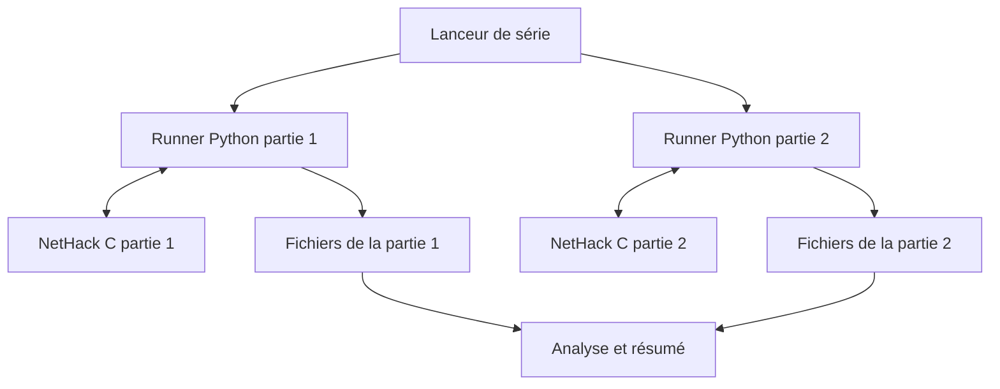
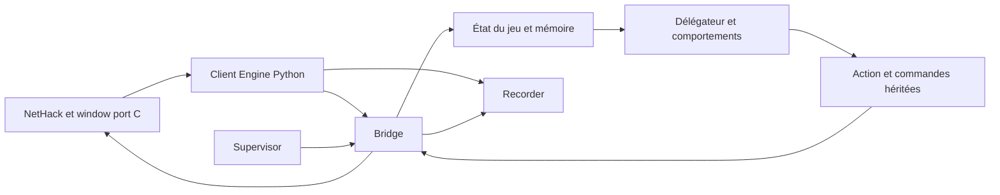

# Comprendre et expliquer BotHack 3.6.7

## Le guide de l'application réelle, du débutant à l'expert

**Date : 18 septembre 2026.** Application examinée : `bothack_3.6/claude`, avec vérification en lecture seule de la version en service dans `/home/roro/bothack36` sur `miniforum-worker`.

**L'idée en une phrase : cette application fait jouer automatiquement un personnage à NetHack, grâce à un programme de règles et de mémoire, pendant qu'un ensemble d'outils lance les parties, surveille les blocages et conserve leurs résultats.**

Ce document explique **ce qui existe et fonctionne actuellement**. Il est distinct du [document d'architecture de refonte](ULTIMATE_BOTHACK_3.6_ARCHITECTURE.md), qui décrit aussi des composants futurs. Ici, une proposition d'amélioration n'est jamais présentée comme une fonction déjà livrée.

Les explications « comme un joueur » sont des analogies pédagogiques. Le bot ne possède pas de conscience, de volonté ou de compréhension humaine ; les phrases « il veut », « il pense » et « il comprend » désignent des calculs et des règles.

Le guide dévoile des étapes importantes de NetHack, jusqu'à la victoire.

## Comment utiliser ce document

| Votre besoin | Lecture conseillée |
| --- | --- |
| Expliquer le projet en quelques phrases | 1 et 2 |
| Comprendre le jeu sans connaître NetHack | 3 à 6 |
| Comprendre les décisions du bot comme celles d'un joueur | 7 à 11 |
| Expliquer l'architecture à un développeur | 12 à 17 |
| Exploiter l'application ou discuter de ses résultats | 18 à 22 |
| Répondre aux questions difficiles | 23 et 24 |
| Préparer une présentation | 25 |
| Retrouver un terme ou une preuve | 26 et 27 |

Les trois niveaux désignent des profondeurs d'explication, pas trois versions du logiciel :

- **Débutant** : ce que fait le système et à quoi cela sert.
- **Confirmé** : les mécanismes de décision, les choix et les limitations.
- **Expert** : les processus, fonctions, protocoles, garanties et angles morts.

## Sommaire détaillé

- [1. Présentations prêtes à dire](#1-présentations-prêtes-à-dire)
- [2. De quoi parle-t-on exactement ?](#2-de-quoi-parle-t-on-exactement-)
- [3. NetHack expliqué à quelqu'un qui n'y a jamais joué](#3-nethack-expliqué-à-quelquun-qui-ny-a-jamais-joué)
- [4. Gagner : une aventure avec des dépendances](#4-gagner--une-aventure-avec-des-dépendances)
- [5. Quel personnage joue l'application actuelle ?](#5-quel-personnage-joue-lapplication-actuelle-)
- [6. Les aides : à quoi elles servent vraiment](#6-les-aides--à-quoi-elles-servent-vraiment)
- [7. Comment il observe et mémorise le monde](#7-comment-il-observe-et-mémorise-le-monde)
- [8. Comment il choisit son action](#8-comment-il-choisit-son-action)
- [9. Explorer, se déplacer et revenir en arrière](#9-explorer-se-déplacer-et-revenir-en-arrière)
- [10. Combattre et gérer son personnage](#10-combattre-et-gérer-son-personnage)
- [11. Objets, identification et logistique](#11-objets-identification-et-logistique)
- [12. Architecture réelle : du lanceur au moteur](#12-architecture-réelle--du-lanceur-au-moteur)
- [13. Le window port : comment le jeu parle au bot](#13-le-window-port--comment-le-jeu-parle-au-bot)
- [14. La passerelle : pourquoi un écran existe encore à l'intérieur](#14-la-passerelle--pourquoi-un-écran-existe-encore-à-lintérieur)
- [15. Une décision suivie de bout en bout](#15-une-décision-suivie-de-bout-en-bout)
- [16. Les données secrètes et la question de la triche](#16-les-données-secrètes-et-la-question-de-la-triche)
- [17. Pourquoi le portage de Clojure laisse des traces dans Python](#17-pourquoi-le-portage-de-clojure-laisse-des-traces-dans-python)
- [18. Le superviseur : le gardien contre les parties sans fin](#18-le-superviseur--le-gardien-contre-les-parties-sans-fin)
- [19. Lancer une partie, lancer une série, tester une situation](#19-lancer-une-partie-lancer-une-série-tester-une-situation)
- [20. État réellement observé le 18 septembre 2026](#20-état-réellement-observé-le-18-septembre-2026)
- [21. Lire les fichiers sans être développeur](#21-lire-les-fichiers-sans-être-développeur)
- [22. Résultats, vitesse et coûts : comment en parler correctement](#22-résultats-vitesse-et-coûts--comment-en-parler-correctement)
- [23. Points forts, limites et difficultés profondes](#23-points-forts-limites-et-difficultés-profondes)
- [24. Questions fréquentes et réponses faciles à reprendre](#24-questions-fréquentes-et-réponses-faciles-à-reprendre)
- [25. Kits de présentation selon le public](#25-kits-de-présentation-selon-le-public)
- [26. Glossaire à trois niveaux](#26-glossaire-à-trois-niveaux)
- [27. Sources, preuves et périmètre](#27-sources-preuves-et-périmètre)

---

## 1. Présentations prêtes à dire

### 1.1 En quinze secondes

> « C'est un joueur automatique pour NetHack, un jeu d'exploration très complexe. Il explore, combat, utilise ses objets et cherche à terminer l'aventure. On peut lancer plusieurs parties et analyser précisément pourquoi il réussit ou se bloque. »

### 1.2 En trente secondes, avec le contexte actuel

> « Le projet adapte un ancien bot de NetHack à la version 3.6.7. Le jeu tourne en C et le joueur automatique est écrit en Python. Le bot utilise des règles, une mémoire du donjon et des calculs de déplacement. Pour développer sa progression, les parties actuelles utilisent des aides, notamment contre la mort et la faim. Le défi n'est donc pas seulement de survivre : il faut retrouver les objets indispensables, accomplir les étapes du jeu et éviter les boucles. »

### 1.3 En trois minutes

> « Imagine un joueur avec quatre outils : un carnet de cartes, une encyclopédie du jeu, une liste de priorités et une façon de taper les commandes. BotHack réunit ces quatre éléments.
>
> Le moteur NetHack applique les vraies règles : il crée le donjon, fait agir les monstres, modifie l'inventaire et décide si la partie est gagnée. Le bot reçoit des informations sur ce qui se passe et met à jour sa mémoire. Il consulte ensuite des comportements : une urgence, un combat, un objet intéressant, une étape à atteindre. Le premier comportement applicable selon les priorités choisit l'action.
>
> L'action peut demander plusieurs échanges. Utiliser une baguette signifie par exemple demander à l'utiliser, choisir laquelle, puis choisir une direction. Une interface spéciale fait communiquer le programme et le jeu sans dépendre d'un vrai terminal à lire image par image.
>
> Autour de cela, un lanceur démarre les parties et un superviseur repère les actions répétées ou l'absence de progrès. Des fichiers racontent ce qui a été joué et pourquoi la partie s'est arrêtée.
>
> Aujourd'hui, les parties observées sont assistées. Elles permettent d'étudier le parcours jusqu'à la victoire sans perdre chaque essai sur une erreur de survie. Mais l'invincibilité ne donne pas les objets de quête et ne résout pas les labyrinthes. Le bot doit encore accomplir ces tâches lui-même. »

### 1.4 Pour un développeur

> « C'est un agent symbolique Python, porté de BotHack en Clojure, qui pilote un processus NetHack 3.6.7 patché. Un window port C publie des requêtes structurées sur des pipes. Une passerelle reconstruit les représentations attendues par le bot historique et transforme ses commandes en réponses au moteur. Le modèle du monde est mis à jour par événements ; un délégateur ordonne des handlers de décision. Un harnais gère les seeds, les aides, les limites, les traces et le recoupement du verdict moteur avec le xlogfile. »

### 1.5 Pour un responsable de projet

> « Le produit est à la fois un joueur automatique et un laboratoire de tests. La difficulté principale est de faire tenir ensemble perception, mémoire, gestion des objets, décisions et dialogues sur une très longue partie. Les bons indicateurs sont la progression réellement accomplie, les causes d'échec, le taux de réussite dans un budget fixé et le coût par partie. Le nombre de parties lancées ne suffit pas à mesurer l'avancement. »

---

## 2. De quoi parle-t-on exactement ?

### 2.1 Les quatre éléments à ne pas confondre

| Élément | Rôle | Analogie |
| --- | --- | --- |
| NetHack | Le jeu et ses règles | Le plateau, les dés et l'arbitre |
| BotHack / `pybothack` | Le joueur automatique | Le joueur et son carnet |
| Interface `bot` et passerelle | Les échanges avec le jeu | Les yeux et les mains du joueur |
| Harnais `nhbot` et scripts | Lancement, surveillance et analyse | L'organisateur et le journal de partie |

L'application n'est pas simplement « un script qui appuie sur des touches ». Elle inclut un modèle du monde, une stratégie, une couche de dialogue et des outils d'expérimentation.

### 2.2 Le nom `claude` ne décrit pas le cerveau du bot

`claude` est le nom du répertoire de travail examiné. La boucle de jeu inspectée n'appelle pas un modèle de langage Claude pour décider à chaque tour. Elle exécute du Python, des données et des règles.

Un assistant de développement peut aider à écrire ou corriger le programme. Cela ne transforme pas le programme livré en modèle de langage. Il faut distinguer **l'outil qui aide à construire le joueur** et **le joueur qui prend les décisions pendant la partie**.

### 2.3 Est-ce une intelligence artificielle ?

Oui, au sens d'un système artificiel qui perçoit un environnement, mémorise des informations et choisit des actions pour atteindre un but. Le terme précis est **agent symbolique**, ou système fondé sur des règles et des heuristiques.

Il n'y a pas, dans la boucle examinée, d'entraînement automatique d'un réseau neuronal, d'apprentissage par renforcement ou de raisonnement conversationnel à chaque décision. Il existe en revanche une mémoire qui évolue pendant la partie : apprendre qu'une porte est fermée ou qu'une potion est identifiée n'est pas la même chose que réentraîner un modèle.

### 2.4 Est-ce NLE ?

Non : la version en service examinée utilise un **window port maison** ajouté à NetHack. NLE était une option discutée dans le document de refonte, pas le moteur d'intégration de cette campagne.

### 2.5 Est-ce une application graphique ?

Le fonctionnement principal examiné est en ligne de commande, avec des fichiers JSON, des logs et des outils de suivi textuel. Il ne dépend pas d'une interface web pour jouer. Un écran reconstitué existe à l'intérieur de la passerelle et dans certains diagnostics ; ce n'est pas la preuve qu'un navigateur pilote le bot.

---

## 3. NetHack expliqué à quelqu'un qui n'y a jamais joué

NetHack est un jeu d'aventure au tour par tour, organisé en cases et en niveaux. On déplace un personnage dans un donjon, on découvre des passages, on rencontre des créatures et on utilise des objets. La partie combine exploration, combat et gestion de ressources. Le manuel officiel présente le fonctionnement général, les commandes et les catégories d'objets. [Guidebook NetHack 3.6.7](https://www.nethack.org/v367/Guidebook.html).

### 3.1 Une carte simple, des règles complexes

Un affichage textuel peut utiliser `@` pour le héros, `.` pour le sol ou `<` et `>` pour des escaliers. Mais la difficulté du jeu ne tient pas au graphisme : elle tient aux conséquences des actions.

Une situation qui paraît simple peut combiner plusieurs problèmes : un objet est inaccessible parce que le personnage lévite ; il ne peut pas retirer son anneau parce qu'il est maudit ; descendre demande donc de résoudre l'équipement avant le déplacement.

Cette interaction entre domaines explique pourquoi un bon algorithme de déplacement ne suffit pas à faire un bon joueur.

### 3.2 Le temps du jeu

Le jeu avance lorsque des actions consomment du temps. Ouvrir certains menus ou répondre à une demande de sélection ne signifie pas nécessairement avancer d'un tour.

Il faut distinguer :

- le **tour du jeu**, qui fait évoluer les effets et les créatures ;
- la **commande du joueur**, qui demande une action ;
- les **réponses au dialogue**, qui précisent cette commande ;
- les **secondes réelles**, pendant lesquelles l'ordinateur calcule.

Exemple : « utiliser une baguette vers le nord » peut produire plusieurs échanges informatiques sans représenter autant de tours NetHack.

### 3.3 Le personnage possède plusieurs dimensions

| Information | Sens pour un joueur | Utilité pour le bot |
| --- | --- | --- |
| Points de vie | Capacité à encaisser des dégâts | Estimer l'urgence et la défense |
| Niveau d'expérience | Progression du personnage | Évaluer sa préparation et certaines conditions |
| Classe d'armure | Protection ; une valeur plus basse est généralement meilleure | Comparer les équipements |
| Faim | Besoin de nourriture | Manger ou chercher une solution |
| Charge transportée | Poids et encombrement | Choisir quoi garder ou ranger |
| États temporaires | Confusion, aveuglement, etc. | Corriger un handicap ou adapter l'action |
| Alignement | Relation avec les règles religieuses du jeu | Prières, autels et offrande |
| Inventaire | Objets disponibles | Déterminer quelles actions sont possibles |

Le bot ne peut donc pas décider uniquement à partir de « où est l'escalier ? ». Il doit aussi savoir s'il est capable de l'atteindre et de l'utiliser.

### 3.4 La carte est incomplète

Le joueur découvre progressivement les niveaux. Certains passages, objets ou monstres ne sont pas immédiatement visibles. La mémoire est indispensable : le héros peut revenir dans une branche visitée longtemps auparavant.

L'application doit distinguer ce qui existe réellement dans le moteur et ce qu'elle croit savoir. Une grande partie des bugs intéressants apparaît lorsque ces deux représentations divergent.

---

## 4. Gagner : une aventure avec des dépendances

### 4.1 Le but final

Le projet vise l'**ascension** : obtenir l'Amulette de Yendor et accomplir l'offrande finale appropriée sur le Plan Astral. Atteindre une grande profondeur ou obtenir beaucoup de points ne suffit pas.

On peut comprendre le parcours comme une chaîne de préparations : explorer, s'équiper, obtenir des objets clés, ouvrir l'accès final, récupérer l'Amulette, revenir et traverser la fin de partie.

### 4.2 Les grandes étapes dans le vocabulaire du projet

| Nom rencontré dans les logs | Ce que cela représente | Ce qu'il faut éviter de conclure trop vite |
| --- | --- | --- |
| Mines / Minetown | Branche et lieu utiles au développement du personnage | Ce n'est pas une victoire |
| Sokoban | Branche de puzzles à rochers | L'avoir visitée ne signifie pas l'avoir résolue |
| Oracle | Repère de progression du donjon | Un repère n'est pas un équipement acquis |
| Méduse | Passage spécial avec contraintes de traversée | Une solution passée peut disparaître avec un objet perdu |
| Château | Étape importante du donjon | L'atteindre ne prouve pas que la suite est prête |
| Vallée / Gehennom | Accès à une partie profonde du parcours | La profondeur seule ne résume plus la progression |
| Quête / Cloche | Branche du rôle et objet indispensable au rituel | Explorer la quête ne garantit pas avoir la Cloche |
| Vlad / Chandelier | Tour et objet rituel à récupérer | Visiter Vlad n'est pas conserver son butin |
| Sorcier / Livre | Étape donnant accès à un autre objet rituel | Avoir le Livre ne suffit pas à invoquer |
| Invocation | Rituel ouvrant la suite | Il faut réunir et préparer plusieurs éléments |
| Sanctuaire / Amulette | Acquisition de l'objectif central | Il reste la remontée et les Plans |
| Plans / Astral | Dernière partie du voyage | Il faut encore réussir l'offrande |
| Ascension | Victoire attestée par le moteur | La distinguer d'un scénario préparé |

L'ordre exact des détours peut varier. Ce tableau sert à comprendre les traces, pas à fournir une solution universelle pour tous les personnages.

### 4.3 Pourquoi les objets sont aussi importants que les monstres

Un personnage très puissant peut rester incapable de finir parce qu'il manque un objet rituel. Inversement, avoir obtenu un objet une fois n'assure pas qu'il est encore disponible.

Il peut être dans un sac, mal identifié, inaccessible dans l'état actuel du personnage, perdu ou simplement ignoré par une règle de ramassage. Pour expliquer le projet, cette phrase est très utile :

> « Le bot doit gérer une aventure logistique autant qu'une aventure de combat. »

### 4.4 Le rituel, exemple concret de dépendance

Dans le moteur 3.6.7 examiné, la réussite de l'invocation dépend notamment de la position, du Livre, de la Cloche et du Chandelier préparé. Le code vérifie un Chandelier à sept bougies allumées et une Cloche utilisée récemment, avec moins de cinq tours d'écart dans le test moteur. Les malédictions peuvent empêcher la réussite.

Ce n'est pas seulement « posséder trois objets ». C'est **posséder, préparer, atteindre le bon lieu et agir dans le bon contexte temporel**. Voir [le code local du rituel](../../claude/engine/nethack-3.6.7/src/spell.c) pour la condition exacte.

---

## 5. Quel personnage joue l'application actuelle ?

La campagne distante observée utilise une **Valkyrie naine, femme, loyale**. Les manifestes la notent `val-dwa-fem-law`.

Le choix d'une cible précise permet de concentrer le développement : mêmes grandes capacités, même quête de rôle, mêmes habitudes stratégiques. Cela ne prouve pas que l'application sait aussi bien jouer tous les rôles.

Les options par défaut du client fixent notamment le personnage, désactivent le compagnon de départ et les fichiers bones, et règlent le comportement de l'interface. Ces détails comptent : deux campagnes avec des options différentes ne représentent pas exactement la même expérience.

### 5.1 Le profil `full`

Le profil courant est `full`. Il conserve une progression héritée du bot, avec des étapes d'exploration et des détours comme les Mines et Sokoban. Le programme dispose aussi d'un profil `fast`, qui change certaines priorités de progression.

« Full » ne signifie pas « sans aide » ; c'est un choix de parcours. « Assisted » désigne séparément une tactique adaptée aux aides. Le manifeste enregistre les deux.

### 5.2 Ce qui est présent dans le code n'est pas toujours actif

Des fonctions anciennes de farming restent dans `mainbot.py`. Pourtant `rules36.FARMING_ENABLED` vaut `False` et les handlers correspondants ne sont pas enregistrés pour cette stratégie.

Pour présenter correctement un logiciel, il faut regarder le chemin effectivement activé, pas seulement les noms des fonctions présentes sur disque.

---

## 6. Les aides : à quoi elles servent vraiment

### 6.1 Version débutant

On donne au joueur automatique des protections pour qu'une erreur de survie n'arrête pas immédiatement l'expérience. Cela permet de regarder s'il sait accomplir les étapes longues du jeu.

Ces protections ne doivent pas lui donner la victoire. Il lui reste à explorer, choisir les objets, trouver les passages et exécuter le rituel.

### 6.2 Le kit actuel

Le fichier [kit-default.txt](../../claude/config/kit-default.txt) et les manifestes de `cyc-04` indiquent :

| Objet | Intérêt fonctionnel principal |
| --- | --- |
| Armure d'écailles de dragon gris, bénie, +2 | Protection et résistance magique liée à cet équipement |
| Amulette de réflexion bénie | Réflexion de certaines attaques |
| Bottes de vitesse bénies, +2, protégées du feu | Amélioration de la mobilité et de la vitesse |
| Anneau de lévitation béni | Possibilité de léviter pour certaines traversées |
| Corne de licorne bénie | Outil de récupération pour certains troubles |
| Sac de contenance | Gestion du poids et du rangement |
| Pioche bénie | Possibilités de creusement |
| Deux rations | Ressource alimentaire |

Les détails mécaniques dépendent du moteur ; ce tableau explique l'intention du kit. Les objets sont identifiés par l'aide. Le kit ne contient pas la Cloche, le Chandelier, le Livre, l'Amulette de victoire ou les bougies rituelles.

### 6.3 Anti-faim et invincibilité

L'aide anti-faim remet la nutrition à une valeur plus haute sous un seuil configuré et prévient l'étouffement mortel couvert par son patch.

L'aide d'invincibilité annule certaines morts et restaure certains états dégradés. Des compléments traitent notamment le slime, l'intelligence face à certaines attaques et des pertes de niveaux ou de maximum de points de vie.

Le nom « invincibilité » ne doit pas être compris comme une garantie contre toute fin anormale, tout blocage ou toute perte d'objet. C'est un ensemble précis de modifications du moteur, consigné dans `botassist.c` et les points d'insertion du patch.

### 6.4 Pourquoi un bot invincible peut échouer

Il peut :

- combattre une foule sans avancer ;
- chercher une porte au mauvais endroit ;
- répéter une action interdite ;
- perdre son moyen de traversée ;
- ignorer un objet indispensable ;
- ne pas reconnaître le bon autel ;
- atteindre la limite de temps réel.

L'aide réduit certains échecs de survie. Elle ne corrige pas une représentation erronée du monde.

### 6.5 Effet sur la stratégie

En tactique `assisted`, des comportements ordinaires de fuite ou de repos ne sont pas enregistrés. Le bot privilégie davantage l'avancement et le rééquipement après certains événements. Cela évite de passer du temps à fuir pour des points de vie que l'aide protège déjà.

Cette stratégie ne doit pas être utilisée comme preuve de compétence en survie normale. Le code conserve une tactique `normal`, mais ses résultats doivent être évalués séparément.

### 6.6 Formulation honnête à employer

> « C'est une partie complète assistée : le parcours est joué par le bot, mais des modifications déclarées réduisent certains risques. Ce n'est ni une victoire sans aide ni une simple téléportation au dernier écran. »

---

## 7. Comment il observe et mémorise le monde

### Débutant : le carnet du joueur

Le bot reçoit ce que le jeu lui montre ou lui demande. Il conserve une carte, un inventaire et un état du personnage. Il ajoute des informations au fil des déplacements et des messages.

Il peut ainsi se souvenir d'un escalier, d'un objet déjà inspecté ou d'un monstre rencontré.

### Confirmé : plusieurs sortes de connaissances

| Connaissance | Exemple | Risque |
| --- | --- | --- |
| Information reçue maintenant | Points de vie actuels | Mauvaise lecture du champ |
| Mémoire d'une observation | Objet aperçu sur une case | L'objet a pu bouger |
| Déduction | Identités compatibles avec un prix | Déduction fondée sur une hypothèse fausse |
| Connaissance générale du jeu | Tel type de monstre est dangereux | Règle obsolète après changement de version |
| Reconnaissance de niveau | Forme ressemblant à une carte spéciale | Variante incorrectement reconnue |

Le programme combine ces connaissances sans disposer encore de la nouvelle architecture de preuves typées proposée dans la refonte.

### Expert : structures et mise à jour

`game.py`, `player.py`, `dungeon.py`, `level.py`, `tile.py` et `tracker.py` organisent l'état. Les structures utilisent largement des dictionnaires, ensembles et fonctions de transformation, avec des conventions héritées du port Clojure.

`Atom` est une petite boîte mutable autour de la valeur courante. `deref()` lit cette valeur ; `swap()` la remplace par le résultat d'une fonction ; `reset()` affecte directement une nouvelle valeur. Ce n'est ni une base de données ni, dans cette implémentation, une garantie générale de synchronisation concurrente.

Une partie de la mise à jour est déclenchée par les événements : statut, messages, inventaire, changement de niveau et nouvelle représentation de carte. L'ordre de livraison compte : choisir une action avant de prendre en compte un inventaire modifié peut produire une sélection d'objet périmée.

### Le cas pédagogique de l'autel sous les objets

Le sol peut être un autel même lorsqu'une pile d'objets occupe l'affichage. Un ancien bug transformait cette case en sol ordinaire dans la mémoire. Le bot pouvait alors choisir une action inadaptée et la répéter.

Ce cas montre trois choses : la perception est une interprétation ; les couches d'une case peuvent se masquer ; une erreur de mémoire peut ressembler à une mauvaise stratégie.

---

## 8. Comment il choisit son action

### 8.1 Débutant : une liste de priorités

Imagine une liste de questions :

1. Puis-je finir la partie maintenant ?
2. Y a-t-il un danger à traiter ?
3. Dois-je combattre ?
4. Dois-je réparer mon équipement ou utiliser un objet ?
5. Y a-t-il quelque chose d'intéressant ici ?
6. Quelle étape du parcours dois-je poursuivre ?

Le bot consulte des fonctions correspondant à ces préoccupations. Une fonction peut proposer une action ou ne rien proposer. La sélection suit des priorités.

### 8.2 Confirmé : ce n'est pas un vote général

Le programme ne calcule pas forcément un score global pour toutes les actions possibles. Dans le mécanisme principal, les handlers sont ordonnés ; le premier résultat utilisable peut gagner.

Conséquence : une action locale constamment proposée peut empêcher la progression générale. Le bot peut passer son temps à examiner un objet ou à combattre parce qu'un comportement prioritaire ne cesse de répondre.

Cela explique les « fixations » sans supposer que le programme a oublié son but final.

### 8.3 Expert : le délégateur

`Delegator` conserve une liste triée par `(priorité, ordre d'enregistrement)`. Une valeur numérique plus basse est consultée plus tôt. Les événements peuvent être distribués aux handlers intéressés ; les demandes de réponse recherchent une réponse adaptée selon cet ordre.

La file interne `_queue` reproduit un ordre d'exécution hérité de Clojure : des appels déclenchés pendant un événement sont traités dans un ordre contrôlé, au lieu de provoquer n'importe quelle récursion immédiate.

Extrait représentatif des priorités enregistrées dans `mainbot.init()` :

| Priorité | Comportement | Interprétation |
| ---: | --- | --- |
| -99 | `offer_amulet` | Finir si l'offrande est possible |
| -20 | `assisted_astral_rush` | Avancer vers les autels en mode assisté |
| -16 | `enhance` | Développer une compétence disponible |
| -13 | `handle_drowning` | Traiter une situation liée à la noyade |
| -11 | `handle_starvation` | Traiter la faim critique |
| -9 | `handle_illness` | Traiter certaines maladies et altérations |
| -7 | Fuite normale ou rééquipement assisté | Dépend du profil tactique |
| -6 | `fight` | Réagir aux menaces |
| -1 / 0 | Rééquipement | Réviser l'équipement ou l'arme |
| 2 | `consider_items_here` | Ramasser ce qui est utile ici |
| 7 | `use_items` | Exploiter des objets disponibles |
| 10 | `itemid` | Chercher à identifier des objets |
| 13 | `bag_items` | Ranger dans un sac |
| 19 | `progress` | Avancer dans le parcours |
| 25 | Déblocage | Derniers recours de la politique |

C'est un extrait, pas la totalité des handlers. Les fonctions peuvent refuser de proposer une action si leurs conditions ne sont pas remplies. Une priorité élevée ne signifie donc pas que le bot fait cette action à chaque tour.

### 8.4 Les raisons associées aux actions

`with_reason()` attache des explications aux actions. Dans les traces, une chaîne peut ressembler à :

```text
progress
→ full-explore
→ exploring mines until minetown
→ using cached exploration step
→ move E
```

Cette chaîne aide à expliquer l'intention. Elle ne prouve pas que l'action a réussi, ni que la mémoire sur laquelle elle repose était correcte.

---

## 9. Explorer, se déplacer et revenir en arrière

### Débutant : savoir où aller et comment y aller

Le bot doit résoudre deux questions : « quel lieu m'intéresse ? » et « quel prochain mouvement me rapproche de ce lieu ? ».

Le premier choix est stratégique ; le second est un calcul de déplacement. Une mauvaise destination ne devient pas bonne parce que le chemin jusqu'à elle est optimal.

### Confirmé : le chemin le plus court n'est pas toujours choisi

Le coût d'un passage dépend de ses propriétés : piège, terrain inconnu, case bloquée, proximité de l'eau dans certains lieux ou intérêt d'un objet. Le bot peut préférer un détour.

La navigation peut également déboucher sur une interaction : ouvrir une porte, creuser, retirer une lévitation ou résoudre un obstacle. Se déplacer dans NetHack est plus riche que parcourir une grille vide.

### Expert : `pathing.py`

Le module contient une recherche de type A*, une structure de priorité, des coûts de terrain, des options de navigation et des fonctions pour viser une case, un type de case, un niveau ou une branche.

`navigate()` peut travailler vers une position ou un prédicat décrivant une destination. Le résultat de type `Path` contient notamment une prochaine étape, un chemin et une cible. Les fonctions d'exploration déterminent quelles cases ou zones restent à examiner.

Les égalités entre chemins ont fait l'objet d'un travail de fidélité à l'ordre de collections du programme Clojure. Deux chemins de coût égal peuvent mener à des parties très différentes plusieurs milliers de tours plus tard.

### Pourquoi il fait des allers-retours

Un retour peut être légitime : récupérer un objet, finir une branche, chercher une fontaine ou revenir vers une quête. Il devient suspect si le même objectif réapparaît sans progrès utile.

Le superviseur surveille des fixations et l'absence de nouveauté. Il ne possède pas une preuve mathématique que chaque aller-retour est inutile ; ses seuils peuvent donc manquer une boucle ou interrompre une activité très lente.

---

## 10. Combattre et gérer son personnage

### 10.1 Combat : reconnaître les menaces

Le bot utilise des informations sur les monstres et leur position. Il ne traite pas tous les ennemis comme une quantité de points de vie identique.

Les règles distinguent notamment des créatures proches, des ennemis capables de poursuivre certains objets, des adversaires à tenir à distance ou des situations où le personnage est trop exposé.

### 10.2 Exemple de décision tactique

Le héros est entouré de plusieurs ennemis. Une règle peut proposer de rejoindre une case moins exposée. Si un ennemi prioritaire est adjacent, une attaque peut être choisie. Si la tactique normale est active et la situation dangereuse, un repli peut devenir pertinent.

Le code de `fight()` combine ces tests et fait parfois appel au générateur aléatoire du bot pour certaines décisions. « Fondé sur des règles » ne veut donc pas dire « sans aucun hasard ».

### 10.3 Corps à corps, distance et environnement

Le programme contient des comportements pour attaquer, lancer des objets, utiliser des baguettes et exploiter certaines particularités de terrain. Une partie du travail consiste à vérifier que l'outil est utilisable et que la cible ou la direction est adaptée.

Il ne faut pas présenter cette collection de règles comme un simulateur parfait capable de prévoir toutes les conséquences de chaque action.

### 10.4 Équipement et états

Le bot compare et utilise des armes, armures, anneaux et amulettes selon les règles disponibles. Il peut tenter de se soigner, de retirer un trouble ou de remplacer un équipement.

Une amélioration locale peut entraîner un conflit : retirer volontairement un objet pour une opération, puis voir un autre handler le remettre immédiatement. Le code assisté possède justement un délai après un retrait volontaire pour limiter ce type d'oscillation.

### 10.5 Elbereth : exemple de règle de version

L'ancien BotHack utilisait des tactiques liées à la gravure Elbereth. La version 3.6.7 impose des restrictions qui rendent certaines anciennes habitudes invalides. `rules36.py` contient des règles adaptées et le combat a retiré l'ancien comportement « graver puis continuer à attaquer depuis la même protection ».

Pour l'expliquer sans détailler tout NetHack :

> « Une stratégie correcte sur une ancienne version du jeu peut devenir mauvaise quand les règles changent. Le portage doit adapter les décisions, pas seulement faire fonctionner les commandes. »

---

## 11. Objets, identification et logistique

### 11.1 Débutant : une potion n'affiche pas toujours son vrai effet

Les objets peuvent avoir une apparence connue et une identité encore inconnue. Le bot doit raisonner avec cette incertitude avant de les utiliser.

Il possède des tables de connaissances et suit des indices : nom, apparence, prix, messages et effets observés.

### 11.2 Confirmé : l'identification est un filtrage de possibilités

Une apparence correspond à des identités candidates. Une observation peut réduire cette liste. Le module `itemid.py` adapte en Python une logique issue du programme original.

Les prix illustrent la difficulté : prix total d'une pile, prix unitaire, charisme, surcharge et arrondis peuvent modifier le résultat. Une formule erronée peut exclure toutes les identités possibles, puis perturber le ramassage et provoquer une boucle.

### 11.3 Garder, utiliser, ranger ou jeter

Le bot maintient des préférences d'objets et tient compte de l'utilité, des doublons, de l'encombrement, de l'état connu et de la place disponible. Il peut ranger des objets dans un conteneur, puis les sortir avant usage.

Sa logique n'est pas celle d'un gestionnaire universel d'inventaire. Par exemple, `want_buy()` retourne actuellement `False` dans le code examiné : il ne faut pas affirmer que la présence d'un module de boutique signifie qu'il optimise librement tous les achats.

### 11.4 Les lettres d'inventaire

Une action peut sélectionner l'objet associé à une lettre. Si l'inventaire du bot est périmé, cette lettre peut ne plus désigner un objet disponible.

La passerelle traite le cas « You don't have that object. » en annulant, en vidant la file de touches concernée et en demandant une mise à jour de l'inventaire. Sans cela, une même lettre peut être renvoyée des centaines de fois sans faire avancer un tour.

### 11.5 Les objets clés et la quête

La version du worker comporte une fonction `quest_bell()` pour revenir vers le niveau de quête et rechercher la Cloche lorsqu'elle manque. Le code local possède déjà un correctif supplémentaire limitant certains retours sans issue ; ce correctif n'était pas dans le fichier du worker au moment du relevé.

C'est un exemple concret de la différence entre **code en préparation** et **code de la campagne active**. Voir la section 20 pour les détails de version.

---

## 12. Architecture réelle : du lanceur au moteur

### 12.1 Vue simplifiée



Chaque partie active comporte un processus Python et un processus moteur. L'application peut donc jouer plusieurs parties indépendantes. Les graines aléatoires, fichiers temporaires et journaux sont séparés par partie.

### 12.2 Vue interne d'une partie



Il n'y a pas un service réseau par rectangle. La plupart de ces composants vivent dans le même processus Python et s'appellent directement.

### 12.3 Les grands répertoires

| Répertoire | Contenu | Public intéressé |
| --- | --- | --- |
| `vendor/` | Source de référence NetHack | Développeur moteur |
| `engine/` | Source patchée, interface, aides, build | Développeur C/intégration |
| `build/` | Binaire et données installés | Exploitation |
| `pybothack/` | Modèle et décisions du joueur automatique | Développeur stratégie |
| `nhbot/` | Client, lancement, supervision, traces et analyse | Développeur plateforme |
| `config/` | Kit et configurations | Opérateur |
| `scenarios/` | Préparations de situations de test | Testeur |
| `tests/` | Tests automatisés | Développeur |
| `tools/` | Scripts de worker et suivi | Opérateur |
| `runs/` | Artefacts des parties | Analyste et débogueur |
| `docs/` | Documentation et historique | Tous |

### 12.4 Pourquoi le moteur reste en C

NetHack existe déjà avec ses règles en C. Le conserver évite de réimplémenter des milliers d'interactions. Le Python porte surtout la prise de décision et les outils, où il est pratique de modifier les règles et d'inspecter les données.

Rust n'est pas la technologie de décision de cette version. Une éventuelle utilisation future ne doit pas être décrite comme déjà active.

---

## 13. Le window port : comment le jeu parle au bot

### Débutant : le jeu annonce ce qu'il attend

Au lieu de forcer le bot à deviner si un menu est ouvert sur un écran de terminal, le jeu lui dit : « j'attends une commande », « j'attends un objet », « j'attends un choix dans ce menu ».

C'est comme remplacer une caméra pointée vers un écran par une prise fournissant les informations sous une forme structurée.

### Confirmé : observations et demandes d'entrée

Le moteur émet des événements depuis la demande précédente, les changements de carte, le statut, l'inventaire lorsqu'il change et le contexte de saisie.

| Type de demande | Signification |
| --- | --- |
| `cmd` | Nouvelle commande de jeu |
| `cmdcont` | Suite d'un préfixe ou d'une commande |
| `key` | Touche isolée attendue |
| `yn` | Choix de caractère, souvent oui/non ou sélection encadrée |
| `line` | Texte libre |
| `ext` | Commande étendue |
| `menu` | Sélection parmi des entrées |
| `pos` | Position sur la carte |

Le nom `yn` ne signifie pas que tous les échanges correspondants sont une simple question morale « oui ou non » : c'est une famille de fonctions de saisie de NetHack.

### Expert : le transport

`Engine.start()` crée deux pipes, lance le binaire avec les descripteurs nécessaires et configure un répertoire par partie. Le moteur écrit des objets JSON séparés par des retours à la ligne. Les réponses actuelles ont une syntaxe plus simple : `k`, `y`, `l`, `x`, `m`, `p` ou `e`, suivies éventuellement de paramètres.

Le protocole v1 est donc asymétrique : messages structurés JSON du moteur vers Python, réponses textuelles compactes dans l'autre sens. Dire « tout est du JSON dans les deux sens » serait inexact.

Exemple pédagogique, réduit à quelques champs :

```json
{"t":"req","seq":42,"kind":"yn","query":"In what direction?"}
```

La passerelle envoie ensuite la réponse correspondant à la direction choisie. Cet exemple illustre la forme générale ; ce n'est pas une capture complète d'une requête réelle.

### Une garantie importante, et sa limite

Le moteur expose explicitement son attente, ce qui réduit les problèmes de synchronisation d'écran. Cependant les réponses actuelles ne reprennent pas le numéro `seq` : il n'existe pas encore le protocole v2 corrélé décrit dans la refonte.

L'ordre synchrone des pipes est utile, mais il ne garantit pas qu'une erreur de sélection, une traduction incorrecte ou une reprise mal gérée soit impossible.

---

## 14. La passerelle : pourquoi un écran existe encore à l'intérieur

### 14.1 Le problème de compatibilité

L'ancien BotHack s'attendait à recevoir certaines représentations d'écran et certains textes. La nouvelle interface fournit des données structurées. Réécrire toutes les règles en une seule fois aurait été un chantier considérable.

`nhbridge.py` sert donc d'interprète entre le moteur récent et les habitudes du joueur historique.

### 14.2 Dans le sens jeu vers bot

La passerelle :

1. reçoit les données accumulées par `Engine` ;
2. transforme les glyphes, caractères et couleurs selon les conventions attendues ;
3. reconstruit un objet `Frame` ;
4. transmet messages, statut, inventaire et autres événements ;
5. laisse les handlers mettre à jour la mémoire et choisir une action.

Le `Frame` est une représentation en mémoire. Ce chemin n'est pas une capture d'écran suivie d'OCR.

### 14.3 Dans le sens bot vers jeu

Les actions héritées produisent encore des commandes et des réponses sous forme de touches. La passerelle conserve une file, compare ce qu'elle a à envoyer avec ce que le moteur demande et convertit la réponse.

Par exemple, les lettres sélectionnées dans un menu doivent être traduites vers les identifiants des entrées fournies par le moteur. Les menus volumineux peuvent réutiliser des lettres ; le code contient des traitements spécifiques pour éviter de les confondre.

### 14.4 Le rôle de `compat36.py`

Certaines formulations et certains menus ont changé entre NetHack 3.4.3 et 3.6.7. Le module adapte des textes ou structures pour les handlers existants.

Le cas « Continue eating? » versus « Stop eating? » montre pourquoi remplacer des mots ne suffit pas : la réponse attendue peut s'inverser. La compatibilité est parfois sémantique, pas seulement typographique.

### 14.5 Ce qu'elle fait quand elle ne comprend pas

La passerelle compte et journalise les prompts inconnus. En repli, elle répond généralement non si ce choix est proposé ou envoie Échap. Au prompt de commande sans action, elle peut également envoyer Échap ; le superviseur compte ces absences de progression.

Le mot « conservateur » décrit l'intention du fallback. Il ne garantit pas que refuser une question inconnue soit toujours la meilleure décision stratégique.

### 14.6 Le veto sur une action refusée

Le code observe certaines actions refusées sans progression de tour et peut les bloquer temporairement pendant 300 tours. Cela permet au handler suivant de proposer autre chose.

C'est une protection contre les répétitions, pas un diagnostic universel. Si une action devient possible avant l'expiration ou reste impossible après, un simple délai ne représente pas parfaitement sa cause. Ce mécanisme explique néanmoins une partie des compteurs `veto` observés.

---

## 15. Une décision suivie de bout en bout

### 15.1 Exemple : ramasser un objet utile

| Étape | Ce qui se passe | Module typique |
| --- | --- | --- |
| Perception | Le jeu annonce des objets sur la case | Moteur / window port |
| Transmission | Le client lit la requête et ses événements | `engine.py` |
| Interprétation | Les textes et l'inventaire deviennent des événements du bot | `nhbridge.py` |
| Mémoire | La case et les objets connus sont mis à jour | `game.py`, `actions.py` |
| Décision | Une règle juge l'objet intéressant | `mainbot.py` |
| Construction | Une action `PickUp` est créée avec une raison | `actions.py` |
| Dialogue | La commande ouvre un menu, le bot sélectionne | Bridge et handlers |
| Effet | NetHack effectue ou refuse le ramassage | Moteur C |
| Observation suivante | Le bot reçoit le nouvel état | Même boucle |
| Trace | Action, réponse, message et éventuelles anomalies sont conservés | `recorder.py` |

La réussite n'est pas décidée par la simple création de l'action. Le jeu peut refuser parce que l'objet est inaccessible ou que l'état du héros a changé.

### 15.2 Exemple : utiliser une baguette vers un ennemi

Version « joueur » :

> « Je choisis cette baguette pour agir sur cet ennemi. Le jeu me demande quel objet, puis quelle direction. J'observe ensuite le résultat. »

Version « programme » :

```text
état du jeu
→ règle tactique
→ action ZapWand / cible
→ commande mise en file
→ demande d'objet par le moteur
→ réponse du handler et de la passerelle
→ demande de direction
→ réponse adaptée
→ messages et état suivants
```

La version actuelle réalise cet enchaînement avec des actions, handlers et une file de commandes hérités. Elle ne possède pas encore partout les machines à états explicitement typées et les postconditions unifiées proposées dans la refonte.

### 15.3 Exemple : une erreur se transforme en boucle

Le bot croit avoir un objet à la lettre `a`. Le moteur dit qu'il n'a pas cet objet. Si le bot conserve la même croyance, il peut proposer à nouveau `a`.

Le tour ne bouge pas, mais le nombre de requêtes explose. Le problème n'est pas une lenteur de combat ; c'est une incohérence d'inventaire et de dialogue. La passerelle et le superviseur disposent de traitements pour interrompre ce type de répétition.

Cet exemple permet d'expliquer pourquoi les compteurs « requêtes », « actions » et « tours » doivent être séparés.

---

## 16. Les données secrètes et la question de la triche

### 16.1 Trois notions différentes

| Notion | Exemple | Statut |
| --- | --- | --- |
| Connaissance des règles | Savoir qu'un type d'objet peut léviter | Connaissance générale intégrée au programme |
| Information sur cette partie | Savoir quel objet précis est identifié | Doit venir des observations autorisées |
| Modification des règles | Annuler une mort | Assistance déclarée |

Un bot peut connaître beaucoup de règles sans connaître la carte cachée de la partie. Il peut aussi recevoir une aide moteur tout en ignorant certaines informations cachées. Ces deux axes doivent être décrits séparément.

### 16.2 Ce que fait l'interface actuelle

Le window port masque les glyphes d'objets non identifiés qui révéleraient autrement leur vraie identité numérique. Il envoie aussi un bloc `priv`, destiné aux diagnostics et à l'évaluation, contenant des informations internes.

Le recorder utilise ces diagnostics pour certains jalons. La documentation indique que la politique ne doit pas les lire. La passerelle examinée ne montre pas de lecture directe de ce bloc pour choisir les actions ; cela ne remplace pas un audit exhaustif de tous les flux.

### 16.3 Limite technique à expliquer à un expert

Le champ privé et la politique vivent dans le même environnement Python, et la passerelle possède un objet moteur complet. La séparation est donc principalement une convention de programmation, pas une barrière forte imposée par des processus distincts.

Certains champs de statut, comme les identifiants de branche/niveau, méritent également une définition précise de ce qui est considéré public. Il serait trop fort d'affirmer sans cet audit que l'interface expose exactement et seulement ce qu'un humain pourrait connaître au même instant.

### 16.4 Réponse courte à « est-ce qu'il triche ? »

> « Les parties actuelles sont explicitement assistées : certaines règles de survie sont modifiées et le personnage reçoit un kit. Le bot doit toutefois jouer le parcours. Pour comparer avec un humain ou un autre bot, il faut aussi préciser quelles informations l'interface expose et quelles connaissances de cartes sont autorisées. »

---

## 17. Pourquoi le portage de Clojure laisse des traces dans Python

### 17.1 L'héritage

BotHack est à l'origine un projet Clojure. Le répertoire `pybothack` contient un port Python de ses structures et comportements, puis des adaptations à NetHack 3.6.7. Le projet original fournit le contexte de cette architecture. [BotHack original](https://github.com/krajj7/BotHack).

### 17.2 Une traduction doit préserver davantage que les formules

Quand deux monstres sont aussi prioritaires, quel est le premier parcouru ? Quand deux chemins coûtent la même chose, lequel est choisi ? Quand un handler s'enregistre pendant un événement, quand devient-il actif ?

Ces détails dépendent des structures de données et de l'ordre d'exécution. Changer l'ordre peut modifier une action, puis toute la partie.

### 17.3 Ce que contiennent les modules de compatibilité internes

`clj.py`, `atom.py`, certaines fonctions de `position.py` et les données générées reproduisent des conventions du programme original. Des commentaires mentionnent notamment l'ordre de collections hashées et les règles d'égalité ou de sélection.

Cela explique pourquoi le Python peut paraître moins idiomatique qu'un programme écrit de zéro. Une partie de cette complexité protège la fidélité au programme qui a servi de référence.

### 17.4 Ce que cela ne prouve pas

Une fidélité excellente à l'ancien bot ne garantit pas une bonne décision dans les nouvelles règles. Le portage a deux tâches : conserver les comportements encore valables et changer explicitement ceux qui ne le sont plus.

Les victoires historiques en 3.4.3 constituent un patrimoine utile. Elles ne doivent pas être annoncées comme des victoires de la campagne actuelle 3.6.7.

---

## 18. Le superviseur : le gardien contre les parties sans fin

### 18.1 Débutant

Un joueur humain voit qu'il tourne en rond et décide de faire autre chose. Un programme peut répéter éternellement la même erreur. Le superviseur surveille donc les répétitions, essaie certaines récupérations et finit par arrêter l'essai si nécessaire.

### 18.2 Les situations surveillées

| Situation | Exemple simple | Réaction générale |
| --- | --- | --- |
| Prompt répété | Même question sans issue | Tentative d'annulation puis arrêt |
| Action répétée sans tour | Retirer un anneau impossible à retirer | Récupération ou veto |
| Fixation de cible | Retour permanent sur la même case | Oubli temporaire/correction de cible |
| Tempête de requêtes | Des milliers d'échanges pour quelques tours | Arrêt de blocage |
| Absence de nouveauté | Long parcours sans nouveau progrès détecté | Réinitialisation d'exploration puis arrêt |
| Morts annulées en boucle | Foule qui tue constamment le héros assisté | Arrêt si la situation ne progresse pas |
| Décision trop longue | Calcul Python qui ne rend pas la main | Capture de piles puis intervention |
| Budget dépassé | Temps ou nombre de tours maximum | Fin classée comme limite |

### 18.3 Seuils représentatifs réellement configurés

Dans les manifestes de `cyc-04` relevés :

- 200 000 tours maximum ;
- 14 400 secondes, soit quatre heures, maximum par partie ;
- 3 000 000 de requêtes maximum ;
- seuil d'action répétée à 8, avec arrêt à 40 selon le détecteur ;
- absence de nouveauté surveillée sur 6 000 tours ;
- tempête : fenêtre de 3 000 requêtes pour moins de 30 tours ;
- décision lente : diagnostic à 60 secondes, intervention à 600 secondes ;
- boucle de mort : seuil de 150 interventions sur une fenêtre de 300 tours, avec les conditions de progression du détecteur.

Ce sont des seuils techniques propres à cette configuration. Ils ne définissent pas une règle de NetHack et peuvent changer dans d'autres campagnes.

### 18.4 Expert : deux protections différentes

`Supervisor` travaille dans le processus Python de la partie et utilise un thread de surveillance. Le lanceur de série dispose aussi d'une limite extérieure : il peut terminer un runner qui dépasse largement son budget.

La surveillance interne aide à expliquer le problème ; la surveillance extérieure protège contre un runner qui ne s'arrête plus normalement. Le montage actuel n'est pas une garantie démontrée de fermeture parfaite de tous les descendants dans toutes les pannes possibles.

### 18.5 Le superviseur peut aussi se tromper

Une longue recherche peut être légitime. Une boucle subtile peut changer assez de détails pour éviter le détecteur. Les seuils sont des heuristiques, pas une preuve de progression.

Une récupération qui fait seulement passer un tour peut également donner l'apparence d'un progrès. C'est pourquoi plusieurs détecteurs existent : le nombre de tours seul ne suffit pas.

---

## 19. Lancer une partie, lancer une série, tester une situation

### 19.1 Une partie

`nhbot.rungame` prépare le répertoire, la configuration, les aides et les graines, démarre NetHack, construit le bot, lance la boucle puis écrit les résultats.

Le répertoire de partie contient ses propres fichiers de jeu et journaux. Cette isolation évite de mélanger inventaires, niveaux temporaires et résultats de plusieurs essais.

### 19.2 Une série

`nhbot.series` possède une liste de seeds et un nombre de jobs. Il démarre autant de parties que la capacité autorisée le permet. Quand une partie finit, il peut lancer la suivante.

Dans `cyc-04`, six seeds sont prévues et deux parties peuvent tourner en parallèle. Cela ne signifie pas six jeux simultanés.

### 19.3 L'arrêt sur répétition d'erreur

Le lanceur peut regrouper les résultats en signatures d'échec et arrêter de démarrer de nouvelles parties si la même signature revient trop souvent. C'est utile pour ne pas dépenser des heures sur un bug déjà dominant.

En revanche, une campagne arrêtée de cette façon n'est pas une estimation neutre du taux de réussite sur toute la liste initiale. Il faut publier combien de parties étaient prévues, commencées et terminées.

### 19.4 Les scénarios préparés

Un scénario peut donner un niveau d'expérience, des objets, révéler une carte ou téléporter le personnage pour tester un morceau difficile du jeu. Ces préparations passent par le mode wizard et sont journalisées.

Le manifeste indique qu'un scénario ne compte pas comme partie complète. C'est la différence entre tester l'atterrissage d'un avion et démontrer un voyage complet depuis le décollage.

### 19.5 La seed

La seed initialise l'aléatoire. Elle aide à retrouver des conditions de départ et à comparer des versions.

Mais une seed seule n'est pas une vidéo de la partie : le build, les options, les décisions et d'autres sources d'état peuvent changer le déroulement. Une vraie reproduction doit conserver davantage de contexte.

### 19.6 Où se déroule le travail

La documentation du projet réserve les runs au worker et utilise la machine locale pour l'édition, les tests unitaires et la lecture de résultats rapatriés.

Deux répertoires distants sont prévus : l'un pour les séries, l'autre pour les essais de développement. Les scripts cherchent à éviter de synchroniser une série en cours. Pour comprendre une partie précise, son manifeste est plus fiable que l'état actuel du répertoire local.

---

## 20. État réellement observé le 18 septembre 2026

### 20.1 Ce qui a été vérifié

Une lecture des processus distants et des artefacts a confirmé, autour de **14 h 08 UTC**, la campagne `cyc-04` dans `/home/roro/bothack36`.

| Paramètre | Valeur observée |
| --- | --- |
| Démarrage de la série | 18 septembre, 10:04:25 UTC |
| Seeds prévues | 7013, 7011, 7034, 7043, 7047, 7007 |
| Parallélisme | 2 |
| Limite par partie | 200 000 tours ou 14 400 secondes |
| Arrêt sur signature répétée | Seuil 25 |
| Personnage | Valkyrie naine, femme, loyale |
| Moteur | NetHack 3.6.7, window port `bot`, protocole 1 |
| Python indiqué par les manifestes | 3.12.3 |
| Profil / tactique | `full` / `assisted` |
| Aides | Invincibilité, anti-faim et kit |
| Scénario / wizard | Aucun scénario, wizard désactivé |
| Hash bot déclaré | `b93f36983c4b5f80` |

Deux résultats étaient terminés et classés `limit`. Deux parties suivantes étaient actives ; les dernières seeds attendaient encore leur tour. Il s'agit d'une photographie datée, pas d'un tableau de bord continu.

### 20.2 Ce que racontaient les parties déjà terminées

`g001`, seed 7013, avait notamment des jalons de Cloche et de Livre, mais pas de Chandelier enregistré dans l'état relevé. Son dernier état de suivi se situait en Gehennom. L'absence d'un jalon ne suffit pas à prouver l'histoire complète d'un objet.

`g002`, seed 7011, avait une dernière raison d'action indiquant un retour vers le niveau de quête pour la Cloche. C'est une indication d'intention utile ; à elle seule, elle ne démontre pas combien de fois une boucle s'est répétée.

### 20.3 Cycles précédents disponibles sur le worker

| Campagne | Résultats présents | Répartition observée |
| --- | ---: | --- |
| `cyc-01` | 9 | 8 limites, 1 blocage |
| `cyc-02` | 9 | 6 limites, 3 blocages |
| `cyc-03` | 6 | 6 blocages |
| `cyc-04`, partiel | 2 | 2 limites |

Ces chiffres décrivent ces cycles précis. Ils ne constituent pas une comparaison contrôlée entre versions ni un recensement exhaustif de tous les résultats historiques du projet.

### 20.4 Une différence importante entre local et worker

Huit fichiers ciblés ont été comparés. Sept étaient identiques entre la copie locale et le worker au relevé : passerelle, comportements de rituel, lanceur de partie, superviseur, client moteur, lanceur de série et kit.

`pybothack/bots/mainbot.py` différait. Le local contenait un état `bell-hopeless` et un délai de 5 000 tours pour éviter certains retours sans issue vers la Cloche. Ce traitement supplémentaire n'était pas dans la copie distante examinée.

La source distante sur disque et les hashes du manifeste ont été conservés comme éléments de traçabilité ; cela n'équivaut pas à extraire tous les modules déjà chargés en mémoire d'un processus. La comparaison suffit en revanche à montrer qu'il ne faut pas attribuer automatiquement le dernier correctif local à la campagne active.

### 20.5 Ce qu'on peut annoncer sur la victoire

Les cycles examinés ici ne fournissent pas d'ascension complète. Le précédent audit local rapportait également des campagnes allant jusqu'au Livre sans invocation enregistrée. La documentation mentionne des succès d'offrande en scénario préparé.

La formulation correcte est donc :

> « Le bot joue de longues parties assistées et atteint des étapes profondes. Des morceaux de fin de partie ont été testés séparément. Dans les campagnes examinées pour ce guide, la victoire complète n'est pas encore attestée. »

Cela évite de transformer une absence de preuve dans ce périmètre en affirmation absolue sur tout ce qui pourrait avoir été exécuté ailleurs ou plus tard.

### 20.6 Preuve conservée

Le fichier [application-worker-2026-09-18.json](../evidence/application-worker-2026-09-18.json) conserve l'horodatage exact de sa collecte, les sources ciblées du worker, leurs empreintes et les artefacts relevés. Aucune partie n'a été démarrée, arrêtée ou modifiée pour cette lecture.

---

## 21. Lire les fichiers sans être développeur

### 21.1 Le dossier d'une partie est son dossier d'enquête

| Fichier | Question à laquelle il répond |
| --- | --- |
| `manifest.json` | Avec quelle version et quelles conditions a-t-on joué ? |
| `live.json` | Quel était le dernier état de suivi écrit ? |
| `result.json` | Comment la tentative s'est-elle terminée ? |
| `progress.jsonl` | Quelles étapes et événements importants ont été enregistrés ? |
| `last_steps.jsonl` | Que s'est-il passé juste avant la fin ? |
| `bot.log` | Quelles erreurs et anomalies Python ont été signalées ? |
| `assist.jsonl` | Quelles interventions d'aide le moteur a-t-il faites ? |
| `engine.stderr` | Qu'a signalé le processus moteur ? |
| `stacks.txt` | Où le Python passait-il du temps lors d'un diagnostic ? |
| `nhdir/xlogfile` | Quel résultat le jeu lui-même a-t-il écrit ? |
| `nhdir/dumplog.txt` | Quel était l'état final détaillé, lorsqu'il existe ? |
| `trace.jsonl` | Trace plus complète si l'option correspondante était active |
| `protocol.trace` | Échanges bruts si leur enregistrement était activé |

JSON est un format de données avec des noms de champs. JSONL signifie qu'une ligne contient un enregistrement JSON : pratique pour écrire des événements successifs.

### 21.2 Exemple pédagogique de manifeste

```json
{
  "engine_seed": 7034,
  "character": "val-dwa-fem-law",
  "bot_profile": "full",
  "bot_tactics": "assisted",
  "wizard": false,
  "scenario": null,
  "counted_as_full_game": true
}
```

Cette sélection de champs montre que « partie complète » et « assistée » sont compatibles : complète décrit le parcours depuis le départ ; assistée décrit les règles d'aide.

### 21.3 Lire un état de suivi

```text
turn=2127   lvl=Dlvl:4   xl=6   hp=70/70
```

Cela signifie : compteur de tours 2 127, étiquette de niveau `Dlvl:4`, expérience 6, 70 points de vie sur 70. Il faut lire aussi `dname` : une profondeur affichée ne dit pas toujours à elle seule dans quelle branche se trouve le héros.

`max_depth` est un maximum atteint, pas nécessairement la position actuelle. `stages` raconte des étapes atteintes au moins une fois, pas les objets possédés maintenant.

### 21.4 Lire les résultats

| `outcome` | Interprétation |
| --- | --- |
| `ascended` | Ascension validée selon le classificateur |
| `died` | Mort reconnue du personnage |
| `quit` | Partie quittée |
| `escaped` | Sortie du donjon, distincte de l'ascension |
| `goal_reached` | Objectif intermédiaire configuré atteint |
| `stuck` | Blocage ou watchdog classé comme tel |
| `limit` | Budget ou interruption classée comme limite |
| `crash_bot` | Erreur du programme Python |
| `crash_engine` | Arrêt anormal ou fin non reconnue du moteur |
| `unknown` | Résultat non certifiable avec les preuves reçues |

Le champ `reason` est indispensable. Deux résultats `limit` peuvent correspondre à une durée maximale et à une interruption par signal ; ce ne sont pas nécessairement les mêmes problèmes.

### 21.5 L'anneau des dernières étapes

Par défaut, le recorder conserve un anneau de 800 entrées. Quand il est plein, les entrées les plus anciennes sont remplacées. Cela donne du contexte autour de l'échec sans stocker tous les détails de toute la partie.

Ce n'est pas un enregistrement complet depuis le départ. Pour expliquer un objet perdu très tôt, il faut les jalons pertinents ou une trace plus complète. Dire « tout est rejouable parce qu'on a les dernières actions » serait faux.

### 21.6 Les commandes de consultation

Depuis le répertoire local `claude`, ces commandes lisent des artefacts déjà présents :

```bash
python3 -m nhbot.analyze runs/worker/big-w02/g007 --steps 80
python3 tools/live.py runs/worker/big-w02
```

Le second exemple lit des copies locales : il n'interroge pas magiquement une partie distante. Pour les essais de développement distants, le script existant propose :

```bash
tools/worker_dev.sh status
```

Ce guide ne demande pas de lancer une nouvelle campagne. Les commandes de lancement, de synchronisation et de build ont des effets ; pour une démonstration, commencer par les outils de consultation.

---

## 22. Résultats, vitesse et coûts : comment en parler correctement

### 22.1 Quatre mesures différentes

| Mesure | Ce qu'elle apprend | Ce qu'elle ne prouve pas |
| --- | --- | --- |
| Tours par seconde | Vitesse d'exécution d'un parcours | Qualité des décisions |
| Profondeur maximale | Jusqu'où le personnage est descendu | Proximité certaine de la victoire |
| Jalons | Étapes enregistrées | Conservation actuelle des ressources |
| Taux d'ascension | Réussite dans une configuration et un budget | Résultat universel sur tous les rôles et machines |

Un bot peut être rapide mais tourner en rond. Un bot peut être très profond mais manquer la Cloche. Une campagne peut avoir zéro crash et uniquement des blocages.

### 22.2 Le coût vient de plusieurs endroits

Le moteur calcule les règles et les actions des créatures. Python met à jour la mémoire, cherche des chemins, examine l'inventaire et choisit une action. Les échanges et les traces ajoutent aussi du travail.

Sur une machine partagée, un ralentissement peut venir du processeur indisponible plutôt que du code. Le taux de CPU volé par l'hyperviseur, souvent appelé *steal time*, explique certains écarts possibles sur une VM.

### 22.3 Pourquoi plusieurs processus ?

Une partie indépendante peut utiliser un autre cœur. Le lanceur peut donc améliorer le nombre de parties terminées par heure en faisant jouer plusieurs personnages à la fois.

Cela n'accélère pas nécessairement une partie individuelle. Trop de parties simultanées peuvent se gêner sur le CPU, la mémoire ou les écritures disque.

### 22.4 Pourquoi pas forcément un GPU ?

Le bot actuel exécute surtout des règles et des recherches classiques, pas un grand réseau neuronal. Le CPU et la qualité des algorithmes sont donc les sujets immédiats. Un GPU ne supprime pas une boucle logique ni une erreur de menu.

### 22.5 Pourquoi le score n'est pas l'objectif principal

Le projet veut accomplir le parcours et certifier l'ascension. Accumuler de l'expérience ou des points peut être utile, mais ce n'est pas une preuve que l'agent résout les étapes indispensables.

L'ancienne stratégie de farming illustre cette distinction : son comportement et sa rentabilité dépendaient des règles historiques. La version 3.6.7 a désactivé cette voie plutôt que de supposer qu'un score élevé résoudrait la fin de partie.

---

## 23. Points forts, limites et difficultés profondes

### 23.1 Les points forts actuels

Le projet réutilise un joueur historique riche en règles plutôt qu'un agent minimal. Il utilise le moteur NetHack réel, possède une interface explicite pour les dialogues et des outils d'expérimentation déjà fonctionnels.

Ses raisons d'action, traces et résultats permettent de discuter de cas précis. Les parties indépendantes et les scénarios préparent un développement progressif.

### 23.2 Les limites actuelles

| Limite | Conséquence observable |
| --- | --- |
| Traductions entre plusieurs représentations | Texte ou menu mal compris malgré le protocole structuré |
| Priorités locales | Combat ou inspection pouvant retarder indéfiniment un objectif |
| Mémoire imparfaite | Objet, terrain ou monstre considéré dans un état périmé |
| Règles héritées | Hypothèse 3.4.3 encore inadaptée à 3.6.7 |
| Récupérations heuristiques | Blocage retardé plutôt que résolu |
| Traces complètes optionnelles | Origine ancienne d'une anomalie parfois perdue |
| Code local différent du worker | Correctif attribué à tort à une campagne |
| Aides importantes | Résultats non comparables à une partie normale sans précisions |

### 23.3 Pourquoi le problème est difficile, même sans mortalité

Les décisions forment une très longue chaîne. Une mauvaise lecture de nom peut faire ignorer un objet ; cet objet peut manquer beaucoup plus tard ; la fin de partie peut alors échouer sans erreur évidente au moment de la mauvaise lecture.

La difficulté n'est donc pas seulement la force d'un ennemi. C'est la cohérence des connaissances et des décisions pendant des dizaines de milliers de tours.

### 23.4 Ce qui est proposé mais pas déjà installé partout

La méga documentation de refonte propose une mémoire mieux typée, des compétences à préconditions et postconditions, un protocole corrélé et une séparation publique/privée renforcée.

Dans la version ici décrite, le cœur reste le modèle et les handlers hérités, avec des correctifs de compatibilité, des veto et une supervision. Il faut dire « nous proposons de renforcer » et non « l'application garantit déjà ».

### 23.5 Ce qu'un bon diagnostic doit distinguer

Avant de dire « le bot est mauvais », déterminer la couche :

- il n'a pas reçu l'information ;
- il l'a reçue mais mal interprétée ;
- il l'a comprise puis oubliée ou écrasée ;
- il a choisi une mauvaise action avec un état correct ;
- il a choisi une bonne intention mais mal répondu au dialogue ;
- le moteur a refusé et le bot n'a pas intégré ce refus ;
- l'environnement a interrompu une partie qui avançait encore.

Ces causes demandent des corrections très différentes.

---

## 24. Questions fréquentes et réponses faciles à reprendre

### « Est-ce qu'il apprend tout seul ? »

Il met à jour ses connaissances pendant la partie. Mais les essais examinés ne réentraînent pas automatiquement sa stratégie entre parties. Les développeurs analysent les échecs et modifient le code.

### « Pourquoi ne pas demander à ChatGPT ou Claude de jouer chaque tour ? »

L'application a été construite autour de règles rapides et inspectables. Un modèle de langage dans chaque décision ajouterait une autre architecture, un coût et de nouvelles incertitudes. Ce n'est pas le fonctionnement actuel.

### « Est-ce simplement une macro ? »

Non. Une macro rejoue généralement une suite prédéfinie. Ici, le bot examine l'état, gère une mémoire et choisit des actions différentes selon les circonstances. Certaines séquences et connaissances de cartes sont toutefois codées explicitement.

### « Est-ce qu'il voit tout le donjon ? »

Le bot est conçu pour jouer avec une mémoire de ce qu'il perçoit et sait. L'interface possède aussi des diagnostics internes pour l'analyse. Une équivalence parfaite avec l'information d'un humain demanderait un audit plus strict des champs exposés.

### « Si le moteur donne les données, pourquoi reste-t-il des erreurs de perception ? »

Les données doivent encore être traduites vers l'ancien modèle et interprétées. Un texte d'objet, une superposition sur la carte ou un état périmé peuvent toujours être mal traités.

### « Pourquoi ne suffit-il pas de descendre tout droit ? »

La victoire dépend d'objets et de passages préparés. Il faut parfois visiter une autre branche, revenir, se rééquiper ou chercher un objet manquant.

### « Pourquoi retourne-t-il dans une zone déjà visitée ? »

Il peut poursuivre un but légitime : quête, objet, ressource ou exploration incomplète. Si ce retour se répète sans progrès, c'est possiblement une fixation de sa mémoire ou de ses priorités.

### « Pourquoi le bot peut-il rester bloqué avec tous ses points de vie ? »

La survie n'implique pas la progression. Un anneau maudit, une mauvaise cible ou une séquence de dialogue incorrecte suffit à bloquer un personnage en pleine santé.

### « À quoi sert de sauver les dernières actions ? »

Elles montrent le contexte immédiat de l'échec : question reçue, réponse envoyée, raison de l'action. Elles ne remplacent pas une trace depuis le début pour une cause ancienne.

### « Une seed permet-elle de rejouer exactement ? »

Elle aide, mais il faut aussi retrouver la version du moteur, du bot, les options et les entrées. Sans cela, la partie peut diverger.

### « Pourquoi Python et C ? »

C exécute le jeu existant. Python facilite la programmation et l'analyse du joueur automatique. Il n'est pas nécessaire de réécrire les règles du moteur pour modifier la stratégie.

### « Où intervient Rust ? »

Dans la version décrite, il n'intervient pas comme composant principal. Son usage éventuel reste une proposition d'optimisation fondée sur des mesures futures.

### « Est-ce que le bot joue comme un humain ? »

Il accomplit des actions comparables, mais son organisation est différente : règles explicites, tables et calculs de chemin. La comparaison est limitée aussi par les aides et le contrat d'information.

### « Est-ce que les développeurs lui disent quoi faire pendant la partie ? »

La boucle joue automatiquement selon sa configuration. Les opérateurs lancent les campagnes, lisent les résultats et préparent les correctifs. Un scénario préparé est une intervention initiale de test, explicitement distincte d'une partie complète.

### « Peut-on lancer mille parties ? »

Oui en organisant un ensemble de tâches et un nombre limité de parties simultanées. Il faut dimensionner les ressources et garder des versions et résultats cohérents. Mille parties ne veulent pas dire mille processus de jeu au même moment.

### « Est-il déjà meilleur qu'un humain ? »

Les données présentées ne permettent pas cette conclusion. Il faut définir le personnage, les aides, l'information disponible, les budgets et la population de parties avant toute comparaison.

### « Comment sait-on qu'il a vraiment gagné ? »

Le classificateur cherche un verdict d'ascension du moteur et une entrée cohérente dans le `xlogfile`. Il faut ensuite vérifier que le manifeste décrit bien une partie complète et quelles aides étaient actives.

### « Un scénario gagné compte-t-il comme une victoire ? »

Il prouve que la situation préparée a été résolue. Il ne prouve pas que le bot aurait su atteindre cette situation depuis le début.

### « Pourquoi la documentation dit autre chose que les derniers logs ? »

Le code et les campagnes évoluent. Une page peut décrire une ancienne étape. Toujours rattacher une affirmation à une date, un build, un manifeste et des résultats.

### « Quel est le prochain progrès le plus utile ? »

Pour les blocages observés, comprendre et fiabiliser les objets indispensables, les refus et l'enchaînement de fin de partie a une valeur immédiate. C'est un avis de développement, pas une fonction déjà réalisée intégralement.

---

## 25. Kits de présentation selon le public

### 25.1 Pour un ami qui ne programme pas — deux minutes

**Message à faire passer :** un joueur automatique doit garder une histoire cohérente de son aventure.

1. Présenter NetHack comme un jeu d'exploration en cases.
2. Montrer le but : objets clés, rituel et victoire.
3. Expliquer le carnet, les règles et les priorités.
4. Donner l'exemple de l'anneau maudit qui empêche une action.
5. Expliquer les aides et la différence entre survivre et progresser.

**Phrase de fin possible :** « Le plus intéressant est de comprendre comment une petite erreur peut compromettre une aventure très longue. »

### 25.2 Pour un joueur de NetHack — cinq minutes

**Message :** le bot possède beaucoup de connaissances, mais leur coordination reste difficile.

Présenter le personnage, le kit, `full` et `assisted`, les changements Elbereth/farming, les branches, les objets rituels et les conditions de victoire. Illustrer avec la différence entre « quête explorée » et « Cloche possédée ».

Ne pas cacher les aides. Ne pas promettre une maîtrise de tous les rôles. Préciser que les chiffres portent sur des campagnes identifiées.

### 25.3 Pour un développeur — dix minutes

**Message :** la frontière entre observation, mémoire, décision et saisie est le sujet technique central.

Présenter les deux processus, le window port, `Engine`, `Bridge`, le délégateur et le recorder. Montrer le trajet d'un `PickUp`, puis un refus dû à un inventaire périmé. Expliquer les priorités et pourquoi une règle locale peut empêcher l'objectif global.

Terminer par les garanties existantes et celles encore proposées : réponses non corrélées au `seq`, diagnostic privé par convention et traces complètes optionnelles.

### 25.4 Pour un expert systèmes ou IA — quinze minutes

**Message :** c'est un agent symbolique partiellement informé, à longue durée, dont les défauts se situent souvent aux interfaces et dans l'état mémorisé.

Points de discussion :

- sémantique événementielle et ordre des handlers ;
- héritage des collections Clojure et déterminisme ;
- actions à plusieurs interactions et absence de postconditions unifiées ;
- différences entre état moteur et croyances du bot ;
- séparation connaissance des règles, données cachées et assistance ;
- isolation des tentatives et limites du watchdog ;
- protocole expérimental, interruptions et population de seeds ;
- coût CPU réel par parcours utile.

Ne pas présenter ce logiciel comme un planificateur optimal, un système bayésien complet ou un environnement à garantie de replay exacte. Ces qualificatifs nécessiteraient des propriétés qui n'ont pas été démontrées ici.

### 25.5 Pour un décideur ou financeur — cinq minutes

**Message :** le projet construit un système autonome vérifiable, et chaque échec utile doit faire progresser le produit.

Montrer une carte des responsabilités, un exemple d'échec expliqué et un tableau des résultats par catégorie. Discuter du coût par partie, de la stabilité et de la prochaine preuve attendue.

Éviter de vendre des « milliers de parties » comme résultat en soi. Une campagne très répétitive peut coûter beaucoup sans apporter de nouvelles informations.

### 25.6 Démonstration sans perturber les runs

Préparer une copie de quelques artefacts : manifeste, capture textuelle, derniers événements, résultat et journal moteur. Ne pas dépendre d'une victoire en direct pour expliquer le système.

Déroulé :

1. Lire le manifeste : personnage, aides et seed.
2. Montrer un état de suivi : niveau, points de vie, tour.
3. Lire une raison d'action compréhensible.
4. Relier la décision à une commande et au résultat du moteur.
5. Montrer un incident et sa classification.
6. Expliquer la correction ou la question encore ouverte.

Si une partie est en cours, présenter son état comme provisoire et daté. Un fichier `live.json` ancien ne prouve pas que le processus est encore vivant.

---

## 26. Glossaire à trois niveaux

| Terme | Débutant | Confirmé / expert |
| --- | --- | --- |
| Agent | Joueur automatique | Système qui observe et agit vers un objectif |
| Agent symbolique | Joueur à règles | Décisions sur représentations explicites, sans réseau neuronal requis |
| Moteur | Le jeu qui applique les règles | Exécutable C NetHack |
| Window port | Façon dont le jeu communique | Implémentation des callbacks d'interface NetHack |
| Bridge | Interprète | Adaptateur entre protocole structuré et conventions BotHack |
| Handler | Petite règle ou réaction | Fonction enregistrée pour un événement ou une demande |
| Délégateur | Distributeur des questions | Ordonne et invoque les handlers |
| Heuristique | Règle pratique | Choix utile sans garantie d'optimalité générale |
| A* | Calcul de chemin | Recherche avec coût et estimation de distance |
| Glyphe | Symbole du jeu | Identifiant de représentation, différent d'un simple caractère |
| Frame | Écran mémorisé | Objet reconstitué avec lignes, couleurs et curseur |
| Prompt | Question du jeu | État demandant une saisie précise |
| Pipe | Canal entre programmes | Flux local lu et écrit par des processus |
| JSON | Fichier de données lisible | Objets, tableaux et valeurs structurées |
| JSONL | Liste d'événements | Un document JSON par ligne |
| Seed | Graine du hasard | Initialisation d'un générateur pseudo-aléatoire |
| RNG | Source de hasard | Générateur pseudo-aléatoire moteur ou bot |
| Manifest | Fiche d'identité d'une partie | Configuration et empreintes d'exécution |
| Hash | Empreinte | Résumé numérique permettant de comparer des contenus |
| Worker | Machine ou unité qui joue | Exécute des tentatives indépendantes |
| Job | Partie confiée à l'exécution | Emplacement ou tâche dans le parallélisme |
| Run | Essai | Exécution d'une partie avec ses artefacts |
| Campagne / série | Lot de parties | Population planifiée et règles de lancement |
| Watchdog | Gardien contre le blocage | Surveillance de délais et intervention |
| Stack trace | Où le programme était | Pile des appels pour diagnostiquer un calcul ou une erreur |
| Fallback | Réponse de secours | Traitement quand le cas normal échoue |
| Veto | Action temporairement refusée | Filtre empêchant de resélectionner un échec connu |
| Stuck | Bloqué | Catégorie liée aux détecteurs de non-progression |
| Crash | Erreur du programme | Arrêt anormal bot ou moteur |
| Timeout / limite | Budget épuisé | Temps, tours ou requêtes autorisés dépassés |
| BUC | État magique d'un objet | Blessed, Uncursed, Cursed : béni, non maudit, maudit |
| XL | Expérience du héros | Niveau d'expérience, distinct de la profondeur |
| Dlvl | Étage du donjon | Étiquette de niveau, à contextualiser avec la branche |
| Gehennom | Région profonde | Ensemble de lieux de fin de parcours avant les Plans |
| Invocation | Rituel d'accès | Suite soumise à des préconditions de lieu et d'objets |
| Ascension | Victoire | Issue finale certifiée par le moteur |
| Wizard mode | Mode de préparation | Commandes de débogage, notamment pour les scénarios |
| xlogfile | Journal du jeu | Enregistrement moteur utilisé pour recouper le résultat |
| Replay | Reproduction | Peut viser les entrées, les décisions ou la trajectoire moteur |

---

## 27. Sources, preuves et périmètre

### 27.1 Ce qui a été examiné

Le travail a combiné la lecture du dépôt local, une interrogation en lecture seule du worker actif, la comparaison de huit fichiers ciblés et la lecture d'artefacts de campagnes.

Aucune partie, aide, configuration ou source du bot actif n'a été modifiée. Aucun test de victoire n'a été lancé pour rédiger ce guide. Les exemples inventés sont indiqués comme pédagogiques ; les états d'exécution sont datés.

### 27.2 Les fichiers à ouvrir selon la question

| Question | Source principale |
| --- | --- |
| Comment est lancé le moteur ? | [engine.py](../../claude/nhbot/engine.py) |
| Comment se déroule une tentative ? | [rungame.py](../../claude/nhbot/rungame.py) |
| Comment fonctionne une série ? | [series.py](../../claude/nhbot/series.py) |
| Comment les blocages sont-ils détectés ? | [supervisor.py](../../claude/nhbot/supervisor.py) |
| Qu'est-ce qui est enregistré ? | [recorder.py](../../claude/nhbot/recorder.py) |
| Comment lire les résultats ? | [analyze.py](../../claude/nhbot/analyze.py) |
| Comment les scénarios sont-ils préparés ? | [scenarios.py](../../claude/nhbot/scenarios.py) |
| Qui décide quoi faire ? | [mainbot.py, copie locale](../../claude/pybothack/bots/mainbot.py) |
| Comment les priorités fonctionnent-elles ? | [delegator.py](../../claude/pybothack/delegator.py) |
| Comment l'état est-il mémorisé ? | [game.py](../../claude/pybothack/game.py), [dungeon.py](../../claude/pybothack/dungeon.py) |
| Comment les objets sont-ils identifiés ? | [itemid.py](../../claude/pybothack/itemid.py) |
| Comment calcule-t-il les déplacements ? | [pathing.py](../../claude/pybothack/pathing.py) |
| Comment joue-t-il le rituel ? | [behaviors.py](../../claude/pybothack/behaviors.py) |
| Comment les dialogues sont-ils adaptés ? | [nhbridge.py](../../claude/pybothack/nhbridge.py), [compat36.py](../../claude/pybothack/compat36.py) |
| Quelles règles 3.6 sont adaptées ? | [rules36.py](../../claude/pybothack/rules36.py) |
| Comment le jeu produit-il les requêtes ? | [winbot.c](../../claude/engine/nethack-3.6.7/win/bot/winbot.c) |
| Où sont les aides ? | [botassist.c](../../claude/engine/nethack-3.6.7/src/botassist.c) |
| Quel équipement est fourni ? | [kit-default.txt](../../claude/config/kit-default.txt) |
| Quel est le contexte du projet ? | [README](../../claude/README.md), [HANDOFF](../../claude/docs/HANDOFF.md), [DEVLOG](../../claude/docs/DEVLOG.md) |
| Qu'a-t-on réellement lu sur le worker ? | [Snapshot du 18 septembre](../evidence/application-worker-2026-09-18.json) |

Les liens vers `claude` désignent des fichiers vivants, qui peuvent évoluer après la rédaction. Pour `mainbot.py`, la différence local/worker décrite plus haut doit être gardée à l'esprit ; le snapshot contient la source distante relevée.

### 27.3 Références externes

Le [Guidebook officiel 3.6.7](https://www.nethack.org/v367/Guidebook.html) sert de référence générale pour découvrir le jeu. Le [dépôt BotHack original](https://github.com/krajj7/BotHack) situe l'origine du joueur automatique. Les comportements précis de l'application décrite proviennent principalement du code local et de la copie distante relevée, pas d'une promesse générale de ces projets.

### 27.4 La phrase la plus sûre pour présenter l'ensemble

> « Nous adaptons un joueur automatique symbolique à NetHack 3.6.7. Il joue des parties longues avec une mémoire, des règles et une interface structurée. Les campagnes actuelles sont assistées et surveillées, et nous évaluons séparément ce qu'il sait accomplir, pourquoi il se bloque et quelles preuves attestent une réussite. »
