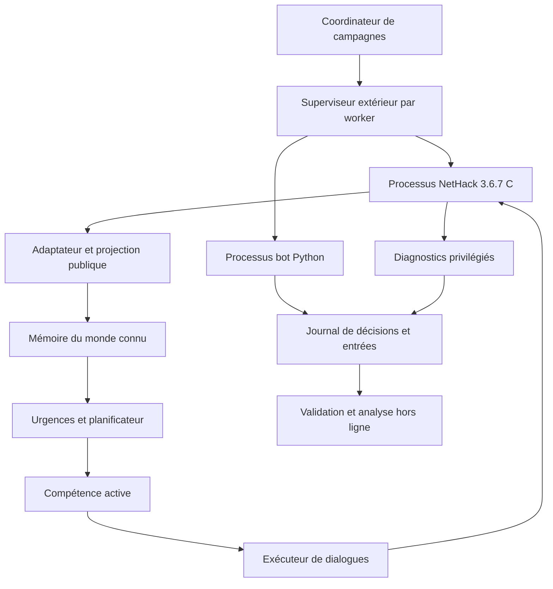

# Ultimate BotHack 3.6.7 — audit, architecture et programme de refonte

Document de conception et d'audit, rédigé le **17 septembre 2026**. Cible initiale : Valkyrie naine, femme, loyale ; ascension assistée complète, puis fiabilité et réduction des aides.

**Recommandation principale : conserver le moteur C 3.6.7 et le window port existants, refondre progressivement la représentation du monde et l'exécution des actions en Python, et soumettre NLE à un comparatif limité avant toute migration.** Rust reste une option pour des calculs dominants mesurés. Le projet a davantage besoin de contrats vérifiables et de mémoire cohérente que d'un nouveau langage.

Cette proposition part du document fourni par l'utilisateur, mais la confronte au projet réel dans `../claude`, à ses résultats rapatriés et à la documentation historique dans `../../new_bothack`. Elle ne remplace pas la version qui joue actuellement. Aucun moteur n'a été lancé, arrêté, recompilé ou modifié pour cet audit ; aucune connexion au worker n'a été faite. Les recommandations et seuils futurs ne sont pas des fonctionnalités déjà livrées.

## Table des matières

1. [Décisions et définition du succès](#1-décisions-et-définition-du-succès)
2. [Audit du patrimoine existant](#2-audit-du-patrimoine-existant)
3. [Ce que les résultats prouvent](#3-ce-que-les-résultats-prouvent)
4. [Choisir l'interface : window port ou NLE](#4-choisir-linterface--window-port-ou-nle)
5. [Architecture cible et frontières](#5-architecture-cible-et-frontières)
6. [Contrat moteur et protocole](#6-contrat-moteur-et-protocole)
7. [Mémoire du monde et connaissance](#7-mémoire-du-monde-et-connaissance)
8. [Actions et compétences interruptibles](#8-actions-et-compétences-interruptibles)
9. [Progression jusqu'à l'ascension](#9-progression-jusquà-lascension)
10. [Règles 3.6.7 et assistance](#10-règles-367-et-assistance)
11. [Supervision et récupération](#11-supervision-et-récupération)
12. [Traces, reproduction et preuves](#12-traces-reproduction-et-preuves)
13. [Validation et campagnes](#13-validation-et-campagnes)
14. [Performance, Python et Rust](#14-performance-python-et-rust)
15. [Déploiement et passage à 1 000 parties](#15-déploiement-et-passage-à-1-000-parties)
16. [Migration et backlog](#16-migration-et-backlog)
17. [Organisation du travail et première semaine](#17-organisation-du-travail-et-première-semaine)
18. [Risques et décisions à réexaminer](#18-risques-et-décisions-à-réexaminer)
19. [Sources et traçabilité](#19-sources-et-traçabilité)

## 1. Décisions et définition du succès

### 1.1 Ce que signifie « ultimate »

Le mot doit désigner des propriétés mesurables : terminer une partie depuis sa génération, expliquer les décisions, reproduire les anomalies, résister aux dialogues inattendus, et augmenter le taux de réussite sur des seeds non utilisées pour corriger le programme.

L'ordre recommandé est :

1. Une ascension assistée complète, vérifiée par le moteur, avec les aides actuelles précisément déclarées.
2. Des ascensions répétées sur un ensemble de validation figé.
3. Une réduction des blocages et du coût CPU par partie à paramètres identiques.
4. Une réduction progressive des aides, avec des résultats séparés pour chaque profil.
5. Une ascension sans aide sur la même cible de personnage.
6. L'extension aux autres rôles, seulement après stabilisation du socle.

Une victoire depuis un scénario Astral ne satisfait pas le premier objectif. Une campagne sans crash ne satisfait pas le deuxième. Une amélioration de tours/seconde qui fait perdre davantage de parties ne satisfait pas le troisième.

### 1.2 Décisions de référence

| Sujet | Décision proposée | Condition de réexamen |
| --- | --- | --- |
| Règles | NetHack 3.6.7 C figé et patchs séparés | Besoin explicite d'une autre version |
| Interface immédiate | Window port `bot` existant | Comparatif NLE montrant une meilleure couverture ou un coût moindre |
| Bot | Python modulaire | Profiling représentatif montrant un noyau à extraire |
| Modèle du monde | État connu, historique des preuves, incertitude | Aucun accès implicite à l'état secret |
| Décision | Urgences, objectifs, compétences | Mesurer les conflits et la famine de priorité |
| Exécution | Automates typés avec postconditions | Pas de suites de touches non vérifiées dans les nouveaux modules |
| Isolation | Un worker Python et un moteur enfant par partie | Une alternative doit préserver l'isolation des pannes |
| Distribution | Parties entières attribuées aux machines | Aucune dépendance réseau dans chaque tour |
| Refonte | Migration par modules, ancienne politique conservée | Bascule après validation de chaque compétence |
| Apprentissage/LLM | Hors de la boucle critique initiale | Besoin démontré, budget et bénéfice mesurables |

### 1.3 Contrat de résultat

Séparer trois axes dans le futur `result.json` :

- **Résultat du jeu** : ascension, mort, sortie, abandon demandé, inconnu.
- **Résultat d'exécution** : terminé, limite, blocage, crash bot, crash moteur, interruption opérateur, erreur de protocole.
- **Régime d'expérience** : partie complète ou scénario ; aides ; politique ; contrat d'observation ; build ; budget.

Conserver les causes même si le harnais fait quitter proprement NetHack pour obtenir son journal. Une partie interrompue pour blocage et terminée par `#quit` reste un blocage dans l'analyse.

Une ascension certifiée exige le verdict `ascended` du moteur et une entrée correspondante du journal moteur, rattachés à cette tentative. Le code actuel recoupe déjà `end` et `xlogfile` ; le projet futur doit également empêcher la réutilisation accidentelle d'un ancien répertoire. Une tentative ne peut produire qu'un résultat canonique.

## 2. Audit du patrimoine existant

### 2.1 Ce qui mérite d'être conservé

Le projet est déjà sensiblement plus avancé que ne le supposait le document de départ.

| Élément examiné | Constat | Traitement proposé |
| --- | --- | --- |
| `engine/nethack-3.6.7/win/bot/winbot.c` | Environ 1 380 lignes ; requêtes structurées, menus, carte, statut, inventaire | Conserver et versionner son contrat |
| `src/botassist.c` et points d'insertion | Aides, seed, événements et fin moteur | Séparer les patchs assistance/interface/reproductibilité |
| `nhbot/engine.py` | Moteur enfant, répertoire de partie, deux pipes, état accumulé | Renforcer validation, délais et séparation des observations |
| `pybothack/nhbridge.py` | Environ 983 lignes ; touches vers réponses, glyphes vers écran reconstruit | Garder comme adaptateur de compatibilité transitoire |
| `pybothack/bh36.py` | Réutilisation des handlers sans l'ancien terminal | Point d'intégration pour une migration graduelle |
| `compat36.py`, `rules36.py` | Adaptations de vocabulaire et de règles | Conserver les exemples réels, extraire les contrats |
| `nhbot/rungame.py` | Manifeste, classification, recoupement du verdict | Conserver, rendre les sorties atomiques |
| `nhbot/series.py` | Sous-processus, limite extérieure, arrêt sur répétition | Séparer explicitement développement et évaluation |
| `nhbot/recorder.py` | Jalons, anneau de 800 entrées, traces optionnelles | Ajouter le journal complet minimal obligatoire |
| `nhbot/supervisor.py` | Boucles, fixations, tempêtes de requêtes, watchdog | Passer des signatures textuelles aux causes structurées |
| `scenarios/`, `tests/` | Situations préparées et 48 fonctions de test repérées | Élargir les interactions réellement exécutées |

Le comptage de tests n'est pas un résultat d'exécution : les tests n'ont pas été relancés pendant cet audit documentaire.

Le patrimoine historique contient des ascensions 3.4.3 déjà auditées dans [le document du 16 septembre](../../../new_bothack/codex_3/doc/CODEX_GPT6_MEGA_DOC_BOTHACK_ASCENSIONS_ET_TRANSFERT_NLE_2026-09-16.md). Cela justifie de réutiliser les compétences de BotHack ; cela ne prouve pas leur correction en 3.6.7. Les preuves historiques n'ont pas été réauditées intégralement ici.

### 2.2 Le défaut architectural principal

La chaîne actuelle passe encore par plusieurs représentations :

```text
NetHack → données structurées → écran reconstruit et textes adaptés
        → mémoire historique BotHack → intention rendue en touches
        → interprétation des touches → réponse structurée → NetHack
```

Le window port supprime la dépendance au rafraîchissement d'un terminal réel. Il ne supprime pas les erreurs de traduction, les menus mal associés, les messages incompris ou les hypothèses obsolètes du modèle.

Le code de `Bridge` construit encore un `Frame` à partir de la carte ; les actions héritées continuent à produire des touches. Cette compatibilité a permis d'avancer rapidement. Elle doit devenir une frontière temporaire et mesurée, pas le modèle permanent des nouvelles compétences.

### 2.3 Faiblesses concrètes à traiter

**Corrélation incomplète.** Les requêtes ont un `seq`. Les réponses `k`, `y`, `m`, etc. ne renvoient pas ce numéro. Les pipes synchrones limitent les risques ordinaires, mais le protocole n'impose pas qu'une réponse appartienne à la requête courante.

**Lecture bloquante.** `Engine._readline()` utilise `readline()` sans délai propre. Il faut vérifier la couverture du watchdog dans tous les états : démarrage, attente moteur, décision, fermeture. Le délai extérieur de série existe, mais ne remplace pas des budgets d'interaction précis.

**Watchdog dans le processus du bot.** Un thread peut diagnostiquer une décision lente et tuer le moteur. Il ne garantit pas d'arrêter un bot bloqué dans tout type de code natif ou ignorant le signal. Le parent extérieur doit avoir autorité sur tous les processus de la tentative.

**Arrêt incomplet possible.** La limite dure de `series.py` appelle `p.kill()` sur le runner. Le moteur ouvre sa propre session. La fermeture des pipes peut le faire sortir, mais le code ne fournit pas à elle seule la preuve qu'un moteur figé disparaît. Tester explicitement ce cas.

**Séparation des secrets par convention.** `priv` est destiné au recorder et ne semble pas utilisé directement pour choisir les actions dans la passerelle examinée. Il reste cependant présent dans l'objet `Engine` accessible à celle-ci. Une convention doit devenir une API : la politique reçoit uniquement une projection publique.

**Contrat d'information à préciser.** Le statut émet notamment `dnum`, `dlevel`, `dname` et des valeurs internes. Cela n'est pas automatiquement équivalent à ce qu'un joueur peut voir à cet instant. Leur exposition et leur utilisation doivent être auditées champ par champ avant de revendiquer un mode strictement équivalent au joueur.

**Historique incomplet par défaut.** L'anneau de 800 entrées aide à expliquer la fin d'une partie. Il ne suffit pas pour retrouver la disparition d'une Cloche 20 000 tours plus tôt. `--trace` et `--protocol-trace` sont optionnels ; aucun replay fidèle de toutes les parties n'est donc garanti par défaut.

**Releases mutables.** L'installation échange des répertoires pour préserver le binaire déjà ouvert ; c'est utile. Mais les données de partie sont liées symboliquement à `build/install/nhdir`. Le binaire et toutes ses données doivent appartenir à une release immuable, surtout si un répertoire dev est synchronisé pendant une partie.

**Documentation divergente.** Le README pointe vers un `docs/RESULTS.md` absent de la liste locale relevée. `PROGRESS.md` décrit un état plus ancien que `HANDOFF.md`. Les mesures doivent être générées à partir d'artefacts identifiés et datés.

### 2.4 Leçon des anciens blocages

Le document historique [LIMITATIONS.md](../../../new_bothack/claude/docs/LIMITATIONS.md) explique qu'un compteur censé borner une boucle était remis à zéro à chaque réentrée. Les replays passaient alors que la protection ne se déclenchait jamais en partie réelle.

Conséquence pour la refonte : chaque mécanisme de récupération doit être testé en provoquant le défaut qu'il prétend résoudre. Une simple assertion sur sa configuration ne suffit pas. Les budgets doivent survivre aux changements de sous-état d'un même incident.

## 3. Ce que les résultats prouvent

### 3.1 Mesures locales recalculées

Les valeurs suivantes viennent des `result.json` rapatriés, pas d'une observation directe des processus distants. Le relevé et les empreintes des principaux fichiers sont dans [audit-local-2026-09-17.json](../evidence/audit-local-2026-09-17.json).

| Campagne | Résultats présents | Château | Vallée | Cloche | Chandelier | Livre | Invocation enregistrée | Ascension |
| --- | ---: | ---: | ---: | ---: | ---: | ---: | ---: | ---: |
| `big-w01` | 49 | 35 | 29 | 11 | 8 | 2 | 0 | 0 |
| `big-w02` | 62 | 46 | 41 | 26 | 14 | 13 | 0 | 0 |

Autres résultats vérifiés dans les fichiers : `mt-w02`, 18 succès d'objectif sur 20 ; `ca-w06`, 9 succès d'objectif sur 14.

`big-w01` contient 44 blocages, 3 crashs bot et 2 limites. `big-w02` contient 37 blocages et 25 limites, sans crash classé dans les fichiers présents. Les 25 limites se décomposent en **17 limites d'une heure et 8 interruptions par SIGTERM**. Les appeler toutes « parties trop lentes » serait faux.

Les seeds sont 7001–7049 pour `big-w01` et 7001–7062 pour `big-w02`. Il existe donc un sous-ensemble commun, mais les deux populations ne sont pas identiques. Les hashes bot relevés sont respectivement `659ba0474facb883` et `ad2230eedd99f48e`.

### 3.2 Désaccords avec la documentation

Le tableau de `HANDOFF.md` donne pour `big-w01` des valeurs plus hautes, notamment 38 Châteaux et 5 Livres. Les fichiers `result.json` et le résumé local donnent 35 et 2. Des événements de parties sorties sans résultat complet peuvent expliquer une partie de l'écart, mais cela n'a pas été établi ici. Ne pas choisir arbitrairement le chiffre le plus favorable ; publier la source et la règle d'agrégation.

Le handoff décrit `big-w02` comme utilisant les mêmes seeds que `big-w01`, alors qu'il contient 13 seeds supplémentaires. Pour comparer les changements, utiliser les 49 seeds communes et publier séparément les 13 nouvelles.

Le récit de perte d'objet pour `g007` doit aussi rester une hypothèse tant que les traces ne prouvent pas la succession : acquisition, présence, disparition. L'absence du jalon Cloche dans son `result.json` n'établit ni qu'elle n'a jamais existé ni qu'elle a été perdue.

### 3.3 Interprétation utile

Le passage de 2 à 13 Livres enregistrés est encourageant, mais les configurations, populations et interruptions empêchent d'en faire une mesure propre de gain causal. Les jalons d'une branche ne forment pas tous une succession obligatoire : la quête et Vlad peuvent être visités dans des ordres différents.

Le point le plus informatif est l'absence d'invocation enregistrée malgré 13 Livres. Cela priorise le diagnostic des préconditions de l'invocation, des objets transportés et de la mémoire ; cela ne prouve pas que l'exécuteur du rituel est la seule cause.

Les 2 succès sur 4 du scénario `astral-altar` sont rapportés par la documentation locale. Ils indiquent une compétence partielle et n'ont pas été recomptés ici comme les campagnes ci-dessus. Aucun succès de scénario ne doit entrer dans le taux d'ascension complète.

## 4. Choisir l'interface : window port ou NLE

### 4.1 Ce que la recherche confirme

Le dépôt maintenu `NetHack-LE/nle` se présente comme une interface NetHack utilisable depuis Python/Gymnasium. Son `include/patchlevel.h` consulté définit bien **3.6.7**. NLE peut servir à un bot symbolique ; l'apprentissage n'est pas une obligation. [Dépôt NLE](https://github.com/NetHack-LE/nle), [version dans les sources](https://raw.githubusercontent.com/NetHack-LE/nle/main/include/patchlevel.h).

Son architecture comprend plusieurs couches, dont une liaison C++ et la gestion d'un moteur doté de nombreux états globaux. Réutiliser NLE ne signifie donc pas réécrire NetHack ni obtenir automatiquement une isolation parfaite de plusieurs jeux dans un même processus. [Architecture NLE](https://raw.githubusercontent.com/NetHack-LE/nle/main/doc/nle/ARCHITECTURE.md).

L'article ICLR Blogposts 2026 illustre des limitations d'observation des menus et de sélection d'objets dans certains montages d'agents NLE. Il ne démontre pas que tout usage de NLE empêche ces interactions. Son intérêt ici est de proposer des cas à tester, pas de condamner le framework. Ses affirmations générales sur les ascensions d'agents ne doivent pas être reprises sans distinguer NLE, version du jeu et BotHack historique. [Analyse expérimentale des interfaces](https://iclr-blogposts.github.io/2026/blog/2026/revisiting-the-nle/).

### 4.2 Décision adaptée à ce dépôt

Le document fourni proposait NLE comme premier candidat si l'interface restait à construire. Or elle existe et sert déjà aux parties longues. **Le meilleur choix immédiat est de stabiliser cette interface et de rendre le bot indépendant de son implémentation.**

| Critère | Window port actuel | NLE adapté |
| --- | --- | --- |
| Coût immédiat | Faible continuité, durcissement nécessaire | Adaptation du bot, tests et aides à reporter |
| Menus | Déjà structurés et identifiés | Couverture à mesurer dans la configuration retenue |
| Aides actuelles | Déjà intégrées au moteur | Port des patchs à valider |
| Communauté et outils | Maintenance locale | Écosystème existant |
| Fidélité au moteur | Sources officielles patchées à auditer | Fork et configuration à auditer aussi |
| Observations | Contrôle fin, risque de fuite à vérifier | Clés/masquage à examiner |
| Coût CPU | Pas de mesure comparative ici | Pas de promesse de gain |
| Verdict final | `end` et `xlogfile` existants | Vérifier terminaison et limites du wrapper |

### 4.3 Expérience de décision bornée

Réserver un petit lot de travail à un adaptateur NLE minimal. Utiliser des versions fixées par commit, sans installer arbitrairement la dernière version pendant une campagne.

Faire passer les deux interfaces sur les mêmes **intentions et scénarios**, avec vérification des effets : commandes ordinaires, annulation, chaînes longues, nombres, menus avec doublons de lettres, conteneurs, objets indisponibles, direction, position, `#name`, `#enhance`, fenêtres informatives, mort et ascension préparée.

Mesurer couverture, nombre de traitements spécifiques, temps de réalisation, CPU, latence de décision et difficulté de diagnostic. Une même seed numérique ne garantit pas le même donjon entre deux builds ou forks : employer des fixtures comparables et documenter les différences.

NLE devient candidat au remplacement lorsque les cas nécessaires sont couverts, les aides/verdicts sont validés et le coût total est inférieur. Sinon, garder le window port. Fixer une date de décision évite deux adaptateurs de production maintenus indéfiniment.

## 5. Architecture cible et frontières

### 5.1 Vue générale



Le diagramme décrit des responsabilités. Tous les blocs Python n'ont pas besoin d'être des processus ou services distincts. Le chemin critique reste local. Le coordinateur connaît les tâches, les builds et les résultats ; il n'intervient pas dans les choix de direction.

### 5.2 Dépendances autorisées

| Module | Reçoit | Produit | Ne doit pas faire |
| --- | --- | --- | --- |
| Adaptateur | Messages moteur | `PublicObservation`, dialogues | Choisir une stratégie |
| Mémoire | Observations, résultats d'action | `BeliefState`, événements | Lire les structures secrètes C |
| Règles | Faits connus et version | Prédicats, coûts, possibilités | Modifier le moteur |
| Planificateur | État, buts, ressources | Objectif actif, alternatives | Répondre directement à un prompt |
| Compétence | Objectif et état | Intention, attente, résultat | Envoyer des touches libres |
| Exécuteur | Intention et dialogue | Réponse validée, `ActionResult` | Inventer une réussite |
| Superviseur | Heartbeats, budgets, progrès | Diagnostic, récupération, arrêt | Attribuer des objets ou téléporter |
| Évaluateur | Traces et diagnostics | Résultat certifié, métriques | Fournir des secrets à la politique |

### 5.3 Organisation proposée

```text
ultimate_bothack/
  pyproject.toml
  engine/
    upstream.lock
    patches/{windowport,assistance,reproducibility}/
    build/
  src/ubh/
    protocol/{schema,validation,capabilities}.py
    adapters/{windowport,nle_experiment,legacy}.py
    observation/{public,diagnostic,projection}.py
    world/{state,reducer,levels,inventory,beliefs}.py
    rules/v367/{combat,items,prayer,terrain,invocation}.py
    planning/{goals,dependencies,resources,arbitration}.py
    skills/{combat,exploration,inventory,quest,invocation,planes,offer}.py
    execution/{intents,dialogs,results,recovery}.py
    runtime/{worker,supervisor,deadlines}.py
    telemetry/{events,manifest,replay,metrics}.py
    campaigns/{scheduler,results,evaluation}.py
  legacy/pybothack/
  scenarios/{protocol,progression,endgame}/
  tests/{unit,contracts,integration,replay,regression}/
  configs/{profiles,campaigns}/
  docs/{architecture,decisions,runbooks}/
```

Cette arborescence est une cible, pas une invitation à créer immédiatement cinquante fichiers vides. Commencer avec quelques modules réels et extraire quand les interfaces sont stables. Une base de données distribuée, un bus de messages et Kubernetes ne sont pas nécessaires au premier millier de parties.

### 5.4 Configuration résolue une fois

Au lancement, fusionner profil, options de campagne et overrides, puis produire une configuration immuable inscrite dans le manifeste. Les modules ne relisent pas indépendamment des variables d'environnement susceptibles de diverger.

Valider les contradictions : scénario compté comme partie complète, tactique assistée sans invincibilité par accident, contrat d'observation inconnu, seed manquante pour une campagne reproductible. Autoriser les expériences atypiques explicitement, avec un identifiant de profil distinct.

## 6. Contrat moteur et protocole

### 6.1 Trois horloges, plus une durée

Conserver séparément :

- `game_turn` : temps NetHack, utilisé pour les effets de jeu et le rituel.
- `request_id` : demande d'entrée, y compris dialogues sans tour consommé.
- `decision_id` : choix d'une intention par le bot.
- Temps monotone : délais d'exécution et durée des attentes.

Un menu de vingt échanges peut ne consommer aucun tour. Une action longue peut en consommer plusieurs avant de rendre la main. Une récupération qui fait avancer artificiellement le tour ne doit pas effacer son historique d'échec.

### 6.2 Exemple de protocole v2 proposé

Exemples de conception, non compatibles tels quels avec le protocole v1 actuel :

```json
{
  "type": "request",
  "protocol": 2,
  "session_id": "attempt-uuid",
  "request_id": 1843,
  "game_turn": 902,
  "observation_revision": 1220,
  "dialog": {
    "kind": "menu",
    "dialog_id": "menu-87",
    "selection": "many",
    "items": [
      {"entry_id": "entry-4", "label": "a silver bell", "selectable": true}
    ]
  }
}
```

```json
{
  "type": "response",
  "protocol": 2,
  "session_id": "attempt-uuid",
  "request_id": 1843,
  "decision_id": 619,
  "action_id": "pickup-18",
  "response": {
    "kind": "menu_selection",
    "dialog_id": "menu-87",
    "entries": [{"entry_id": "entry-4", "count": 1}]
  }
}
```

Les identifiants du menu ne sont valides que pour son instance. Les raccourcis clavier sont des propriétés d'affichage, pas des identités. Le moteur refuse une réponse de mauvaise session, de mauvaise requête, de type incompatible ou contenant un identifiant absent.

**Ces identifiants ne créent pas une garantie d'exécution exactement une fois après crash.** Si une réponse a pu être consommée sans que son effet soit reçu, son statut est incertain. Ne pas la renvoyer automatiquement. Avec des pipes locaux, la politique simple est d'arrêter la tentative, conserver les preuves et reproduire ; une reprise exige un mécanisme explicite de checkpoint cohérent.

### 6.3 Enveloppe et capacités

Le message initial annonce version du protocole, build moteur, capacités, encodage, limites de tailles et version du contrat d'observation. Les clients rejettent les versions majeures inconnues. Les capacités facultatives évitent de supposer que tous les adaptateurs savent fournir le même détail.

Définir les limites de longueur des lignes, nombres d'entrées et chaînes. Le C actuel lit dans un tampon de 8 192 octets : une ligne dépassant ce format doit être rejetée ou entièrement drainée, jamais être interprétée en deux réponses. Ajouter des tests de troncature et d'EOF en plein message.

Les parseurs conservent l'événement brut en cas d'erreur. Un message non reconnu devient une observation inconnue et diagnostiquable ; il ne doit pas être silencieusement converti en état normal.

### 6.4 Deltas et snapshots

Chaque delta référence une révision de base. Le premier état d'une session et chaque transition de niveau doivent donner suffisamment d'information pour éviter les cases fantômes. Prévoir un snapshot complet public à des points contrôlés : ouverture, changement de niveau, demande de resynchronisation à une frontière sûre.

Une resynchronisation de l'observation ne rejoue pas une action. Si l'adaptateur ne peut pas obtenir un snapshot sans action de jeu, cette limitation doit être déclarée. Ne pas introduire une commande cachée qui consomme un tour à l'insu de la politique.

### 6.5 Observabilité sans omniscience

Créer deux types de données distincts :

```text
PublicObservation
  position, statut autorisé, messages, cellules perçues,
  inventaire connu, dialogue courant, possibilités de réponse

DiagnosticObservation
  état interne d'évaluation, événements d'aide, verdict,
  compteurs moteur et données réservées aux tests
```

La politique ne reçoit pas un `Engine` complet avec un champ `priv` qu'elle promet d'ignorer. Elle reçoit une valeur publique immuable. Le diagnostic est envoyé au recorder par une autre voie logique ; un processus séparé peut renforcer cette séparation si nécessaire, mais n'est pas obligatoire pour le prototype.

Pour chaque champ, documenter sa provenance : affiché, accessible via une commande ordinaire, déduit, connaissance générale des règles, ou secret moteur. Des identifiants opaques de niveaux ne doivent pas révéler le nom d'une branche encore inconnue. Une identité stable d'objet ne doit pas suivre magiquement un objet volé hors de vue.

Test essentiel : deux états moteur ne différant que par un secret non observé doivent produire la même observation publique. Couvrir propriétés non identifiées, objets sous une pile, carte hors de vue, monstres cachés, apparences aléatoires et hallucination.

## 7. Mémoire du monde et connaissance

### 7.1 État connu et provenance

Le modèle cible est une mémoire partiellement informée, pas une copie du moteur. Un fait comporte sa valeur, sa provenance, sa date et son statut : observé, inféré, hypothétique, contredit ou périmé.

```python
@dataclass(frozen=True)
class Evidence:
    event_id: str
    game_turn: int
    observation_revision: int
    source: str

@dataclass(frozen=True)
class KnownFact:
    value: object
    certainty: str
    evidence: tuple[Evidence, ...]
```

Ce pseudocode illustre le contrat ; le modèle définitif doit employer des types plus précis selon les domaines. Ne pas ajouter des probabilités arbitraires : une petite liste d'hypothèses et leurs preuves suffit souvent.

### 7.2 Carte en couches

Une case possède des couches distinctes : terrain connu, objets aperçus, occupant, piège connu, gravure, exploration et restrictions temporaires. Voir un objet ne doit pas remplacer un autel connu par du sol. Perdre la vue d'un monstre ne doit pas effacer le terrain.

La carte distingue « inconnu », « connu autrefois », « visible maintenant » et « observé vide ». L'absence d'un glyphe ne prouve pas toujours l'absence de l'objet. Une inspection qui ne peut pas voir sous une pile ne marque pas la pile comme entièrement analysée.

Utiliser une convention unique de coordonnées dans le nouveau domaine. Les conversions historiques NetHack/Frame restent dans l'adaptateur legacy. Les tests couvrent bords de carte, indices de lignes et `getpos` ; le code actuel possède déjà des tests utiles à conserver.

### 7.3 Identité et cycle de vie des objets

Une lettre d'inventaire est un emplacement temporaire. Une description est une représentation susceptible de changer. Une pile peut fusionner ou se séparer. Concevoir une référence de connaissance avec :

- classe, apparence et identités candidates ;
- quantité observée et intervalle d'incertitude si nécessaire ;
- état connu BUC, équipement, charges connues ;
- emplacement connu : inventaire, conteneur identifié, sol connu, inconnu ;
- liens de provenance entre division, fusion et renommage ;
- restrictions liées aux objectifs.

Le bot peut créer un identifiant interne pour suivre ses observations. Il ne doit pas assimiler cet identifiant au pointeur C de l'objet ni prétendre reconnaître une identité cachée après une disparition ambiguë.

### 7.4 Protection des ressources indispensables

Créer un registre `ResourceReservation` pour la Cloche, le Chandelier, le Livre, les bougies nécessaires, l'Amulette réelle et les moyens de traversée indispensables au trajet courant.

Chaque action de vente, jet, sacrifice, stockage ou consommation consulte ce registre. Une apparence compatible avec un objet indispensable peut recevoir une protection provisoire jusqu'à inspection. Protéger le conteneur d'un objet protégé protège aussi son contenu.

Une protection ne bloque pas toute adaptation : retirer un objet pour l'utiliser reste autorisé ; abandonner du poids en urgence peut être justifié, mais demande une décision explicite avec lieu de dépôt et plan de récupération. L'assistance ne doit pas recréer l'objet perdu.

Après téléportation, vol observé, polymorphisme, destruction d'équipement, changement d'inventaire ou combat critique, réévaluer les capacités : lévitation disponible, mains libres, résistances connues, objets rituels accessibles. Une traversée de Méduse n'est pas valide parce qu'un anneau existait vingt niveaux auparavant.

### 7.5 Contradictions et inspections bornées

Si l'identification par prix exclut toutes les identités possibles, conserver les faits conflictuels et affaiblir l'inférence douteuse. Ne pas réécrire sans trace les connaissances précédentes. Distinguer erreur de formule, quantité, surtaxe et observation mal parsée.

Pour les fixations `examining tile`, mémoriser une signature telle que : niveau connu, case, révision des objets observés, motif d'inspection. Une nouvelle inspection identique sans information nouvelle clôt cette tentative et produit `inspection_no_information`. Reconsidérer seulement après un événement pertinent ou une politique de revisite bornée.

Le budget porte sur l'objectif d'inspection, pas seulement sur le nombre de tours au même endroit. Marcher entre deux cases ne doit pas réinitialiser le problème.

### 7.6 Mise à jour déterministe

Un reducer transforme `(état connu, événement public)` en nouvel état connu et événements dérivés. Les tests peuvent rejouer les mêmes événements sans moteur. Les structures persistantes actuelles peuvent être conservées là où elles sont utiles ; les caches doivent dépendre des révisions qui affectent réellement leur réponse.

Éviter un cache basé sur la seule identité d'une case si le résultat dépend aussi des capacités du joueur, d'un objet maudit ou du graphe de niveaux. Chaque cache documente ses dépendances et ses règles d'invalidation.

## 8. Actions et compétences interruptibles

### 8.1 L'intention n'est pas une suite de touches

Exemples d'intentions : `MoveTo`, `PickUp`, `ApplyItem`, `Zap`, `ReadBook`, `OfferAmulet`. Elles utilisent des références du domaine, jamais une lettre d'inventaire mémorisée à l'avance.

Chaque exécution produit un résultat :

| Résultat | Sens |
| --- | --- |
| `succeeded` | Postcondition observée |
| `rejected` | Le jeu a refusé, cause connue ou inconnue |
| `partial` | Une partie des effets est confirmée |
| `interrupted` | Interruption à une frontière identifiée |
| `uncertain` | Effet non déterminable avec les observations reçues |
| `protocol_error` | Dialogue incompatible ou invalide |

Un retour au prompt de commande n'est pas à lui seul une preuve de réussite. Une action peut échouer en consommant un tour ; une consultation peut réussir sans en consommer.

### 8.2 Exemple : utiliser une baguette

```text
Préparer : objet connu disponible, intention et cible enregistrées
  → envoyer la commande au prompt command
  → recevoir la demande d'objet
  → résoudre la lettre actuelle dans cette observation
  → sélectionner uniquement une réponse admise
  → recevoir la demande de direction, ou traiter un refus
  → envoyer la direction
  → absorber les événements et l'état suivant
  → vérifier les effets observables ; conclure ou marquer incertain
```

À chaque étape, la réponse dépend du dialogue reçu. Une baguette sans charge ou indisponible ne suit pas forcément la même séquence qu'une baguette utilisable. Aucun code ne doit envoyer automatiquement « commande + lettre + direction » en espérant que le moteur les acceptera.

### 8.3 Contrat d'une compétence

```text
Skill
  id et version
  objectif et arguments
  préconditions connues
  ressources réservées
  état local sérialisable
  budget de tours, requêtes et temps réel
  frontières d'interruption
  effets attendus et preuves de fin
  causes d'échec et alternatives
```

États possibles : `ready`, `running`, `waiting_for_dialog`, `suspended`, `completed`, `failed`. Le planificateur choisit une compétence ; l'exécuteur gère les dialogues élémentaires. Cette séparation permet de tester les deux sans confondre stratégie et saisie.

### 8.4 Arbitrage et interruptions

Ordre de base : dialogue en cours, urgence irréversible, maintien d'une capacité critique, compétence active, objectif de progression, amélioration facultative.

« Dialogue en cours » signifie traiter correctement l'entrée attendue, pas laisser la stratégie ignorer un danger. L'exécuteur peut annuler si cette annulation est légale et utile ; il ne peut pas lancer une seconde commande au milieu d'une sélection d'objet.

Définir les urgences selon le profil : pétrification, slime, suffocation, famine, déplacement forcé dangereux, perte d'une capacité indispensable. Sous invincibilité, certaines urgences de survie perdent leur priorité, mais la perte de mobilité ou d'objets reste critique.

Une compétence interrompue ne reprend jamais aveuglément : elle vérifie ses préconditions. Une section courte sensible au temps, comme la fin du rituel, peut différer une tâche facultative. Si une urgence l'interrompt, elle repasse par la préparation.

### 8.5 Remplacer les veto temporels aveugles

Le veto actuel de 300 tours constitue un garde-fou utile. Le futur échec doit porter une cause et une condition de réactivation :

- anneau maudit → réessayer après décursing observé ;
- arme soudée empêchant une action → réessayer après changement de capacité ;
- case temporairement occupée → réexaminer après évolution de l'occupation ;
- objet non disponible → résoudre à nouveau l'inventaire ;
- cause inconnue → inspection bornée, puis budget de réessai.

Un délai reste acceptable pour l'inconnu. Il ne doit pas être le seul mécanisme, car 300 tours sans évolution pertinente ne rendent pas une action possible.

## 9. Progression jusqu'à l'ascension

### 9.1 Graphe de dépendances

Le planificateur gère les préconditions, pas une liste rigide de profondeurs. Pour chaque but, stocker état, éléments manquants, preuves, coût estimé et alternatives.

```text
Survie et mobilité
  → accès aux branches et ressources
  → quête : obtenir et conserver la Cloche
  → Vlad : obtenir et conserver le Chandelier
  → réunir les bougies nécessaires
  → Sorcier : obtenir et conserver le Livre
  → localiser la case vibrante et préparer le rituel
  → invocation confirmée
  → Sanctuaire et Amulette réelle
  → remontée et Plans
  → haut autel compatible et offrande
  → verdict moteur d'ascension
```

Ce graphe n'impose pas de faire toutes les branches annexes. Mines et Sokoban deviennent des décisions motivées par des ressources et des capacités manquantes. Un profil rapide n'est pas automatiquement meilleur si ses économies rendent le milieu de partie impossible.

### 9.2 Début et milieu de partie

| Étape | Compétences nécessaires | Preuve de progression |
| --- | --- | --- |
| Début | Exploration, nourriture, équipement, identification prudente | Accès stable à un nouvel étage et capacités minimales |
| Mines/Minetown | Navigation de branche, boutiques, ressources | Niveau reconnu par faits publics et objectif local rempli |
| Sokoban si utile | Reconnaissance de variante, poussées légales | Puzzle validé, ressource effectivement acquise |
| Méduse | Traversée planifiée, lévitation/solution alternative | Passage réalisé et capacité de retour vérifiée |
| Château | Accès, foule, ressources et objets | Entrée/sortie et acquisitions enregistrées |
| Quête | Conditions d'accès, dialogues, navigation, cible | Cloche observée puis possédée |
| Vlad | Accès à la tour, combat, inspection du butin | Chandelier possédé, pas seulement niveau visité |
| Sorcier | Navigation correcte, combat, conservation | Livre possédé et état du rituel réévalué |

La connaissance de cartes spéciales peut être une connaissance générale du jeu, mais sa politique d'utilisation doit être déclarée. Une reconnaissance de variante ne peut pas sélectionner une carte à partir d'un identifiant moteur secret.

### 9.3 Invocation : première compétence à refondre

Le code actuel `behaviors.invocation()` vérifie la présence des objets, puis enchaîne recherche, bougies, décursing, Chandelier, Cloche, Livre et descente. Des sous-décisions dépendent du dernier message ; `_ring_bell()` n'est pas un état durable du rituel. Le contrôle de présence autorise des objets dans un sac, alors que leur utilisation et les préconditions moteur demandent une accessibilité effective. Il faut tester ce passage explicitement, sans présumer que le code ne sait jamais désensacher ailleurs.

Le moteur local, dans `src/spell.c`, vérifie notamment la position d'invocation, un Livre non maudit, le Chandelier avec sept bougies allumées et non maudit, et une Cloche non maudite dont l'usage est récent : `(moves - otmp->age) < 5L`. Les objets préparés sont recherchés dans l'inventaire direct. La politique doit garantir ces préconditions par ses observations et ses actions, pas lire `age` ou `cursed` secrètement. [Règles officielles 3.6.7, `spell.c`](https://github.com/NetHack/NetHack/blob/NetHack-3.6.7_Released/src/spell.c).

Automate proposé :

1. **Inventorier** les trois objets, les bougies et les moyens de lever une malédiction.
2. **Expliquer les manques** : absent, identité non reconnue, dans un sac, accès impossible, charges/état insuffisants.
3. **Récupérer** un manque par un sous-objectif explicite ; ne pas laisser `None` relancer l'exploration générale sans motif.
4. **Préparer** les objets hors du sac, les sept bougies et leur état utilisable ; éliminer les tâches facultatives qui pourraient interrompre la séquence.
5. **Atteindre** la case vibrante reconnue par des preuves publiques.
6. **Allumer**, **sonner**, **lire**, en suivant le tour de jeu de chaque effet confirmé.
7. **Vérifier** la transformation et l'accès produit ; le diagnostic moteur sert séparément à valider le test.
8. **Descendre** seulement après confirmation ; sinon diagnostiquer le prérequis et appliquer un budget de récupération.

Tests indispensables : Cloche expirée, objet maudit, objets dans un sac, bougie manquante, objet non identifié, confusion, interruption entre Cloche et Livre, mauvaise case, objectif déjà réalisé. Une petite erreur dans ce contrat peut annuler des heures de partie ; c'est une priorité supérieure à l'accélération du pathfinding.

### 9.4 Sanctuaire, remontée et Plans

Après l'invocation, la réussite reste loin d'être acquise. Chaque phase exige un contrat propre : franchissement de l'accès, acquisition de l'Amulette réelle, navigation inverse, gestion des menaces récurrentes et conservation des outils.

Le graphe inter-niveaux doit enregistrer les transitions observées, leurs destinations, conditions et incertitudes. Une profondeur numérique seule ne distingue pas suffisamment branches, tours et portails. La remontée peut utiliser des chemins différents si les capacités ont changé.

Pour les Plans, prévoir détection/recherche de passage, mobilité propre au terrain, gestion des dangers et vérification de transition. Ne pas traiter tous les portails comme une simple case d'escalier. Les scénarios doivent tester chaque Plan puis leur enchaînement ; les solutions exactes restent à confronter aux sources et traces lors de l'implémentation.

### 9.5 Astral et offrande

La tactique assistée existante privilégie les cases d'autel connues de la carte spéciale. Cela peut être une bonne accélération déclarée sous assistance ; elle ne prouve pas une tactique normale sûre.

Séparer : avancer vers un temple, dégager le passage, identifier l'autel, vérifier l'alignement actuel, vérifier l'Amulette réelle et effectuer l'offrande. Après un changement d'alignement ou d'équipement, recalculer les préconditions.

Le combat sert à rendre une action de progression possible. Éliminer indéfiniment une foule renouvelée n'est pas un objectif. La politique doit mesurer les actions gagnant une position utile, et réserver les moyens de contrôle ou de passage dont elle connaît réellement la disponibilité.

La postcondition finale reste le verdict moteur. Ni une animation, ni un message isolé, ni un score élevé ne doivent suffire à certifier la victoire.

## 10. Règles 3.6.7 et assistance

### 10.1 Une couche de règles explicitement versionnée

Chaque règle sensible associe un identifiant, la version du moteur, les fichiers sources de référence, les observations nécessaires et les tests. Un correctif de message ne doit pas être confondu avec une modification tactique.

Les adaptations déjà présentes — Elbereth, suppression du pudding farming, seuil de prière, prix et noms d'objets — sont à conserver comme point de départ. Leur présence dans le dépôt ne dispense pas de tester les situations limites.

| Domaine | Risque de transfert | Validation attendue |
| --- | --- | --- |
| Elbereth | Ancienne tactique offensive ou contexte invalide | Cas respecté/non respecté, texte, lieu, attaque et conséquence |
| Prière | Mauvaise estimation du besoin ou du délai | Faits connus séparés du timeout moteur secret |
| Objets | Apparences et noms nouveaux | Couverture des tables et exemples de libellés réels |
| Prix | Quantité, arrondis, surtaxe | Tests de formule et contradictions d'identification |
| Monstres | Type absent, description non reconnue | Tables statiques complètes et fallback sans boucle |
| Menus | Inversion sémantique, choix informatif | Tests de dialogues réels, notamment `Continue eating?` |
| Fin de partie | Préconditions temporelles et objets | Scénarios négatifs et positifs sur le moteur exact |

Une extraction des tables statiques de `objects.c` et `monst.c` peut réduire les oublis. Elle ne doit pas exposer au bot les associations aléatoires entre apparence et identité de la partie courante. Versionner aussi les données générées et leur procédure de génération.

### 10.2 Profils d'aide

Créer des profils explicites, sans les mélanger dans les statistiques :

| Profil proposé | Aides | But |
| --- | --- | --- |
| `assisted-current-v1` | Aides et kit actuels figés | Baseline de progression |
| `assisted-current-v2` | Modification déclarée d'une aide | Tester son effet sans réécrire l'historique |
| `kit-only` | Équipement de départ seulement | Évaluer survie et usage des ressources |
| `normal` | Aucune aide | Performance complète sans assistance |
| `scenario` | Préparation wizard déclarée | Tester une compétence, jamais une partie complète |

L'invincibilité actuelle restaure davantage que des points de vie : elle intervient sur des pertes de niveaux/attributs, le slime et certains risques de cerveau. C'est un outil de test cohérent avec l'objectif assisté, mais il faut nommer précisément ses effets. Un profil ne devient pas « sans aide » parce qu'aucune intervention n'a été nécessaire : le kit et les règles activées comptent aussi.

### 10.3 Couverture des aides

Construire une matrice de causes et vérifier chaque chemin moteur couvert : dégâts, poison, faim, étouffement, eau/lave, pétrification, slime, maladie, étranglement, perte d'intelligence, drains, polymorphisme et fins particulières. La liste est un programme de tests, pas l'affirmation que tout doit être rendu inoffensif.

Pour chaque aide : condition exacte, point d'insertion, événement avant/après, effets secondaires, restauration éventuelle et test avec aide désactivée. Vérifier que le mode désactivé ne modifie pas les règles normales.

Interdire dans les aides de progression : apparition d'un objet rituel manquant, téléportation vers un but, ouverture de l'invocation, réponse automatique à l'offrande. Les préparations de scénario peuvent le faire si leur statut de scénario est explicite et exclu des campagnes complètes.

### 10.4 Éviter la dépendance tactique aux aides

Mesurer le nombre et la nature des interventions par phase. Une ascension avec plusieurs milliers de morts annulées prouve le parcours assisté, pas une préparation à la survie normale. Le curriculum doit changer une dimension à la fois : même politique, puis même profil sans une aide, puis tactique réadaptée si nécessaire.

La stratégie de progression et le modèle d'objets peuvent être communs ; les décisions de risque doivent dépendre du profil déclaré. Ne pas supprimer globalement repos, fuite et défense au motif que la première cible utilise l'invincibilité.

## 11. Supervision et récupération

### 11.1 Trois niveaux de protection

1. **Exécuteur** : dialogue et action ; délais courts, réponses valides, postconditions.
2. **Politique** : objectif et compétence ; progression, ressources, alternatives, mémoire des échecs.
3. **Superviseur extérieur** : vie du processus, CPU, mémoire, temps réel, présence des traces et fermeture.

Le superviseur extérieur ne dépend pas de l'exécution de Python dans le worker. Sous Linux, une unité de processus ou un cgroup peut regrouper les descendants ; une solution plus simple doit suivre explicitement les PID et sessions. Tester la disparition de tous les enfants après un arrêt forcé.

### 11.2 Mesurer la progression utile

Remplacer le seul critère « nouvelle case/profondeur/XL » par un vecteur :

```text
objectif satisfait, précondition obtenue, ressource critique acquise,
information nouvelle, obstacle résolu, transition utile,
état d'action avancé, ressource consommée sans bénéfice
```

Une attente légitime ou un retour vers un objet n'apporte pas toujours de nouvelle case. Inversement, explorer des cases inutiles peut masquer une impasse du plan. La compétence annonce donc sa mesure locale et son horizon de progression attendu.

Conserver les détecteurs génériques existants comme filets de secours. Leurs seuils deviennent des paramètres de profil, accompagnés d'une justification et d'une mesure de faux positifs.

### 11.3 Récupération graduée

| Niveau | Action | Condition de fin |
| --- | --- | --- |
| 0 | Comprendre le refus et actualiser l'état | Une nouvelle précondition est identifiée |
| 1 | Annuler légalement le dialogue | Retour à un état de contrôle connu |
| 2 | Réobserver l'inventaire ou la case pertinente | Révision utile du modèle |
| 3 | Replanifier avec l'échec mémorisé | Alternative réellement différente |
| 4 | Abandonner l'objectif local si possible | But substitut compatible |
| 5 | Terminer la tentative avec preuves | Budget épuisé ou absence d'alternative |

L'incident garde son identifiant au travers de ces étapes. Un Échap, un déplacement ou une recherche ne remet pas son budget à zéro. En cas de `uncertain`, aucune répétition non idempotente n'est automatique.

Un nombre maximal de récupérations peut être proposé au démarrage, par exemple trois pour un même incident, puis réglé sur les traces. Ce nombre est une hypothèse de travail, pas une valeur universelle de NetHack.

### 11.4 Codes d'échec structurés

Utiliser `ITEM_UNAVAILABLE`, `CURSED_EQUIPMENT`, `NO_FREE_HAND`, `INSPECTION_NO_INFORMATION`, `UNKNOWN_PROMPT`, `PROTOCOL_MISMATCH`, `NO_GOAL_PROGRESS`, `ENGINE_TIMEOUT` et des champs de contexte.

La signature de regroupement combine code, compétence, étape du dialogue et forme du contexte. Elle ne supprime pas tous les nombres et noms d'un texte tronqué : deux fixations sans rapport ne doivent pas devenir indistinguables.

Conserver également le texte original. Une classification imparfaite doit rester corrigeable hors ligne sans rejouer toute la campagne.

## 12. Traces, reproduction et preuves

### 12.1 Journal minimum obligatoire

Chaque tentative conserve :

```text
manifest.json                 configuration et versions résolues
inputs.jsonl.gz               toutes les réponses réellement envoyées
public-events.jsonl.gz        événements utiles et observations de contrôle
milestones.jsonl              progression et objets critiques
anomalies.jsonl                incidents, causes et récupérations
metrics.json                  temps, ressources et coûts par phase
result.json                   résultat canonique, écrit atomiquement
engine/                       xlogfile, stderr, diagnostics pertinents
```

Un tampon détaillé autour des anomalies complète ce socle. Les captures intégrales volumineuses peuvent être optionnelles ; les entrées exactes depuis le début ne le sont pas.

L'ordre des écritures doit permettre de distinguer `intent_created`, `response_write_started`, `response_write_completed` et effet observé. Un log écrit avant l'envoi n'atteste pas que le moteur a consommé la réponse. En cas de crash entre les deux, marquer l'incertitude au lieu de reconstruire une histoire certaine.

Les fichiers compressés gagnent à être découpés en segments fermés pour limiter la perte de fin de fichier. Spécifier le compromis entre flush, durabilité et coût disque. Ne pas affirmer qu'une simple écriture dans un buffer survivra à une panne machine.

### 12.2 Manifeste reproductible

Inclure : commit et empreinte du bot, modifications locales éventuelles, archive ou commit moteur, patchs, binaire, données NetHack, compilateur et options de build, Python, dépendances, OS/architecture, options du jeu, contrat public, profil d'aide, kit exact, rôle, seeds moteur/bot, limites et stratégie de terminaison.

Les seeds ne suffisent pas : auditer horloge, calendrier, fichiers bones/saves, environnement, fonctions d'aléatoire supplémentaires et ordre de parcours des structures. Le mode actuel désactive les bones et permet une seed moteur ; cela constitue une base, pas une preuve complète de déterminisme.

La durée monotone pilote les timeouts. Si les timeouts influencent les décisions, un replay sur machine différente peut diverger malgré le même aléatoire : conserver leur déclenchement et distinguer replay logique et exécution soumise aux budgets réels.

### 12.3 Trois types de replay

| Replay | Entrée | Ce qu'il vérifie |
| --- | --- | --- |
| Modèle | Observations publiques enregistrées | Même état connu et mêmes contradictions |
| Décision | Observations + état initial + RNG bot | Mêmes intentions ou divergences expliquées |
| Moteur | Build exact + environnement + entrées | Même trajectoire observée et résultat |

Les traces d'actions abstraites ne remplacent pas les entrées moteur exactes. Les entrées seules ne remplacent pas les observations pour diagnostiquer une divergence de politique.

Comparer des hashes normalisés de l'observation publique à intervalles réguliers. À la première divergence, produire un diff local : inventaire, dialogue, position, carte ou message. Éviter un hash contenant des timestamps non pertinents.

### 12.4 Checkpoints

Une sauvegarde NetHack seule ne capture pas la mémoire, le plan, les caches et le RNG du bot. Un checkpoint complet doit associer l'état moteur compatible, l'état du bot, les identifiants du protocole et l'offset des journaux, à une frontière stable.

Ne pas ajouter ce mécanisme avant le replay de base. Pour le débogage initial, une reproduction depuis le début et des scénarios ciblés sont souvent plus simples. Un checkpoint fabriqué en wizard ne devient jamais une partie complète évaluée depuis le début.

## 13. Validation et campagnes

### 13.1 Pyramide de validation

| Niveau | Exemples | Valeur |
| --- | --- | --- |
| Unitaire | Prix, inconnus, invalidation de cache, coordonnées | Rapide, erreurs locales |
| Contrat | Schémas, réponse périmée, delta invalide, masquage | Fiabilité de la frontière |
| Intégration moteur | Menus, refus, objets, annulation | Comportement réel du dialogue |
| Compétence | Quête, invocation, offrande | Préconditions et effets |
| Parcours | Méduse→Château, Vlad→objet, rituel→Sanctuaire | Enchaînement de compétences |
| Partie complète | Départ standard jusqu'au verdict | Objectif utilisateur |
| Campagne tenue à l'écart | Seeds jamais utilisées pour régler le bot | Généralisation mesurable |

MiniHack propose des descriptions de niveaux et un générateur utiles pour fabriquer des situations contrôlées. On peut reprendre cette méthode avec le moteur actuel, sans introduire immédiatement tout le framework. Une compatibilité automatique avec les patchs et sauvegardes locaux ne doit pas être supposée. [Interface de scénarios MiniHack](https://minihack.readthedocs.io/en/latest/getting-started/interface.html).

### 13.2 Matrice prioritaire de tests

| ID | Situation | Réussite attendue |
| --- | --- | --- |
| P01 | Réponse au mauvais `request_id` | Refus sans action de jeu |
| P02 | Menu avec plus de 52 entrées et lettres répétées | Sélection de l'entrée exacte |
| P03 | EOF ou ligne tronquée en plein échange | Erreur bornée, trace exploitable |
| P04 | Réponse trop longue | Rejet sans contamination de la requête suivante |
| P05 | Prompt inconnu | Aucun choix dangereux inventé, sortie bornée |
| W01 | Autel sous une pile | Terrain conservé, aucune boucle de gravure |
| W02 | Objet inconnu inspecté plusieurs fois | Fin de l'inspection sans information |
| W03 | Anneau maudit, puis décursing | Refus mémorisé puis réactivation correcte |
| W04 | Division/fusion de pile, lettre modifiée | Quantités et références cohérentes |
| W05 | Apparence d'objet rituel non identifié | Protection provisoire et clarification |
| G01 | Chandelier après Vlad | Ramassage et possession confirmés |
| G02 | Rituel avec objets dans un sac | Sortie du sac, préparation puis invocation |
| G03 | Cloche trop ancienne | Nouvelle préparation, pas de lecture aveugle |
| G04 | Interruption du rituel | Préconditions réévaluées |
| G05 | Haut autel incompatible/faux objet | Aucune fausse certification de victoire |
| R01 | Boucle passant par plusieurs sous-états | Budget global de l'incident déclenché |
| R02 | Bot figé, moteur figé, fermeture figée | Tous les descendants arrêtés par le parent |
| O01 | Secret moteur modifié seulement | Observation publique inchangée |
| T01 | Même replay, même build | Première divergence absente ou localisée |

Ces tests ont de la valeur parce qu'ils traversent les conditions qui ont réellement échoué. Éviter les tests se contentant de vérifier qu'une constante vaut la valeur qu'on vient de lui assigner.

### 13.3 Développement et évaluation sont deux modes différents

**Développement :** corpus de bugs connu, seeds réutilisées, arrêt sur erreur répétée permis, interventions et reprises explicites. Le but est d'obtenir de l'information utile rapidement.

**Évaluation :** build et configuration figés, population planifiée, aucun ajustement après lecture des premiers résultats, toutes les tentatives comptabilisées. Le paramètre actuel `--stop-on-repeat` doit être désactivé dans ce mode et la politique d'interruption déclarée.

Séparer les seeds de développement, validation et évaluation finale. Une seed consultée pour corriger un problème devient une seed de développement ; on ne prétend plus qu'elle était tenue à l'écart.

### 13.4 Statistiques honnêtes

Publier nombre prévu, démarré, terminé, interrompu et classé, puis les résultats par configuration. Une limite de temps compte comme échec de réussite **dans ce budget**, mais reste distincte d'une mort ou d'une incapacité démontrée à terminer avec davantage de temps.

Afficher un intervalle de confiance binomial, par exemple Wilson, avec le taux de réussite. À zéro succès sur 62 essais indépendants comparables, la borne supérieure unilatérale exacte à 95 % serait `1 - 0,05^(1/62)`, soit environ 4,7 %. Mais les campagnes de développement actuelles, les interruptions et la sélection des seeds ne justifient pas d'appliquer cette interprétation sans réserve.

Une suite de 1 000 parties à taux proche de 50 % donnerait, dans un modèle binomial indépendant, une incertitude d'environ ±3,1 points à 95 %. Mille essais ne compensent pas un protocole biaisé.

Pour comparer A et B, lancer les mêmes seeds avec les mêmes budgets et profils ; analyser les paires, les deux sens de régression et le temps CPU. Ne pas sélectionner uniquement les seeds où B progresse.

Les taux de jalons sont utiles, mais utiliser aussi les préconditions simultanément vraies : « Livre obtenu au moins une fois » n'est pas « Livre + Cloche + Chandelier actuellement transportés ». Cette dernière mesure est bien plus proche du blocage actuel.

### 13.5 Portes de validation proposées

- Avant une migration de compétence : contrat et scénarios critiques réussis, régressions connues rejouées.
- Avant une campagne longue : protocole stable, fin de partie préparée testée, journal complet actif, arrêt extérieur vérifié.
- Avant d'annoncer la première ascension : artefacts de bout en bout, aides déclarées, aucun scénario, verdict recoupé.
- Avant d'annoncer une amélioration : comparaison figée, résultats complets, coûts et régressions publiés.

Les tailles de lots doivent suivre le coût réel. Commencer petit pour découvrir les défauts communs, puis augmenter quand les parties apportent des informations indépendantes.

## 14. Performance, Python et Rust

### 14.1 Mesurer avant de choisir un langage

Le journal local rapporte une optimisation de 218 s à 80 s sur les mêmes 250 requêtes sous profiler, liée notamment au cache d'exploration. C'est une mesure historique documentée, non reproduite ici, qui montre l'intérêt de supprimer les recalculs ; elle n'autorise pas à extrapoler un gain global sur toutes les parties.

Instrumenter les phases suivantes séparément : attente moteur, CPU moteur, parsing, mise à jour du monde, décision, navigation, inventaire, exécution des dialogues et logs. Mesurer médiane et percentiles élevés, pas seulement la moyenne.

Le temps d'attente peut provenir du moteur, du scheduling ou de contention ; ne pas l'attribuer automatiquement au protocole. Relever CPU utilisateur/système et temps réel des deux processus.

### 14.2 Optimisations dans l'ordre

1. Supprimer les boucles improductives : elles dominent le coût utile même si chaque itération est rapide.
2. Éviter les reconstructions et reparsings inutiles.
3. Rendre les caches dépendants de révisions explicites.
4. Séparer graphe inter-niveaux et navigation locale.
5. Réduire les copies de cartes et d'inventaires ; utiliser des données compactes quand c'est mesuré.
6. Grouper et compresser les journaux, sans perdre les entrées.
7. Optimiser un noyau dominant seulement après avoir vérifié sa correction.

Le gain à viser est le coût par tentative utile ou par ascension dans un profil stable. Les tours/seconde seuls peuvent favoriser un bot qui tourne rapidement en rond.

### 14.3 Quand Rust devient pertinent

Candidats possibles : recherche de chemin répétée, champs de danger, simulation tactique bornée ou traitement massif hors ligne. Conditions : fonction presque pure, entrées compactes, coût dominant, référence Python fiable, benchmark représentatif.

Préférer des appels de granularité suffisante et des tableaux simples aux conversions répétées de dictionnaires imbriqués. Le guide PyO3 décrit précisément des coûts de conversion et d'interaction avec Python. [Performance PyO3](https://pyo3.rs/main/performance).

La formule d'Amdahl, sans surcoût ajouté, est `S = 1 / ((1-p) + p/s)` :

| Part du temps accélérée `p` | Accélération locale `s` | Gain global théorique |
| ---: | ---: | ---: |
| 10 % | 10 | 1,10× |
| 30 % | 10 | 1,37× |
| 60 % | 10 | 2,17× |
| 80 % | 10 | 3,57× |

Ce sont des scénarios mathématiques, pas des prévisions du dépôt. Ajouter au dénominateur le coût réel de liaison, de copie et de maintenance opérationnelle dans la décision finale.

Une extraction Rust réussie peut réduire le CPU par partie et donc le coût d'une campagne, même si les parties sont déjà parallélisées. En revanche, elle ne résout pas une Cloche perdue ni un prompt ambigu.

### 14.4 Benchmarks par phase

Conserver des fenêtres de début de partie, inventaire riche, Sokoban, labyrinthe, foule, rituel et Plans. Utiliser deux familles de mesures : traitement d'observations fixes et exécution réelle avec moteur. La première est stable ; la seconde révèle les effets du scheduling et des changements de décisions.

Mesurer aussi le surcoût de traçage. Toute annonce de gain précise build, machine, configuration, taille d'échantillon et résultats de correction. Le GPU n'a pas de rôle nécessaire dans cette architecture symbolique initiale.

## 15. Déploiement et passage à 1 000 parties

### 15.1 Une unité de travail = une tentative complète

Un coordinateur attribue un manifeste figé à un worker. Celui-ci lance le bot et son moteur localement, écrit les artefacts et publie le résultat. Les processus permettent de distribuer le calcul sur plusieurs cœurs sans partager le GIL entre parties ; cela ne réduit pas le CPU consommé par une partie. [Documentation Python sur les processus](https://docs.python.org/3/library/multiprocessing.html).

Les sous-processus explicites actuels conviennent déjà. Il n'est pas nécessaire de les remplacer par un pool `multiprocessing` pour obtenir ce bénéfice.

### 15.2 Immutabilité des releases

Chaque build est installé dans `releases/<build_id>/` avec binaire, données, code Python et configuration de référence. Les parties référencent ce chemin immuable. Une nouvelle release ne remplace jamais les fichiers d'une partie active.

Un simple symlink `current` peut sélectionner le prochain build, mais la tentative résout sa cible avant de démarrer et enregistre le chemin réel et les hashes. Les fichiers de verrou, saves et journaux restent propres à la tentative.

Pour le dépôt actuel, conserver les scripts de worker comme outil pratique, mais remplacer à terme la synchronisation d'un répertoire actif par la publication d'une nouvelle release. La séparation `bothack36`/`bothack36-dev` réduit les collisions ; elle ne garantit pas à elle seule que deux runs dev ne voient jamais de code mutable.

### 15.3 Ordonnancement et déduplication

Identifiants distincts : `campaign_id`, `task_id` logique, `attempt_id` d'exécution, `build_id`. Une même seed n'est pas une identité de tâche suffisante : rôle, aides, options et build changent l'expérience.

Sur plusieurs machines, une réservation temporaire peut expirer et être reprise. L'ancienne tentative peut néanmoins finir. Prévoir une règle déterministe de résultat canonique et conserver toutes les tentatives, au lieu de compter deux succès ou de garder seulement le meilleur résultat.

En évaluation, décider avant la campagne quels incidents autorisent une nouvelle tentative. Les reprises ne doivent pas éliminer discrètement les échecs. Les fichiers de résultat sont écrits dans un temporaire puis renommés ; les agrégateurs valident leur schéma et ignorent les écritures incomplètes en attendant leur clôture.

### 15.4 Choisir le nombre de workers

Tester une petite grille de concurrence compatible avec la machine, puis retenir le meilleur débit utile sous contrainte de mémoire et de latence. Relever RSS des deux processus, CPU, temps d'attente, steal time, I/O et volume des logs.

La documentation locale mentionne environ 70 % de steal time sur le worker et conseille trois jobs. Ce chiffre n'a pas été remesuré ; il ne faut pas dimensionner une future machine à partir de ce seul constat ancien.

Limiter les threads de bibliothèques utilisées par chaque worker lorsque nécessaire. Mille parties demandées signifient une file de mille tâches, pas mille processus simultanés.

### 15.5 Budget de campagne

Avec un coût moyen de `c` heures CPU par partie, 1 000 parties consomment environ `1000 × c` heures CPU, plus orchestration et échecs d'infrastructure. Avec `w` workers et une durée réelle moyenne `t`, le temps idéal serait `1000 × t / w`, à corriger pour la contention et la longue traîne.

Pour une durée d'une heure par partie à trois workers, l'idéal est environ 333 heures, soit 13,9 jours. Ce calcul illustratif n'est pas une prévision du bot : les blocages corrigés, les aides et les budgets peuvent changer fortement la durée.

Comparer les machines sur parties utiles/heure/euro, avec le même profil et le même ensemble d'essais. Ne pas acheter une machine sur une estimation de fréquence CPU ou un gain Rust supposé.

## 16. Migration et backlog

### 16.1 Principe : une seule autorité par décision

Pendant la transition, l'ancien et le nouveau bot peuvent analyser la même observation en mode comparaison. Un seul choisit les réponses réellement envoyées. Deux politiques ne doivent jamais écrire sur le même canal.

Pour chaque compétence migrée : observer les sorties legacy, implémenter le contrat, comparer les décisions, expliquer les divergences, puis activer la nouvelle compétence derrière un paramètre de configuration. Les divergences volontaires sont documentées ; reproduire une ancienne erreur n'est pas un objectif de fidélité.

Éviter deux mémoires concurrentes se modifiant mutuellement. Au début, la nouvelle mémoire reçoit les événements et reste en observation. Lorsqu'un domaine bascule, désigner son propriétaire et fournir une projection aux modules restants. La synchronisation permanente bidirectionnelle serait une nouvelle source de bugs.

### 16.2 Lots de migration

| Lot | Changement | Critère de sortie | Retour possible |
| --- | --- | --- | --- |
| M0 | Baseline immuable et preuves | Build identifiable, corpus de bugs et métriques reproduisibles | Aucun changement de politique |
| M1 | Traces complètes et résultats robustes | Entrées depuis le début, écriture atomique, cas d'arrêt testés | Garder ancien format en lecture |
| M2 | Projection publique et contrats v1 | API publique distincte, schémas et tests de non-fuite | Ancienne passerelle derrière adaptateur |
| M3 | Protocole v2 et exécuteur typé | Corrélation et cas de menus/refus réussis | Version v1 conservée sur release ancienne |
| M4 | Objets critiques et mémoire des refus | Aucun abandon silencieux dans corpus de régression | Compétences legacy hors de ce domaine |
| M5 | Invocation et offrande | Scénarios négatifs/positifs + parcours intégrés | Désactivation par compétence |
| M6 | Objectifs et navigation | Réduction des fixations sans régression de progression | Comparaison sur seeds communes |
| M7 | Combat et survie | Validation par profil, coûts et morts analysés | Profil assisté conservé séparément |
| M8 | Performance et distribution | Gain mesuré, campagnes complètes et déduplication | Implémentation Python de référence |

Certains travaux M2–M5 peuvent se chevaucher logiquement, mais ne pas changer à la fois moteur, mémoire, tactique et profil d'aide dans une comparaison prétendument causale.

### 16.3 Backlog directement exploitable

Les efforts ci-dessous sont relatifs : petit, moyen, grand. Ce ne sont pas des estimations calendaires garanties.

| ID | Priorité | Travail | Dépendances | Acceptation | Effort |
| --- | --- | --- | --- | --- | --- |
| B01 | P0 | Figer une baseline et ses données | Aucune | Hashes et chemins immuables inscrits | Petit |
| B02 | P0 | Agrégation unique des résultats | B01 | Tableau régénérable, désaccords signalés | Petit |
| B03 | P0 | Journal de toutes les entrées | B01 | Replay sans trou d'une tentative courte | Moyen |
| B04 | P0 | Suivi des objets rituels et traversée | B03 | Gain/perte/localisation avec preuve | Moyen |
| B05 | P0 | Tableau des préconditions d'invocation | B04 | Chaque manque crée un sous-objectif motivé | Moyen |
| B06 | P0 | Scénarios de rituel, avec interruptions | B05 | Succès et refus correctement distingués | Moyen |
| B07 | P0 | Arrêt extérieur de tous les descendants | B01 | Tests bot/moteur/fermeture figés réussis | Moyen |
| B08 | P1 | Protection des objets critiques | B04 | Vente/jet/sac protégés et exceptions explicites | Moyen |
| B09 | P1 | Résultat d'action typé | B03 | Refus et absence de tour non confondus | Moyen |
| B10 | P1 | Réactivation des actions par cause | B09 | Décursing débloque, temps seul n'efface pas | Moyen |
| B11 | P1 | Budget d'inspection par cible/révision | B09 | Corpus `examining tile` sans retour infini | Moyen |
| B12 | P1 | Projection publique et audit de champs | B01 | Politique sans accès à `priv` | Moyen |
| B13 | P1 | Corrélation complète protocole v2 | B09, B12 | Réponses périmées refusées sans effet | Grand |
| B14 | P1 | Mémoire terrain/objets séparée | B12 | Autels/piles et visibilité testés | Grand |
| B15 | P1 | Offrande et progression Astral | B09 | Arrivée puis temple puis verdict | Moyen |
| B16 | P1 | Modes campagne dev/eval distincts | B02 | Évaluation sans arrêt sur signature | Petit |
| B17 | P2 | Comparatif NLE borné | B12 | Rapport couverture/coût avec versions | Moyen |
| B18 | P2 | Graphe d'objectifs et ressources | B05, B09 | Manques et alternatives explicites | Grand |
| B19 | P2 | Profiling multi-phases | B03 | CPU bot/moteur et coûts par domaine | Moyen |
| B20 | P2 | Replay moteur vérifié | B03, B12 | Divergence localisée ou trajectoire identique | Grand |
| B21 | P2 | Releases et scheduler multi-machines | B01, B16 | Tentatives isolées, résultat dédupliqué | Moyen |
| B22 | P3 | Extraction Rust éventuelle | B19 | Gain global et correction démontrés | Variable |
| B23 | P3 | Réduction progressive des aides | B15, B18 | Résultats distincts par régime | Grand |
| B24 | P3 | Extension de rôles | B23 | Quêtes et tactiques testées par rôle | Grand |

### 16.4 Première modification fonctionnelle recommandée

Si une seule modification doit être choisie immédiatement, faire produire au bot un état explicite et actualisé du rituel :

```text
InvocationReadiness
  bell: absent / candidate / bagged / accessible / unusable
  candelabrum: absent / candidate / bagged / accessible
  candles: observed_count / missing_count
  book: absent / candidate / bagged / accessible / unusable
  location: unknown / located / reached
  unresolved_risks: [...]
  next_required_goal: ...
```

Le système doit fonctionner avec les informations publiques. Les diagnostics moteur peuvent mesurer sa justesse après coup. Ce livrable rend concrète la question aujourd'hui ambiguë : « Pourquoi cette partie qui possède le Livre ne peut-elle pas invoquer ? »

Le suivi des objets et les préconditions constituent un meilleur premier investissement qu'une réorganisation générale de tous les fichiers.

## 17. Organisation du travail et première semaine

### 17.1 Cycle de développement conseillé

Partir d'une erreur réelle, conserver son contexte, formuler une hypothèse falsifiable, ajouter un scénario qui la reproduit, corriger une responsabilité et vérifier le résultat. Une note de correction comporte : cause, preuve, module propriétaire, effet attendu, test et résultats avant/après.

Ne pas remplacer ce cycle par « augmenter le seuil, lancer 100 parties, lire les dernières lignes ». Des seuils plus permissifs peuvent seulement retarder un blocage ou changer son étiquette en limite de temps.

Laisser les campagnes actives finir sur leur release. Les correctifs se préparent séparément et sont évalués sur la prochaine release. Une documentation doit distinguer : code présent localement, build réellement lancé, résultats collectés, résultats encore distants.

### 17.2 Programme proposé sur cinq jours de travail

| Période | Travail prioritaire | Livrable de fin |
| --- | --- | --- |
| Jour 1 | Baseline, résultats, releases et corpus | État mesuré sans contradictions cachées |
| Jour 2 | Journal complet, objets critiques, préconditions | Diagnostic précis des cas Livre sans invocation |
| Jour 3 | Rituel typé et tests d'interruption | Invocation préparée répétable et bornée |
| Jour 4 | Fixations et refus, validation Astral | Régressions critiques et récupération vérifiées |
| Jour 5 | Petit lot complet figé, profiling | Rapport d'échecs, décision sur le prochain lot |

C'est un ordre de travail, pas une promesse d'ascension en cinq jours. Si le jour 2 révèle une perte d'objet mal observée, résoudre la cause avant d'ajouter des heuristiques au rituel.

Le comparatif NLE peut attendre la stabilisation du contrat public ; un prototype trop tôt risquerait de recopier les mêmes défauts dans une seconde interface.

### 17.3 Conseils pour le travail assisté par agents

Les tâches se découpent par frontières : protocole, modèle d'objets, compétence de rituel, supervision, analyse de campagne. Chaque tâche reçoit un scénario de reproduction, une interface à respecter et des critères d'acceptation.

Éviter des corrections concurrentes dans le même grand module. Un responsable d'intégration vérifie le contrat commun et la version du moteur. Une suggestion de règle doit citer le code 3.6.7 ou une trace, et distinguer fait et hypothèse.

Pour économiser temps et calcul, fournir un paquet d'incident compact : manifeste, première divergence, derniers événements pertinents, état connu, entrée envoyée et preuve moteur réservée au diagnostic. Un historique de milliers de lignes sans question précise coûte cher et produit des correctifs moins ciblés.

L'audit présent a été réalisé sans sous-agents. Cette section décrit seulement une organisation possible pour les développements futurs.

### 17.4 Quand relancer des parties longues

Une série longue devient informative lorsque les défauts fréquents connus ont un test de régression et que la compétence de fin de partie fonctionne en préparation. Avant cela, privilégier les scénarios et un petit lot de seeds pour vérifier les interactions nouvelles.

Ne pas arrêter toute exploration de nouveaux cas : conserver une fraction des essais pour des seeds fraîches. Sinon, les correctifs peuvent rendre le bot excellent sur quinze histoires connues et fragile partout ailleurs.

## 18. Risques et décisions à réexaminer

| Risque | Symptôme | Mesure de réduction |
| --- | --- | --- |
| Réécriture globale | Plusieurs semaines sans progression comparable | Migration de compétences avec baseline |
| Fuite d'information | Succès dépendant de `priv` ou d'un identifiant caché | Projection publique et tests de non-fuite |
| Surapprentissage des seeds | Réussites de développement, échecs ailleurs | Jeux de seeds séparés |
| Aides trop fortes | Traversée possible mais survie normale absente | Profils versionnés et mesure des interventions |
| Watchdog inefficace | Tentatives qui dépassent tous les budgets | Parent extérieur et injection de pannes |
| Replays illusoires | Même seed, trajectoire différente | Sources externes figées et comparaison d'observations |
| Double mémoire incohérente | Legacy et nouveau domaine se contredisent | Un propriétaire par donnée |
| Optimisation prématurée | Gain microbenchmark sans gain de campagne | Profiling multi-phases et coût par succès |
| Données de résultats ambiguës | Résumés et handoff donnent des nombres différents | Agrégation traçable à partir des artefacts |
| Coût de maintenance de deux moteurs | Correctifs dupliqués sans bénéfice | Comparatif NLE borné et décision explicite |
| Connaissance de cartes non déclarée | Résultats difficiles à comparer | Contrat de connaissances générales versionné |

Décisions à conserver dans de courts ADR : interface principale, définition du mode sans aide, information publique autorisée, politique de reprise, statut des cartes spéciales, critères d'extraction Rust. Chaque ADR indique contexte, décision, conséquences et événement qui justifierait de le rouvrir.

Le dépôt doit rester jouable pendant la refonte. Le prochain jalon utile est une partie où l'on peut expliquer précisément les manques avant l'invocation, puis une invocation réalisée et confirmée, puis le parcours entier. L'architecture sert ces preuves successives.

## 19. Sources et traçabilité

### 19.1 Sources locales examinées

Les liens ci-dessous pointent vers la version vivante du dépôt voisin. Les hashes du relevé permettent d'identifier l'état audité ; ils ne constituent pas une archive intégrale des fichiers.

| Source | Usage dans cet audit |
| --- | --- |
| [README actuel](../../claude/README.md) | Architecture déclarée et commandes |
| [HANDOFF](../../claude/docs/HANDOFF.md) | État récent, blocages et conventions de travail |
| [PROGRESS](../../claude/docs/PROGRESS.md) | Historique de progression, divergences temporelles |
| [DEVLOG](../../claude/docs/DEVLOG.md) | Bugs réels et optimisations rapportées |
| [Client moteur](../../claude/nhbot/engine.py) | Pipes, état accumulé, secrets, lecture et arrêt |
| [Lanceur de partie](../../claude/nhbot/rungame.py) | Manifeste, aides, résultat et verdict |
| [Lanceur de série](../../claude/nhbot/series.py) | Limite extérieure, arrêt répété et agrégation |
| [Recorder](../../claude/nhbot/recorder.py) | Anneau, événements et jalons |
| [Superviseur](../../claude/nhbot/supervisor.py) | Watchdog et détecteurs |
| [Passerelle](../../claude/pybothack/nhbridge.py) | Reconstruction du Frame et interprétation des touches |
| [Initialisation 3.6](../../claude/pybothack/bh36.py) | Enregistrement des handlers |
| [Comportements de rituel](../../claude/pybothack/behaviors.py) | Préconditions et enchaînement actuels |
| [Window port C](../../claude/engine/nethack-3.6.7/win/bot/winbot.c) | Sérialisation et protocole |
| [Rituel dans le moteur](../../claude/engine/nethack-3.6.7/src/spell.c) | Conditions exactes de l'invocation |
| [Build](../../claude/engine/build.sh) | Installation et données de release |
| [Résultats worker](../../claude/runs/worker/) | Recalcul des quatre campagnes examinées |
| [Limites historiques](../../../new_bothack/claude/docs/LIMITATIONS.md) | Compteurs inopérants et leçons de validation |
| [Audit historique du transfert](../../../new_bothack/codex_3/doc/CODEX_GPT6_MEGA_DOC_BOTHACK_ASCENSIONS_ET_TRANSFERT_NLE_2026-09-16.md) | Patrimoine 3.4.3 et ascensions déjà documentées |

### 19.2 Recherches externes

Sources consultées le 17 septembre 2026. Les branches `main` et les pages de documentation peuvent évoluer ; toute implémentation doit figer ses dépendances par version ou commit.

- [NLE maintenu](https://github.com/NetHack-LE/nle) et [version 3.6.7 dans `patchlevel.h`](https://raw.githubusercontent.com/NetHack-LE/nle/main/include/patchlevel.h) : candidat d'interface existante.
- [Architecture NLE](https://raw.githubusercontent.com/NetHack-LE/nle/main/doc/nle/ARCHITECTURE.md) : couches moteur/liaison et gestion du moteur.
- [Revisiting the NLE, ICLR Blogposts 2026](https://iclr-blogposts.github.io/2026/blog/2026/revisiting-the-nle/) : expériences sur menus et observations ; conclusions limitées aux configurations étudiées.
- [AutoAscend](https://github.com/maciej-sypetkowski/autoascend) : référence d'organisation d'un agent symbolique. Son README décrit des stratégies composables, le découpage de modules et des outils de lancement ; son classement au challenge ne démontre pas une ascension complète pour notre cible.
- [BotHack original](https://github.com/krajj7/BotHack) : patrimoine algorithmique et distinction entre projet historique et port local.
- [MiniHack, interface de scénarios](https://minihack.readthedocs.io/en/latest/getting-started/interface.html) : descriptions de niveaux et générateur.
- [Python, processus](https://docs.python.org/3/library/multiprocessing.html) : parallélisme par processus.
- [PyO3, performance](https://pyo3.rs/main/performance) : coûts de conversions et frontières Python/Rust.
- [NetHack 3.6.7, `spell.c`](https://github.com/NetHack/NetHack/blob/NetHack-3.6.7_Released/src/spell.c) : référence source du rituel, recoupée avec le moteur local.

### 19.3 Limites de cet audit

Lecture du code ciblée, pas audit exhaustif de chaque règle ou patch. Aucune mesure actuelle du worker, aucune campagne relancée, aucun benchmark comparatif NLE, aucune nouvelle preuve de victoire produite. Les résultats sont ceux des copies locales disponibles. L'état d'une campagne distante en cours peut avoir évolué après le relevé.

Les problèmes certains du contrat sont distingués des risques : l'absence d'identifiant dans les réponses est constatée ; un moteur orphelin après arrêt forcé est un risque à tester ; une cause précise de perte de Cloche reste une hypothèse tant que sa trace n'est pas établie.

Le livrable est une spécification et un programme de travail. Les exemples de protocole, arborescence, modèles et seuils proposés ne sont pas une implémentation livrée.
