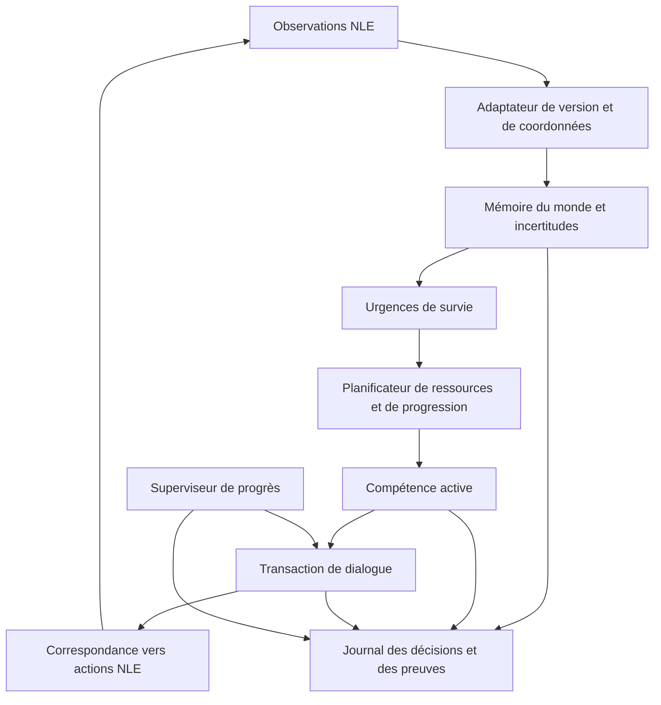

# BotHack Python : ascensions vérifiées et transfert vers NetHack 3.6.x / NLE

**Auteur : Codex, assistant OpenAI basé sur GPT-6.**  
**Date de l’audit : 16 septembre 2026, UTC.**  
**Document rédigé dans `new_bothack/codex_3/doc/`.**

Ce document répond à la demande de Roro : vérifier les ascensions du port Python situé dans `new_bothack/claude`, expliquer le travail qui les a rendues possibles et proposer une méthode concrète pour réutiliser ce savoir afin d’obtenir au moins une ascension sur une cible NetHack 3.6.x accessible par NLE, avec un équipement initial avantageux.

Je suis l’auteur de cet audit et de ces propositions, pas l’auteur du BotHack original ni du port examiné. BotHack est le projet de krajj7 ; le port Python examiné est le travail conservé dans le répertoire `claude`. Le prototype `bothack_new` de `codex_3` est un autre programme : il ne faut pas lui attribuer les victoires de `pybothack`.

Les expressions **vérifié**, **documenté historiquement**, **déduction** et **proposition** distinguent ci-dessous la nature des affirmations. J’ai inspecté les fichiers, le code et des sources officielles ; je n’ai pas relancé une ascension, les 1 821 tests différentiels annoncés ou une campagne de parties. Les propositions ne constituent pas un port NLE déjà implémenté.

## Sommaire

1. [Verdict et décisions principales](#1-verdict-et-décisions-principales)
2. [Preuves des deux ascensions](#2-preuves-des-deux-ascensions)
3. [Quelle version cible-t-on réellement ?](#3-quelle-version-cible-t-on-réellement-)
4. [Comment le port a été construit et validé](#4-comment-le-port-a-été-construit-et-validé)
5. [Ce que les victoires nous apprennent](#5-ce-que-les-victoires-nous-apprennent)
6. [Le patrimoine réutilisable](#6-le-patrimoine-réutilisable)
7. [Les incompatibilités qui peuvent condamner le transfert](#7-les-incompatibilités-qui-peuvent-condamner-le-transfert)
8. [Équipement initial : avantages et limites](#8-équipement-initial--avantages-et-limites)
9. [Architecture proposée](#9-architecture-proposée)
10. [Stratégie complète jusqu’à l’ascension](#10-stratégie-complète-jusquà-lascension)
11. [Programme de validation et d’expérimentation](#11-programme-de-validation-et-dexpérimentation)
12. [Optimisations et organisation des campagnes](#12-optimisations-et-organisation-des-campagnes)
13. [Ordre de travail recommandé](#13-ordre-de-travail-recommandé)
14. [Sources, limites et commandes de vérification](#14-sources-limites-et-commandes-de-vérification)

## 1. Verdict et décisions principales

**Oui : les artefacts locaux attestent deux ascensions de NetHack 3.4.3, le 14 septembre 2026.** Elles sont conservées dans le projet du port Python `claude`, pour les personnages `vp6` et `vp2`. Les deux enregistrements terminal contiennent l’offrande de l’Amulette et l’ascension ; leurs noms, scores et horaires concordent avec les entrées `death=ascended` du journal NetHack.

Le README et plusieurs documents du port disent encore « aucune ascension ». Ils décrivent des états antérieurs aux preuves du 14 septembre. Il faut dater leurs affirmations : une ancienne absence de victoire n’invalide pas un résultat plus récent.

**La conclusion pour le transfert est favorable, avec une condition majeure : réutiliser les compétences et l’architecture de décision, puis remplacer les hypothèses propres à 3.4.3.** Copier le programme tel quel vers 3.6.x cumulerait des problèmes de protocole, de représentation et de stratégie.

Les premières décisions recommandées sont les suivantes :

| Décision | Pourquoi elle compte |
| --- | --- |
| Identifier exactement le moteur demandé | NLE historique utilise 3.6.6 ; le NLE maintenu et vos sources locales examinées utilisent 3.6.7. La 3.6.3 reste une cible distincte. |
| Conserver une référence 3.4.3 immuable | Elle sert à comprendre et tester les compétences originales sans perdre la version qui a produit les preuves. |
| Adapter `pybothack` plutôt que repartir du prototype minimal | Le port contient déjà les comportements de quête, d’invocation et de fin de partie. |
| Remplacer le farming par une préparation explicite | Les ressources obtenues par la ferme ne peuvent pas être supposées disponibles en 3.6.x. |
| Refaire la tactique Elbereth | Des comportements effectivement utilisés sur l’Astral en 3.4.3 ne protègent plus le personnage en 3.6.3. |
| Créer d’abord une cible unique : Valkyrie naine loyale | Les preuves et les compétences du port soutiennent ce choix ; généraliser tous les rôles disperserait l’effort. |
| Tester la fin de partie avant les grandes campagnes | Un bot qui survit longtemps mais ne sait pas offrir l’Amulette a une probabilité de victoire nulle. |

La bonne unité de transfert est une **compétence avec préconditions, effets observables et récupération**, par exemple « traverser un plan », « obtenir la Cloche », « réparer une malédiction ». Une suite de touches enregistrée est une preuve utile, mais n’est pas une compétence portable.

## 2. Preuves des deux ascensions

### 2.1 Résultats relevés

Source principale : [asc.xlog](../../claude/artifacts/ASCENSION/tmp/asc.xlog). Le [fichier record](../../claude/artifacts/ASCENSION/tmp/asc.record) donne également les deux résultats.

| Champ | Première partie | Deuxième partie |
| --- | --- | --- |
| Personnage | `vp6` | `vp2` |
| Enregistrement | `artifacts/vast/game30/game.ttyrec` | `artifacts/vast/game49/game.ttyrec` |
| Version déclarée par NetHack | 3.4.3 | 3.4.3 |
| Personnage | Valkyrie, naine, femme, loyale | Valkyrie, naine, femme, loyale |
| Résultat moteur | `death=ascended` | `death=ascended` |
| Score final | 16 813 686 | 18 738 500 |
| Tours | 72 121 | 90 023 |
| Profondeur maximale enregistrée | 50 | 48 |
| PV finaux / maximum | 261 / 284 | 268 / 268 |
| Début, UTC | 14/09/2026 09:21:10 | 14/09/2026 09:30:29 |
| Fin, UTC | 14/09/2026 16:53:01 | 14/09/2026 17:14:34 |
| Durée `realtime` du journal | 27 110 s, soit 7 h 31 min 50 s | 27 845 s, soit 7 h 44 min 05 s |
| Drapeaux du journal | `flags=0x0` | `flags=0x0` |

Le premier intervalle entre timestamps vaut 27 111 secondes, soit une seconde de plus que `realtime` ; ce n’est pas une discordance significative. Les timestamps des ttyrecs concordent avec les débuts et fins du journal à moins de deux secondes.

Le code local NAO de `src/topten.c`, fonction `encode_xlogflags`, attribue `0x001` au mode wizard et `0x002` au mode explore. **Les deux entrées ne signalent aucun de ces modes.** `uid=0` est l’identité du processus sur la machine d’exécution ; cela ne signifie pas « wizard ».

### 2.2 Contrôle direct des enregistrements

J’ai parcouru la structure binaire des deux ttyrecs : en-têtes de 12 octets, longueurs des données et horodatages. Aucun en-tête ou bloc tronqué n’a été trouvé. Puis j’ai recherché les messages dans les données terminal concaténées et rapproché les résultats du journal.

| Vérification | `game30` | `game49` |
| --- | --- | --- |
| Taille du fichier | 114 666 271 octets | 135 955 831 octets |
| Nombre de trames | 684 756 | 808 475 |
| Offrande de l’Amulette à Tyr observée | oui | oui |
| Message d’ascension en Demigoddess observé | oui | oui |
| Écran final avec le bon personnage | `vp6` | `vp2` |
| Score final concordant | oui | oui |
| Horaires concordants | oui | oui |

Les empreintes SHA-256 calculées pendant cet audit sont :

```text
game30/game.ttyrec
c98ba8158325450a2ac09f3bc97cb923b703344e6f6945bd5ed2a9da7632379c

game49/game.ttyrec
ca2c8077d5448e039a61aa7f4de9b9b6cebd402302e1b692b545dd7f198a4a69
```

Le détail machine de ces vérifications, les empreintes des pièces annexes et des extraits de fin sont conservés dans [AUDIT_ASCENSIONS_2026-09-16.json](AUDIT_ASCENSIONS_2026-09-16.json).

Attention à l’archivage : `ascension.tgz` contient le ttyrec de `game30`, les résultats et les messages de cette première capture, mais **pas le ttyrec de `game49`**. La seconde vidéo est un fichier séparé. Sauvegarder uniquement l’archive ne sauvegarde donc pas les deux victoires.

### 2.3 Ce que l’on peut affirmer, et ce qui manque encore

**Établi par les pièces examinées :** deux parties ont atteint l’ascension ; les journaux et vidéos concordent ; elles sont enregistrées comme des parties sans wizard ni explore ; elles sont conservées dans le projet `pybothack` et ses outils de visualisation les présentent comme les ascensions de la campagne du port.

**Attribution fortement étayée, mais traçabilité incomplète :** les scripts du projet lancent `python3 -m pybothack.main`, et le runtime inspecté contient bien le décideur Python. Toutefois, les sous-répertoires locaux des deux vidéos ne contiennent pas les `run.log`, configurations et manifestes complets de leurs processus distants. Un ttyrec classique enregistre la sortie du terminal ; il ne prouve pas à lui seul qui a envoyé chaque touche. Je ne transforme donc pas la présence des vidéos en preuve forensique exhaustive d’absence d’intervention humaine.

Pour certifier intégralement la provenance, il faudrait aussi archiver le code exact exécuté, son diff éventuel, le binaire et ses empreintes, les options, l’environnement du lancement, les logs de décisions et si possible les entrées terminal. Le binaire local actuel ne suffit pas à identifier rétroactivement celui de la machine distante.

**Non établi :** un taux d’ascension global. `game30` et `game49` sont des identifiants ; ils ne constituent pas un dénominateur expérimental. Il serait incorrect d’annoncer « deux victoires sur 49 » sans le relevé complet des parties de cette campagne, y compris les plantages et abandons.

L’erreur d’écriture de dumplog visible après la victoire de `vp6` ne retire pas l’ascension : le journal et la vidéo la montrent. Elle illustre en revanche pourquoi il faut conserver plusieurs pièces de preuve.

## 3. Quelle version cible-t-on réellement ?

### 3.1 La confusion 3.6.3 / NLE doit être levée techniquement

La demande désigne « NetHack 3.6.3, celle de NLE ». Les sources consultées montrent une autre situation :

| Cible | Constat | Conséquence |
| --- | --- | --- |
| Port `claude/pybothack` | NetHack 3.4.3 avec patches NAO | Référence gagnante disponible. |
| NLE historique `facebookresearch/nle` | Base NetHack 3.6.6 | Une victoire ici ne doit pas être étiquetée 3.6.3. |
| NLE maintenu `NetHack-LE/nle` | Base NetHack 3.6.7 | C’est aussi la version des sources locales examinées du projet Minetown. |
| NetHack exactement 3.6.3 | Tag officiel disponible | Cible possible, mais son intégration NLE exacte reste à identifier ou à construire. |

Sources officielles : [NLE historique](https://github.com/facebookresearch/nle), [NLE maintenu](https://github.com/NetHack-LE/nle), [NetHack 3.6.3 officiel](https://github.com/NetHack/NetHack/tree/NetHack-3.6.3_Released).

Dans `/home/roro/work/projects/super_nethack/run_10.06.26/gpt_5.6/vendor/nle/include/patchlevel.h`, j’ai lu `VERSION_MAJOR=3`, `VERSION_MINOR=6`, `PATCHLEVEL=7`. Le README du projet et le patch `nle-367-minetown.patch` sont cohérents avec cette version. Cela identifie les sources de ce checkout ; l’environnement Python effectivement chargé doit encore être contrôlé au lancement.

Le fichier de test `nle/tests/altorg/xlogfile.nh363` trouvé dans ces sources est un exemple de données historiques. Son nom ne définit pas la version du moteur NLE installé.

### 3.2 Deux objectifs à garder distincts

**Objectif A : obtenir une ascension avec un bot utilisant NLE.** Recommandation pratique : partir du NLE maintenu déjà présent localement, figer sa révision, garder le kit explicitement choisi et porter les compétences vers 3.6.7.

**Objectif B : obtenir exactement une ascension NetHack 3.6.3.** Respecter alors cette contrainte : identifier un fork NLE fondé sur 3.6.3 ou établir le travail nécessaire pour y adapter l’interface. Le protocole terminal peut aussi servir de banc de validation 3.6.3, mais ne doit pas être présenté comme une intégration NLE accomplie.

Je ne remplace pas silencieusement B par A. Ce document étudie les changements cruciaux directement dans le code officiel **3.6.3**, et propose une architecture où les versions sont explicites. Le choix final du moteur n’empêche pas de préparer les compétences et les tests.

### 3.3 Le contrat d’environnement à conserver

Avant une campagne, produire un manifeste contenant :

```text
identifiant du run
version et commit du moteur NetHack
version et commit NLE, chemin du module Python chargé
empreinte du binaire ou de la bibliothèque moteur
patches appliqués, notamment le kit de départ
commit et diff du bot
personnage, options NetHack, statut wizard/explore
observations autorisées, actions disponibles
limites en pas NLE, tours du jeu et temps réel
politique concernant seeds, bones et sauvegardes
critère de victoire et provenance de ce signal
```

Le numéro de version du paquet Python NLE et celui du moteur NetHack sont deux informations différentes. Il faut enregistrer les deux.

## 4. Comment le port a été construit et validé

### 4.1 Le point de départ : un bot symbolique complet

BotHack est un framework et un ensemble de comportements écrits principalement en Clojure, avec des composants JVM. Le port ne consiste pas à demander à un modèle de langage de choisir chaque déplacement. Il traduit une politique symbolique : observer, mettre à jour la mémoire du monde, choisir le comportement prioritaire admissible, exécuter une action et traiter ses réponses.

Le projet original rapporte une première ascension en janvier 2015 après l’ajout du pudding farming. C’est l’historique de l’auteur du bot, distinct des campagnes Python de 2026. [Source : dépôt BotHack](https://github.com/krajj7/BotHack).

Le document local [PORT.md](../../claude/docs/PORT.md) décrit une traduction module par module. L’inspection du point d’entrée, de la boucle et du `mainbot` Python est cohérente avec cette description : les décisions ne sont pas déléguées au Clojure à chaque tour. Les outils JVM servent notamment d’oracle de comparaison et d’extracteur de données.

### 4.2 Les couches reconstruites

| Couche | Fichiers de `claude/pybothack` | Travail réalisé |
| --- | --- | --- |
| Transport et terminal | `iface.py`, `term.py`, `frame.py` | PTY/telnet, ttyrec, écran et attributs. |
| Dialogues | `scraper.py`, `delegator.py`, `handlers.py` | Classification des prompts, menus, priorités et ordre des événements. |
| Actions | `action.py`, `actions.py` | Transformation des intentions en commandes et réponses. |
| Mémoire du monde | `game.py`, `player.py`, `dungeon.py`, `level.py`, `tile.py` | Personnage, niveaux, cases et événements. |
| Objets et monstres | `item.py`, `itemtype.py`, `itemid.py`, `monster.py`, `montype.py` | Identification, propriétés, menaces et inventaire. |
| Navigation | `pathing.py`, `fov.py`, `sokoban.py` | Exploration, trajets et résolution de niveaux spécifiques. |
| Stratégie | `behaviors.py`, `bots/mainbot.py` | Survie, préparation, branches, farming et ascension. |
| Compatibilité Clojure | `clj.py`, fonctions de hash dans `util.py` | Sémantique des collections et choix déterministes. |

Les grosses tables ont été extraites de l’original plutôt que retapées : objets, monstres, plans de niveaux, solutions Sokoban et données de hash. C’est un gain de fidélité considérable pour **la même version**. Ces tables ne deviennent pas pour autant correctes pour toutes les versions futures.

### 4.3 Pourquoi traduire la syntaxe ne suffisait pas

Les documents du port relatent plusieurs classes de divergences particulièrement instructives :

* Les dictionnaires et ensembles Clojure ne sont pas parcourus dans l’ordre des `dict` et `set` Python. Un ordre différent change le monstre inspecté, la pile sélectionnée ou le trajet choisi.
* Le delegator Clojure met certains événements en file ; les rendre immédiatement synchrones peut réinitialiser le scraper au mauvais moment.
* Une erreur d’assertion n’a pas la même place dans la hiérarchie des exceptions Java et Python. Une erreur qui devait arrêter un traitement pouvait être silencieusement avalée.
* Les états précédents doivent rester valides. Une mutation en place d’un inventaire ou d’une carte peut rendre fausse toute détection de changement.
* Les lectures terminal par morceaux participent au protocole. La même sortie présentée avec d’autres frontières de lecture peut produire d’autres décisions.
* Les valeurs absentes, les égalités, les ex æquo et les appels à l’aléatoire influencent les cas rares autant que les cas ordinaires.

Leçon pour le futur : isoler la compatibilité nécessaire à la référence historique, puis adopter dans le nouveau bot des règles déterministes explicites. Reproduire les hashes Clojure reste utile pour diagnostiquer un port fidèle ; ce n’est pas une obligation stratégique pour gagner en 3.6.x.

### 4.4 La méthode de validation accumulée

Le projet a combiné trois niveaux de preuve :

1. **Tests différentiels de fonctions** : présenter le même état au Python et à un oracle original, comparer les résultats. Les documents annoncent 1 821 cas identiques ; ce nombre n’a pas été remesuré pendant cet audit.
2. **Rejeu de sorties originales** : injecter des captures au port et comparer les touches qu’il produit. Les rapports conservés de `artifacts/gate_v2` permettent de recompter 15 captures et 1 182 022 octets de préfixe identique au total.
3. **Parties réellement jouées** : le bot choisit les actions qui modifient un vrai NetHack, et les fins sont examinées. Les vidéos de septembre ajoutent enfin la preuve que le parcours peut atteindre une victoire.

Les 15 rapports historiques se répartissent en six `PASS_COMPLETE`, huit `PREFIX_ONLY` et un `PASS_CAPTURE`. Une capture limitée par le temps reste un préfixe, même si chacun de ses octets est reproduit. Les victoires du 14 septembre ne sont pas, à elles seules, une extension du corpus différentiel à l’ascension entière.

Le README rapporte aussi une revérification ultérieure de 13 captures sur 15, soit 842 549 octets, après certaines corrections. Ces mesures sont attachées à leurs états du code respectifs ; « tout passait le 10 septembre » ne signifie pas « tout a été relancé aujourd’hui sur le code des victoires ».

### 4.5 Les parties longues ont trouvé ce que les tests courts manquaient

Les [limitations](../../claude/docs/LIMITATIONS.md) et [résultats](../../claude/docs/RESULTS.md) décrivent notamment :

| Défaut historique | Effet | Leçon à transférer |
| --- | --- | --- |
| Récupération idle absente ou mal traduite | Bot vivant, mais bloqué sur un prompt | Tester la récupération réelle, pas seulement l’action normale. |
| Confusion entre deux fonctions d’unpause | Les ESC nécessaires n’étaient pas envoyés | Vérifier le chemin appelé dans l’original avant de qualifier une différence d’amélioration. |
| Compteur de blocage remis à zéro à chaque cycle | Une limite annoncée ne se déclenchait jamais | Détecter le manque de progrès à travers plusieurs états du protocole. |
| Exceptions lors des inspections de monstres | Connaissance des menaces incomplète | Les exceptions avalées doivent être comptées et reliées aux observations. |
| Seuil de fin de farming inventé | Stratégie différente de l’original | Séparer fidélité, correction de bug et changement volontaire de politique. |
| Bug apparaissant très loin dans une capture | Corpus court rassurant mais insuffisant | Couvrir les durées longues et les compétences tardives. |

Les chiffres historiques de pertes par blocage décrivent les anciennes campagnes. Ils expliquent pourquoi la fiabilité de l’infrastructure comptait autant ; ils ne sont pas des taux de panne mesurés pour le code gagnant.

### 4.6 Les campagnes ont rendu les longues parties possibles

`tools/ascend_pool.sh` remplit des slots de jeu avec le port Python et relance une partie quand un slot se libère. Les noms distincts réduisent les collisions sur les fichiers de niveau. La détection de victoire consulte le xlogfile du moteur.

Le paramètre `--seed` passé au bot et l’éventuel `NETHACK_FIXED_SEED` du lanceur ne sont pas la même chose : l’un configure l’aléatoire de décision Python ; l’autre peut activer une interception de l’aléatoire du jeu pour les comparaisons. Le manifeste doit préciser les deux.

La campagne distante est documentée dans [VAST.md](../../claude/docs/VAST.md), mais certains chiffres de vitesse concernent des campagnes courtes et ne décrivent pas les deux parties gagnantes de plus de sept heures. Une estimation de coût doit partir de mesures de la politique et du moteur cibles.

## 5. Ce que les victoires nous apprennent

### 5.1 Le port contient un parcours de fin de partie utilisable

Une ascension confirme qu’au moins une trajectoire a réuni et utilisé les moyens nécessaires : progression dans les branches, objets d’invocation, récupération de l’Amulette, remontée et offrande sur l’Astral. Le code contient les comportements correspondants, dont `invocation`, `detect_portal`, `hunt` et `offer_amulet`.

Ce capital est beaucoup plus précieux qu’un bot qui ne fait qu’explorer les premiers niveaux. Le [HANDOFF de codex_3](../HANDOFF.md) décrit au contraire un prototype encore centré sur la survie initiale, sans stratégie complète d’ascension. Pour l’objectif présent, repartir de ce prototype imposerait de reconstruire les compétences les plus difficiles.

### 5.2 Le succès reposait sur des ressources abondantes

Les écrans finaux inspectés donnent des indications concrètes :

| Ressource ou résultat | `vp6` | `vp2` |
| --- | --- | --- |
| Souhaits utilisés | 8 | 13 |
| Types de monstres génocidés | 19 | 14 |
| Niveau d’expérience final | 25 | 30 |
| Artefacts affichés au bilan | Excalibur et Orb of Fate | Excalibur et Orb of Fate |
| Amulettes de life saving affichées au bilan | 3 | 5 |

Ces nombres sont des lectures du bilan, pas une reconstitution de l’origine de chaque objet. En particulier, ils ne prouvent pas que tous les souhaits venaient du farming ni que toutes les amulettes avaient été portées.

**Déduction stratégique :** une armure de départ avantageuse ne reproduit pas tout le budget de ressources d’une telle victoire. Le port peut prendre des risques rendus supportables par une réserve de souhaits, de soins et de suppressions de menaces que le nouveau jeu ne fournira pas aussi facilement.

### 5.3 Le score élevé ne mesure pas directement la préparation

Dans `mainbot.py`, `farm_done` contient notamment des seuils de score supérieurs à six et quinze millions, avec des conditions de ressources pour le premier. La progression réutilise ce prédicat ailleurs.

Ce système peut fonctionner comme indicateur indirect de récolte en 3.4.3. Il serait dangereux d’en faire un prérequis universel : avec un kit donné au départ, le personnage peut avoir les protections voulues sans ces points ; en 3.6.x, il peut aussi accumuler des tours sans jamais reproduire les ressources de la ferme.

Le remplacement doit porter sur **tous les consommateurs du prédicat**, pas uniquement sur l’appel qui lance la ferme. Une recherche de `farm_done`, `farming`, `farm_*`, des seuils de score et des marqueurs de gravure est une étape obligatoire.

### 5.4 Une victoire suffit au premier objectif, pas à une généralisation

Deux trajectoires réussies permettent d’affirmer que le port a atteint le but. Elles ne garantissent ni toutes les variantes de niveau, ni tous les inventaires, ni un taux de réussite élevé.

Pour la future cible, conserver deux objectifs séparés : **première ascension attestée dans le protocole choisi**, puis **taux de réussite sur un lot indépendant**. Cette séparation évite de retarder indéfiniment une première victoire tout en empêchant de la présenter comme une robustesse générale.

## 6. Le patrimoine réutilisable

### 6.1 Ce qu’il faut reprendre en priorité

| Élément | Réutilisation envisagée | Travail indispensable |
| --- | --- | --- |
| Hiérarchie de comportements | Forte | Rendre les priorités d’urgence et les préconditions explicites. |
| Graphe de branches et objectifs | Forte | Vérifier les accès, identités et variantes 3.6.x. |
| Connaissance des objets | Forte au niveau conceptuel | Régénérer les données et contrôler les règles modifiées. |
| Identification sous incertitude | Forte | Corriger volontairement les défauts historiques ; distinguer apparence et identité. |
| Inventaire et équipement | Forte | Intégrer le kit initial, la disponibilité réelle et la perte de protections. |
| Actions multi-étapes | Forte | Réécrire leur exécution pour NLE et ses menus. |
| Navigation/exploration | Moyenne à forte | Adapter coordonnées, cartes, obstacles et risques. |
| Solutions et plans spéciaux | Conditionnelle | Reconnaître la variante avant d’appliquer un plan. |
| Combat et retraite | Conditionnelle | Recalculer la sécurité sans l’ancien Elbereth ni la ferme. |
| Farming de puddings | Faible pour l’objectif 3.6.x | Remplacer le mécanisme économique et ses critères de sortie. |
| Synchronisation PTY `lastmsg` | Faible dans NLE direct | Conserver les leçons de robustesse, simplifier le protocole. |
| Bancs de tests et dossiers de preuves | Très forte | Construire l’équivalent pour les observations et règles cibles. |

### 6.2 Construire un catalogue de compétences

Pour chaque comportement repris, rédiger une fiche courte :

```text
nom : traverser une zone d’eau
intention : atteindre une cible sans perdre le personnage ni les objets critiques
préconditions : capacité adaptée disponible et utilisable ; sortie identifiée
état mémorisé : source de mobilité, état de malédiction, durée si temporaire
action suivante : une transaction contrôlée
succès : position atteinte et état sûr confirmé
échec : activation refusée, objet perdu, prompt inattendu, obstacle nouveau
repli : interrompre le trajet et rejoindre une case sûre si possible
tests : nominal, objet maudit, objet retiré, menu modifié, ennemi adjacent
```

Ce format permet de récupérer le savoir sans recopier des coordonnées ou des hypothèses invisibles. Il donne aussi une unité raisonnable pour comparer ancienne et nouvelle implémentations.

### 6.3 Exploiter les replays comme corpus de situations

Les deux ttyrecs peuvent fournir des observations de fin de partie : entrée dans les plans, inventaire, menaces, identification d’autels et messages d’offrande. Il faut les segmenter et les annoter avant d’en tirer des fixtures.

Une capture visuelle ne donne pas automatiquement l’état interne de croyance du bot. Sans journal d’actions complet, on ne peut pas prétendre reconstruire exactement chaque motif de décision. Le meilleur corpus futur enregistrera ensemble observation, intention, commande, réponse et changement d’état.

Pour transférer entre versions, comparer des **propriétés** : « ne pas franchir l’eau sans moyen sûr », « ne pas offrir sur un autel non identifié », « ne pas abandonner la Cloche ». Exiger les mêmes touches ou le même parcours de cases serait souvent une mauvaise métrique.

## 7. Les incompatibilités qui peuvent condamner le transfert

### 7.1 Elbereth : la tactique ancienne doit être réécrite

Le code officiel 3.6.3 `onscary` exclut la protection Elbereth en Gehennom et dans les plans de fin de partie. Il vérifie aussi la position du héros ou de son image déplacée, ainsi que les exceptions des monstres concernés. [Source : monmove.c 3.6.3](https://github.com/NetHack/NetHack/blob/NetHack-3.6.3_Released/src/monmove.c).

Le contrôle strict de gravure exige le mot intact comme contenu entier. Les anciennes concaténations et le marqueur `Elbereth*` utilisé par le farming ne peuvent donc pas être assimilés à une protection valide. [Source : engrave.c 3.6.3](https://github.com/NetHack/NetHack/blob/NetHack-3.6.3_Released/src/engrave.c).

Le code d’attaque et les notes de version documentent aussi la suppression de protection et la pénalité d’alignement dans les situations d’attaque concernées. Il faut tester les conditions précises, plutôt que conserver le cycle « graver, attaquer, regénérer ». [Source : uhitm.c 3.6.3](https://github.com/NetHack/NetHack/blob/NetHack-3.6.3_Released/src/uhitm.c).

La trace `asc_toplines.txt` montre justement des écritures répétées, des gravures concaténées et des combats sur l’Astral. Cela établit un conflit concret entre la trajectoire victorieuse ancienne et les règles cibles.

**Correction proposée :** une fonction de capacité `elbereth_applicable(state, threat)` propre à la version ; une utilisation de répit ou de fuite, avec lecture du résultat ; interdiction de considérer cette défense comme disponible dans les branches exclues. La stratégie tardive doit fonctionner même quand elle retourne toujours faux.

**Tests essentiels :** gravure correcte, gravure abîmée, texte concaténé, monstre non affecté, branche interdite, déplacement du héros et attaque depuis la case. Le résultat attendu est une décision adaptée, pas seulement l’envoi de la commande de gravure.

### 7.2 Farming : on perd une économie, pas seulement une astuce

En 3.6.3, les puddings produisent des globs, et le code de mort exclut les monstres clonés du tirage de trésor aléatoire concerné. Ces changements attaquent directement l’hypothèse de production répétée de ressources. [Source : mon.c 3.6.3](https://github.com/NetHack/NetHack/blob/NetHack-3.6.3_Released/src/mon.c).

**Proposition : désactiver cette ferme pour le premier transfert.** Ce choix évite de consacrer le projet à sauver une économie conçue pour l’ancienne version. Il ne signifie pas qu’aucune exploitation ou récolte n’est possible en 3.6.x ; il signifie que la première ascension ne doit pas dépendre d’un mécanisme non validé.

Remplacer `farm_done` par des critères par étape : `ready_for_castle`, `ready_for_quest`, `ready_for_gehennom`, `ready_for_planes`. Auditer simultanément les décisions d’achat, les souhaits, les réserves de soins, les génocides attendus et les détours de préparation.

### 7.3 Un kit favorable peut provoquer des décisions défavorables

Un bot qui attend toujours quinze millions de points peut ignorer un équipement déjà suffisant. À l’inverse, un bot qui voit seulement une excellente AC peut descendre trop tôt sans résistance au poison, sans mobilité ou sans remède.

Le kit doit initialiser les capacités réellement connues et utilisables. Sa possession ne suffit pas : un objet peut être dans un sac, non porté, maudit, sans charges ou incompatible avec un autre équipement.

### 7.4 Interface NLE : une observation structurée ne supprime pas les dialogues

NLE fournit des tableaux tels que `glyphs`, `blstats`, les informations d’inventaire et des observations terminal. Cela évite une partie de l’émulation ANSI et des lectures PTY. Mais les menus, choix de direction, confirmations et saisies de texte restent des états à traiter.

Une action Gym/NLE est un **indice dans la liste d’actions de l’environnement**, pas nécessairement le code ASCII de la touche. Il faut construire la correspondance à partir de `env.unwrapped.actions`, dans la version retenue, puis tester les commandes étendues, les lettres d’inventaire et la saisie des souhaits.

Les options `allow_all_yn_questions`, `allow_all_modes` et le traitement automatique des `--More--` peuvent changer ce que le bot voit. Un wrapper configuré pour une tâche courte peut avaler une interaction attendue par BotHack. [Sources locales : NLE `nle/env/base.py` et `nle/env/tasks.py` du checkout examiné.]

### 7.5 Coordonnées, glyphes et mémoire : trois sources de faux états

Le BotHack terminal utilise des coordonnées incluant les lignes de l’écran. Les tableaux de carte NLE n’incluent pas nécessairement ces lignes et sont indexés `[y, x]`. Une conversion unique, documentée et testée doit relier carte, personnage, curseur et menus.

Les identifiants numériques des objets, monstres et glyphes dépendent du moteur compilé. Ne pas réutiliser les numéros issus des dumps 3.4.3. Préférer une couche qui transforme les constantes du moteur cible en identifiants sémantiques internes.

Enfin, le fait qu’une case soit représentée n’implique pas qu’elle soit actuellement observée. Conserver la distinction entre vu maintenant, mémorisé, inféré et inconnu. Les ennemis invisibles, l’hallucination, les mimics et les changements de niveau doivent avoir des tests spécifiques.

### 7.6 Plans de niveaux : les coordonnées codées en dur sont dangereuses

`castle_plan_b` emploie des positions explicites comme `(13, 12)` ; d’autres comportements inspectent des cases particulières de niveaux spéciaux. Ce n’est pas une faute dans une cible étroitement contrôlée, mais c’est une dépendance de version.

Inventorier les plans de Mines, Sokoban, Méduse, Château, Quête, Sanctum et tours. Comparer les fichiers `dat/*.des` du moteur cible aux plans connus ; reconnaître une variante par plusieurs indices ; prévoir un chemin générique ou un arrêt de compétence explicite si la signature ne correspond pas.

Une branche ne doit jamais être reconnue uniquement par la profondeur. Les jonctions varient ; l’identité du niveau doit combiner les informations disponibles et la mémoire du graphe.

### 7.7 Conditions mortelles que l’AC ne résout pas

La politique de survie doit traiter séparément faim, maladie, pétrification, sliming, noyade, paralysie, perte de mobilité et pertes de protections. Les détails de remède et de délai doivent être tirés de la version cible et testés.

Un seuil unique « soigner sous 30 % PV » est insuffisant. Une attaque dangereuse peut tuer ou rendre impuissant avant la prochaine décision. Les actions doivent considérer la menace, la vitesse, le nombre d’ennemis, le temps de préparation et les moyens d’évasion.

Cas typique : disposer d’une potion dans un sac ne vaut pas disposer d’un remède immédiatement utilisable. Sortir l’objet, répondre au menu puis le consommer peut demander plusieurs interactions et, selon l’action, plusieurs tours.

### 7.8 Quête, alignment et réputation

Un rôle équipé reste soumis aux conditions de sa quête. Le port utilise déjà des préconditions de niveau et d’équipement ; il faut y adjoindre la vérification des réponses du chef et de l’alignement acquis.

Les attaques sur pacifiques, certaines utilisations d’Elbereth et les erreurs de boutique peuvent dégrader une partie pourtant très bien équipée. Pour une première ascension, je recommande une politique conservatrice envers pacifiques, prêtres et commerçants, avec exceptions explicites seulement si leur bénéfice a été validé.

### 7.9 Mauvais critère de fin : le bot peut « réussir » sans gagner

Un environnement Minetown, Staircase ou Oracle termine sur un sous-objectif. Il ne convient pas tel quel à une ascension complète. De même, `terminated`, `done`, un score élevé ou un code processus zéro ne veulent pas dire victoire.

Le NLE local inspecté expose `info['is_ascended']` via `how_done() == nethack.ASCENDED`. Cette interface doit être vérifiée pour la version figée. Le verdict final doit croiser un signal moteur, l’identité de la partie et les traces terminal ; les interruptions par limite doivent rester des troncatures.

### 7.10 Risques de campagne déjà visibles dans les outils

Le pool historique cherche `death=ascended` dans un xlogfile partagé. Une ancienne victoire peut donc arrêter une nouvelle campagne si le journal n’est pas isolé ou filtré. Son succès ne doit pas être attribué à un run par simple recherche globale.

Les noms de joueur réutilisés et le rapprochement par fenêtre de temps sont pratiques mais fragiles. Préférer un identifiant unique, un répertoire moteur isolé et un manifeste de début. Conserver les processus enfants jusqu’à une fin contrôlée et rattacher chaque résultat à son lancement.

## 8. Équipement initial : avantages et limites

### 8.1 L’avantage réellement retrouvé dans les projets locaux

Le patch local [nle-367-minetown.patch](/home/roro/work/projects/super_nethack/run_10.06.26/gpt_5.6/patches/nle-367-minetown.patch) ajoute au départ Valkyrie une **gray dragon scale mail +2, bénie et graissée**. Le reste du départ décrit dans le README est standard, familier compris. Le patch ajoute aussi un signal d’évaluation Minetown, explicitement distinct des observations de la politique.

Cette pièce d’armure fournit une excellente base défensive et une source de résistance magique lorsqu’elle est portée. Elle ne remplace pas la réflexion, la résistance au poison, l’action libre, la mobilité sur l’eau ou les remèdes. La graisse ne doit pas être traitée comme une immunité permanente.

Je n’ai pas trouvé dans ce constat une autorisation générale de distribuer n’importe quel kit à la future cible. Le kit exact reste un paramètre du projet ; les propositions suivantes sont des choix d’expérimentation, pas des avantages déjà implémentés.

### 8.2 Trois protocoles utiles, à publier séparément

| Protocole | Départ | Utilité |
| --- | --- | --- |
| Référence locale stricte | Kit GDSM +2 identifié dans le patch | Mesurer le transfert avec l’avantage déjà documenté. |
| Départ renforcé déclaré | Ensemble précis d’objets choisi pour l’objectif | Augmenter les chances d’une première ascension, en publiant toutes les modifications. |
| Scénario de compétence | Position et ressources contrôlées près d’un obstacle | Déboguer Quête, invocation ou Astral rapidement ; ne compte pas comme partie complète. |

Une victoire avec équipement modifié reste une victoire dans cet environnement modifié. Elle ne doit pas être annoncée comme un benchmark NLE standard non modifié.

### 8.3 Choisir un kit par capacités

Si un kit plus large est souhaité, la question utile est « quel blocage supprime cet objet ? » :

| Capacité | Intérêt | Ce qu’il faut encore gérer |
| --- | --- | --- |
| Résistance magique | Réduit une famille de menaces graves | Préservation de la source et distinction avec réflexion. |
| Réflexion | Aide contre des attaques réfléchissables | Les autres dégâts et statuts restent possibles. |
| Mobilité adaptée | Permet certains passages et replis | Malédiction, durée, retrait et interaction avec le sol. |
| Vitesse | Améliore certaines marges tactiques | Ne garantit pas l’absence d’attaque avant la prochaine action. |
| Nourriture | Réduit les décès précoces et interruptions | Poids, renouvellement et ordre de consommation. |
| Soins et remèdes accessibles | Permettent la récupération | Bon remède, bon état, accès assez rapide. |
| Détection et navigation | Réduit les recherches coûteuses | Nombre d’utilisations, branche et incertitude. |
| Gestion de malédictions | Préserve équipement et objets critiques | Réserves, bénédiction et conditions d’usage. |

Ne pas fournir directement les objets de quête, d’invocation ou l’Amulette pour une campagne censée démontrer le parcours complet. Les réserver à des scénarios de test explicitement distincts si nécessaire.

### 8.4 Le familier est aussi une différence

Le `bothack.nethackrc` inspecté contient `pettype:none`. Les projets NLE Minetown décrivent un familier standard. La politique de déplacement doit donc éviter les attaques accidentelles et savoir gérer le passage, les échanges de place et la reconnaissance du familier.

Le rôle « nain loyal » peut faciliter certains passages des Mines ; il ne justifie pas de considérer tous les habitants comme pacifiques. Le statut observé du monstre prime sur une généralisation de race ou de glyphe.

## 9. Architecture proposée

### 9.1 Séparer interface, règles et compétences



Le `Ruleset` identifie la version, les données, les exceptions de combat, les plans compatibles et les interactions autorisées. L’adaptateur décrit ce qui est observable. Les compétences expriment comment agir avec ces informations.

Conserver initialement autant que possible l’interface d’état attendue par les comportements de `pybothack` réduit la réécriture. Ensuite seulement, remplacer les structures problématiques. Changer simultanément transport, modèle du monde et politique rendrait chaque divergence difficile à expliquer.

### 9.2 Deux étapes de portage de l’interface

**Étape transitoire :** utiliser les observations terminal NLE pour fournir des écrans cohérents aux parties récupérables du parseur. Cette voie teste vite les menus, mais ne rend pas automatiquement compatible le protocole `lastmsg` ni les options NAO.

**Étape cible :** lire position, état et carte depuis les observations structurées autorisées ; réserver le terminal aux messages, menus et confirmations. Cela réduit la dépendance aux marqueurs, aux couleurs personnalisées et au timing PTY.

Éviter un faux PTY complet qui réintroduirait les anciennes attentes dans une API synchrone. Une décision doit s’appuyer sur une observation copiée ou conservée correctement : si les tableaux sont réutilisés par l’environnement, un simple stockage de référence peut corrompre le « dernier état ».

### 9.3 Modèle explicite de capacités

Exemple de conception, pas API déjà présente :

```python
Capability(
    name="magic_resistance",
    source="worn_gray_dragon_scale_mail",
    confidence="observed_or_rule_derived",
    usable_now=True,
    loss_conditions={"removed", "destroyed", "transformed"},
)
```

Pour une ressource consommable, ajouter quantité connue, intervalle de charges si incertain, état de bénédiction et coût d’accès. Pour une propriété temporaire, stocker un intervalle de durée possible plutôt qu’une fausse certitude.

Le planificateur ne doit pas supposer qu’une résistance acquise au début existe encore après une polymorphie, un changement d’armure ou une perte d’objet. Tout événement pertinent invalide ou recalcule les capacités affectées.

### 9.4 Transactions robustes

Une action comme zapper une baguette est une transaction : sélectionner la commande, reconnaître le choix d’objet, choisir la lettre courante, reconnaître la direction, envoyer la direction puis interpréter le résultat.

À chaque étape : une attente explicite, une réponse admissible et une borne. Un prompt inattendu déclenche une resynchronisation contextualisée ; il ne faut ni continuer aveuglément la séquence prévue ni envoyer indéfiniment ESC.

La lettre d’inventaire peut changer après tri, perte, fusion ou ramassage. Une compétence garde l’identité logique de l’objet, puis résout sa lettre au moment de l’action.

### 9.5 Supervision sans abandon automatique des bonnes parties

Le superviseur distingue :

| Situation | Signal | Réaction proposée |
| --- | --- | --- |
| Dialogue normal | Étape attendue et réponse reçue | Continuer. |
| Calcul lent | Pile active dans navigation ou décision | Profiler, conserver la partie. |
| Prompt non compris | Écran stable, pas de transaction valide | Capturer, tenter une récupération bornée. |
| Boucle stratégique | Actions présentes, objectif inchangé | Invalider le plan et choisir une alternative. |
| Incapacité en jeu | État expliquant l’absence de contrôle | Attendre selon les règles, surveiller la survie. |
| Limite expérimentale | Budget atteint | Classer `truncated`, conserver les preuves. |

Un compteur de tours seul ne suffit pas : certaines commandes d’inspection ne font pas avancer le jeu. Un compteur de réponses seul ne suffit pas non plus : un protocole peut tourner sans produire d’action utile.

### 9.6 Observations autorisées et évaluation

NLE est naturellement partiellement observable. Une observation plus structurée n’autorise pas à lire directement les salles non vues, la position réelle des portails ou l’identité cachée d’un objet depuis les structures C.

Définir une liste explicite de canaux accessibles à la politique. Les signaux privés d’évaluation, comme le bit local `in_town`, doivent rester séparés. Le statut terminal d’ascension sert au verdict ; les détails privés du moteur ne doivent pas fournir artificiellement le plan de jeu.

Cette séparation protège aussi le développement : une compétence qui fonctionne uniquement avec l’état omniscient d’un test ne sera pas prête pour une vraie partie.

## 10. Stratégie complète jusqu’à l’ascension

### 10.1 Remplacer la préparation globale par des portes de progression

La stratégie proposée ne demande pas au bot d’être invulnérable avant d’avancer. Elle exige que les besoins de la prochaine étape soient satisfaits ou qu’une solution de repli crédible existe.

| Étape | Questions de préparation | Preuve de sortie |
| --- | --- | --- |
| Départ | Kit réellement porté ? nourriture ? arme ? familier reconnu ? | État initial et inventaire cohérents. |
| Exploration initiale | Retraite possible ? faim anticipée ? ennemis gérables ? | Accès aux branches et ressources utiles. |
| Mines / Sokoban | Récompense encore utile ? coût du détour acceptable ? | Ressource obtenue ou détour explicitement abandonné. |
| Château / Méduse | Mobilité, défense contre les menaces et solution de traversée ? | Passage sûr et ressources pertinentes récupérées. |
| Quête | Conditions du chef, équipement et tactique du nemesis ? | Cloche et artefact récupérés selon le parcours. |
| Gehennom | Ressources d’urgence, protections, navigation et objets critiques ? | Accès aux objectifs tardifs sans dépendance à Elbereth. |
| Invocation | Cloche, Livre, Candélabre et conditions d’utilisation satisfaites ? | Invocation effectivement reconnue par le jeu. |
| Sanctum | Accès, combat, récupération du bon objet ? | Vraie Amulette en possession confirmée. |
| Remontée | Itinéraire, stocks, gestion des vols et attaques ? | Entrée dans les plans avec l’Amulette. |
| Plans | Moyen propre à chaque plan et recherche du portail ? | Transition validée vers le plan suivant. |
| Astral | Autel correctement identifié, Amulette disponible, survie immédiate ? | Ascension confirmée par le moteur. |

### 10.2 Départ et économie initiale

Initialiser l’état depuis l’inventaire réel, contrôler l’équipement, puis appliquer une politique de survie simple et stable. Éviter de dépenser des dizaines de milliers de pas à rechercher une ressource déjà fournie par le kit.

La nourriture reste prioritaire : son absence peut condamner un personnage très bien protégé. Les décisions alimentaires doivent tenir compte des risques des cadavres, de leur fraîcheur connue, des régimes et des réserves. Une prière ne doit pas être la seule solution à un déficit permanent d’approvisionnement.

Excalibur est cohérente avec la Valkyrie loyale, mais sa recherche doit être conditionnelle. Si le kit fournit déjà une arme suffisante ou si la fontaine présente un risque disproportionné, le plan doit pouvoir poursuivre autrement.

### 10.3 Mines et Sokoban : objectifs utilitaires

Les connaissances de navigation et les solutions Sokoban sont réutilisables après validation des variantes. Elles doivent servir un besoin : mobilité, sac, réflexion ou autre ressource utile au plan retenu.

Ne pas parcourir mécaniquement toutes les branches par fidélité historique. Un kit peut rendre un détour inutile ; une ressource manquante peut au contraire le rendre indispensable. Mesurer le bénéfice en survie et en préparation, pas seulement en score.

Les anciens bots locaux Minetown fournissent des comportements d’exploration intéressants. Leur résultat s’arrête à un sous-objectif et ne démontre pas leur aptitude au milieu ou à la fin de partie.

### 10.4 Château, souhaits et préparation sans ferme

Le Château peut participer au budget de ressources. Le plan doit gérer plusieurs façons de franchir l’obstacle, avec vérification des variantes et interdiction des traversées supposées sûres sur une carte mal reconnue.

Un souhait répond d’abord à une capacité critique manquante. L’ordre dépend de l’inventaire réel : souhaiter une protection déjà portée gaspille une ressource ; privilégier un bonus d’armure au détriment d’une mobilité indispensable peut bloquer toute la partie.

Après chaque souhait, vérifier l’objet reçu, son état et son équipement. La génération textuelle de la demande n’est pas une preuve d’obtention. Les effets des charges, recharges et consommations doivent être modélisés pour le moteur cible.

### 10.5 Quête Valkyrie

Le code du port connaît déjà cette quête, ce qui favorise un premier transfert ciblé. Il faut tester séparément acceptation par le chef, navigation de la branche, tactique du nemesis, récupération et conservation des objets.

Conserver l’artefact de quête peut apporter des capacités utiles ; le nouveau modèle doit décrire leurs conditions réelles. Une propriété ne doit pas être déduite d’un simple nom si elle dépend du port, du rôle, du maniement ou d’une activation.

Un refus du chef est un événement de planification : le bot doit comprendre le type de condition manquante et repartir vers une action corrective, sans boucler sur le même dialogue.

### 10.6 Gehennom et objets d’invocation

Cette phase doit être entièrement jouable sans la protection Elbereth ancienne. Le bot prépare des replis, limite les combats inutiles et sait interrompre la progression pour restaurer une capacité perdue.

Les objets critiques ont un statut protégé dans la gestion d’inventaire : ne pas les vendre, abandonner, enfermer de manière dangereuse ou utiliser comme ressources ordinaires. Leur perte doit déclencher une recherche ciblée et une mise à jour du plan.

Le trajet doit identifier et traiter les branches nécessaires, puis la case vibrante et l’invocation. Les conditions exactes de la Cloche, du Livre, du Candélabre, des bougies et de leur séquence sont à extraire de `read.c`, `apply.c` et des comportements existants, puis à valider sur le moteur figé. Une simple liste « les trois objets sont présents » ne suffit pas.

### 10.7 Sanctum et vraie Amulette

L’objectif est la possession confirmée de la vraie Amulette, suivie d’une sortie viable. Prévoir les erreurs d’identification, les objets au sol, les menus multiples, les attaques et les vols.

Conserver un état d’objectif explicite : `amulet_not_found`, `amulet_confirmed`, `amulet_lost`, `recovering_amulet`. Sans cela, un bot peut continuer la remontée avec une croyance périmée.

Le nom visible seul ne doit pas être le seul moyen de distinguer les situations où l’objet reste incertain. Réutiliser les mécanismes de connaissance du port, en validant leurs observations sur la version cible.

### 10.8 Remontée

La remontée n’est pas le parcours inverse exécuté automatiquement. Les contraintes liées à l’Amulette, les ennemis et les vols modifient les conditions. Revalider chaque segment, maintenir des réserves et mettre à jour les routes après toute transition inattendue.

Le coût des combats inutiles devient particulièrement élevé : chaque consommation de soin ou de mobilité réduit la marge disponible pour l’Astral. La politique doit préférer un passage sûr et court lorsqu’il existe.

### 10.9 Plans élémentaires

Créer une compétence par plan, avec reconnaissance et préconditions propres. Tester les moyens de déplacement, les obstacles, les menaces et la détection du portail sur la version cible.

La détection doit rester fondée sur les informations accessibles au joueur. Une méthode qui marche dans un scénario parce que le test fournit directement les coordonnées du portail n’est pas un détecteur utilisable en campagne.

Les ressources de détection peuvent manquer ou échouer. Prévoir une exploration de secours bornée et une gestion de réserve ; ne pas conserver un plan qui suppose un consommable absent.

### 10.10 Astral et offrande

L’Astral est un objectif de passage et d’identification sous forte pression. Il faut savoir éviter les combats qui ne rapprochent pas d’un autel, gérer les ennemis spéciaux et interrompre une action pour une urgence immédiate.

Avant l’offrande : vérifier le niveau, la case d’autel, son alignement pertinent et la disponibilité de la vraie Amulette. Ensuite suivre la transaction jusqu’au message final et au statut moteur.

Le `offer_amulet` du port est enregistré avec une très forte priorité. Cette idée est bonne : quand les conditions exactes sont remplies, ne pas repousser la victoire pour trier le sac ou ramasser un objet. Il faut cependant tester ses préconditions dans le nouvel état NLE.

## 11. Programme de validation et d’expérimentation

### 11.1 Trois types de tests complémentaires

**Tests de contrat d’interface.** Vérifier les coordonnées, les indices d’action, les menus, l’inventaire, les conditions d’arrêt et la conservation des observations. Sans cela, un échec tactique apparent peut être une mauvaise touche.

**Scénarios de compétence.** Construire des situations contrôlées pour les règles dangereuses et les objectifs tardifs. Des scénarios wizard ou préparés peuvent servir au développement, mais doivent être exclus des résultats de parties complètes sans wizard.

**Parties complètes.** Exécuter le bot depuis le départ déclaré, sans intervention en cours de partie, avec le kit documenté et tous les résultats conservés. C’est le seul niveau qui valide l’objectif final.

### 11.2 Matrice minimale avant une grande campagne

| Domaine | Cas à couvrir | Échec que l’on veut prévenir |
| --- | --- | --- |
| Interface | Direction, confirmation, choix d’objet, texte libre, menu paginé | Mauvaise commande ou prompt sans fin. |
| État | Changement de niveau, cécité, hallucination, perte d’objet | Décision sur carte ou capacité périmée. |
| Nourriture | Réserve basse, objet risqué, nourriture inaccessible | Famine sous équipement intact. |
| Combat | Plusieurs ennemis, retraite bloquée, paralysie possible | Seuil PV trop simpliste. |
| Elbereth | Tous les cas de 7.1 | Fausse invulnérabilité. |
| Mobilité | Eau, source maudite ou perdue, activation ratée | Noyade ou blocage de progression. |
| Inventaire | Bénédiction inconnue, sac, fusion, nouvelles lettres | Utilisation du mauvais objet. |
| Quête | Refus, accès, boss, objet au sol | Progression sans Cloche. |
| Invocation | Précondition manquante, séquence interrompue | Échec silencieux de l’ouverture. |
| Amulette | Acquisition, perte, récupération, remontée | Arrivée aux plans sans bon objet. |
| Astral | Autel non conforme puis conforme, transaction d’offrande | Mort à un pas de la victoire. |
| Supervision | Boucle de dialogue et boucle stratégique | Abandon d’une partie saine. |

Pour chaque cas : observation initiale, informations autorisées, objectif, action attendue ou invariant de sécurité, événement de succès et trace d’échec. Éviter les tests qui vérifient seulement que la fonction renvoie le résultat qu’elle code déjà en dur.

### 11.3 Mesurer les probabilités conditionnelles

Publier un entonnoir par jalons : départ, préparation, Château, Quête, invocation, Amulette, plans, Astral, ascension. Pour chaque étape, calculer le nombre d’entrées, de sorties et les causes de perte.

Un modèle simplifié aide à décider où investir :

```text
P(ascension) = P(atteindre préparation)
             × P(atteindre invocation | préparation)
             × P(obtenir Amulette | invocation)
             × P(atteindre Astral | Amulette)
             × P(offrir correctement | Astral)
```

Il s’agit d’une décomposition par événements emboîtés, pas d’une hypothèse d’indépendance. Elle montre qu’améliorer une étape déjà fiable peut rapporter moins que supprimer un blocage déterministe tardif.

### 11.4 Toutes les fins doivent compter

Classer chaque partie :

```text
ascended
died
escaped_without_ascension
bot_crash
environment_crash
stuck_abandonment
truncated_by_budget
unknown_requires_review
```

Ne pas exclure les plantages et abandons du dénominateur de fiabilité du système. On peut publier séparément la mortalité en jeu et les pannes techniques, à condition que leur somme reste visible.

Les tours du jeu, les pas d’agent et les touches diffèrent. Une saisie de souhait peut demander de nombreuses interactions sans autant de tours ; une action répétée peut consommer plusieurs tours. Le budget d’épisode doit suivre ces compteurs séparément.

### 11.5 Valider la première victoire

Pour compter une ascension future :

1. Le manifeste identifie moteur, bot, règles et kit avant le lancement.
2. Le moteur signale la cause terminale d’ascension via l’API vérifiée ou son journal.
3. L’enregistrement montre une conclusion concordante pour la même partie.
4. La partie n’est pas un scénario tardif injecté dans le compteur des parties complètes.
5. Les artefacts et leurs empreintes sont conservés, y compris les erreurs de sauvegarde de rapport.

Une victoire sur seed de développement est un résultat de développement. Une victoire sur une nouvelle partie indépendante est un meilleur contrôle de généralisation. Publier le protocole réellement utilisé plutôt que changer son étiquette après succès.

## 12. Optimisations et organisation des campagnes

### 12.1 Réduire le coût des décisions sans retirer les protections

Profiler avant de réécrire : navigation, parsing, identification, copies d’état et journalisation. Les sources historiques signalent des recherches de chemin coûteuses et des effets de timing ; NLE direct permet d’éliminer certains coûts du terminal, mais ne garantit pas que la décision devient rapide.

Optimisations proposées : cache de trajets invalidé par changement pertinent, séparation entre graphe inter-niveaux et trajet local, mise à jour d’inventaire événementielle, journal détaillé autour des anomalies plutôt qu’impression massive systématique.

Les actions répétées sont utiles seulement en contexte sûr et avec interruption correcte. Une recherche de porte par rafale peut économiser du traitement ; un repos prolongé au milieu de menaces peut tuer une partie. Il faut optimiser le coût informatique, pas diminuer arbitrairement la fréquence des contrôles de survie.

### 12.2 Rendre l’aléatoire explicable

Séparer les générateurs du moteur, du bot et des expériences. Les départager dans les logs. Pour les tests, rendre les choix de priorité et d’ex æquo stables ; pour l’évaluation, conserver le protocole de seeds annoncé.

Des seeds identiques ne garantissent pas des trajectoires identiques si les actions, le moteur ou les appels aléatoires diffèrent. Un replay d’observations est souvent un meilleur outil de diagnostic de politique qu’une tentative de rejouer une seed sur une autre version.

### 12.3 Paralléliser après suppression des échecs déterministes

Une campagne parallèle augmente le nombre de tentatives, mais ne répare pas une invocation impossible ou une boucle sur un prompt. Lancer d’abord de petites séries pour identifier les classes de panne, corriger les plus fréquentes, puis augmenter le volume.

Chaque worker doit avoir ses fichiers et son identifiant. Les parties prometteuses doivent pouvoir dépasser la durée médiane sans être sacrifiées à une limite arbitraire trop courte. Si une limite de ressources est nécessaire, enregistrer la troncature et sa raison.

Le nombre de workers doit être choisi selon le débit réel et les pannes observées. Saturer la machine peut augmenter les timeouts et réduire les chances d’achever les longues parties.

### 12.4 Quelle quantité de parties pour une victoire ?

Si une probabilité de victoire fixe `p` s’appliquait à des parties indépendantes, la probabilité d’au moins une victoire après `n` tentatives serait `1 - (1 - p)^n`.

| Hypothèse illustrative pour `p` | Nombre de parties donnant au moins 95 % de chance théorique |
| --- | --- |
| 1 % | 299 |
| 5 % | 59 |
| 10 % | 29 |

Ce sont des exemples arithmétiques, **pas une estimation du port ou de NLE**. Le taux réel manque, les révisions de politique changent la distribution et des seeds répétées ne produisent pas des essais indépendants. Aucun de ces nombres ne garantit une victoire.

Le premier levier est d’augmenter `p` en supprimant les obstacles structurels : données fausses, farming obligatoire, défense inopérante, mauvaise fin de tâche. Le volume vient après.

### 12.5 Faut-il utiliser apprentissage ou LLM ?

Pour obtenir la première ascension, je recommande de garder une politique symbolique et observable comme base. C’est celle pour laquelle nous avons du code complet et des preuves de parcours.

Un modèle peut aider hors ligne à classer les échecs, proposer des tests ou annoter des replays. Une politique apprise peut ensuite remplacer une compétence précisément délimitée. Mettre un modèle dans chaque décision ajouterait pour l’instant une nouvelle source de variabilité, un coût et une difficulté d’attribution des erreurs sans résoudre les incompatibilités déjà identifiées.

Le papier sur le NetHack Challenge 2021 rapporte qu’aucun agent de cette compétition n’avait approché une victoire. Cela situe la difficulté historique ; ce n’est pas une affirmation sur tous les agents disponibles en 2026. [Source : Insights From the NeurIPS 2021 NetHack Challenge](https://arxiv.org/abs/2203.11889).

## 13. Ordre de travail recommandé

### Lot 0 — Figer la référence et le contrat cible

Archiver les deux ttyrecs, les journaux et les empreintes. Récupérer si possible la révision distante du port gagnant et ses logs. Choisir explicitement 3.6.3 exacte ou NLE 3.6.7, puis enregistrer le kit autorisé et les limites.

**Livrable :** manifeste de référence et manifeste cible. Aucun code du projet `claude` n’a été modifié par cet audit.

### Lot 1 — Rendre l’interface fiable

Construire l’adaptateur NLE, les coordonnées, le modèle d’inventaire et les transactions. Jouer de courtes parties pour vérifier que les observations et actions correspondent au jeu réel. Tester immédiatement la classification des fins et les limites du wrapper.

**Critère de sortie :** pas de confusion entre indice et touche ; prompts importants traités ; changement de niveau et inventaire cohérents ; crash et troncature distingués de la victoire.

### Lot 2 — Retirer les dépendances incompatibles

Introduire les règles 3.6.x, désactiver la ferme, remplacer tous ses critères de progression, réécrire Elbereth et intégrer les capacités du kit. Générer ou adapter les tables pour le moteur cible.

**Critère de sortie :** aucune compétence ne réclame implicitement le score de farming ; aucun plan ne suppose Elbereth efficace en Gehennom ou sur les plans ; capacités recalculées après changement d’équipement.

### Lot 3 — Tester la fin de partie tôt

Préparer des scénarios de Quête, invocation, Amulette, plans et Astral. Réutiliser les comportements du port, en remplaçant les observations et règles nécessaires. Prévoir des cas d’échec et de récupération.

**Critère de sortie :** chaque compétence peut atteindre sa postcondition dans le moteur cible ; les scénarios restent séparés des ascensions complètes comptées.

### Lot 4 — Relier le parcours complet

Mettre en place le plan de ressources sans ferme : nourriture, équipement, souhaits, remèdes, mobilité, branches utiles. Exécuter de petites campagnes complètes et analyser l’entonnoir des pertes.

**Critère de sortie :** des trajectoires atteignent les jalons tardifs sans intervention ; les principales pertes sont identifiées ; les erreurs d’interface ne dominent plus.

### Lot 5 — Chercher la première ascension et conserver la preuve

Figer une révision candidate, augmenter progressivement le nombre de parties, laisser les longues parties progresser et recueillir automatiquement les pièces de verdict. Après victoire, archiver avant toute nouvelle modification, puis mesurer sur un autre lot.

**Critère de sortie :** au moins une ascension complète attestée, dans la version et avec le kit annoncés, et une commande reproductible de lancement de la politique correspondante.

### Les cinq travaux à plus forte valeur immédiate

1. **Contrat exact moteur + kit + observations.** Évite de réussir le mauvais problème.
2. **Adaptateur de dialogues et verdict NLE.** Évite les longues parties invalidées par l’interface.
3. **Suppression de la dépendance à la ferme.** Rend la progression atteignable.
4. **Tactique 3.6.x et préparation par capacités.** Remplace les protections historiques perdues.
5. **Tests d’invocation et d’Astral.** Prouve tôt que le dernier tiers du parcours est possible.

Je ne donne pas une promesse en jours ou un taux de réussite inventé. Le travail peut être découpé et contrôlé par ces livrables, puis estimé à partir des premiers résultats du moteur choisi.

## 14. Sources, limites et commandes de vérification

### 14.1 Sources locales principales

Les liens suivants sont relatifs à ce document pour le projet `claude` :

| Source | Usage dans l’audit |
| --- | --- |
| [asc.xlog](../../claude/artifacts/ASCENSION/tmp/asc.xlog) | Deux résultats d’ascension, version, tours, scores, flags et horaires. |
| [asc.record](../../claude/artifacts/ASCENSION/tmp/asc.record) | Corroboration des résultats. |
| [Vidéo game30](../../claude/artifacts/ASCENSION/artifacts/vast/game30/game.ttyrec) | Contrôle direct du résultat de `vp6`. |
| [Vidéo game49](../../claude/artifacts/ASCENSION/artifacts/vast/game49/game.ttyrec) | Contrôle direct du résultat de `vp2`. |
| [Messages vp6](../../claude/artifacts/ASCENSION/tmp/asc_toplines.txt) | Séquence finale et usage d’Elbereth. |
| [Messages vp2](../../claude/artifacts/ASCENSION/vp2_toplines.txt) | Autre trace terminal de fin de partie. |
| [PORT.md](../../claude/docs/PORT.md) | Architecture, extraction de données, sémantique Clojure. |
| [RESULTS.md](../../claude/docs/RESULTS.md) | Historique de comparaison et campagnes. |
| [LIMITATIONS.md](../../claude/docs/LIMITATIONS.md) | Défauts, récupérations, écarts et avertissements historiques. |
| [TESTS.md](../../claude/docs/TESTS.md) | Protocoles des bancs de comparaison. |
| [VAST.md](../../claude/docs/VAST.md) | Organisation et limites des essais distants. |
| [mainbot.py](../../claude/pybothack/bots/mainbot.py) | Stratégie réellement codée, farming et progression. |
| [behaviors.py](../../claude/pybothack/behaviors.py) | Compétences de haut niveau. |
| [ascend_pool.sh](../../claude/tools/ascend_pool.sh) | Lancement Python, slots et détection de victoire. |
| [nethack.sh](../../claude/tools/nethack.sh) | Binaire, options et éventuel contrôle RNG. |
| [bothack.nethackrc](../../claude/upstream/bothack.nethackrc) | Rôle, affichage, absence de bones et de familier. |
| [topten.c NAO](../../claude/upstream/nh343-nao-build/src/topten.c) | Sens des flags wizard et explore. |
| [Rapport Codex du 9 septembre](../../codex/docs/EXAMEN_CLAUDE_2026-09-09.md) | Audit antérieur, sans ascension à cette date. |
| [HANDOFF codex_3](../HANDOFF.md) | État du prototype indépendant. |

Autres fichiers locaux examinés :

* `/home/roro/work/projects/super_nethack/run_10.06.26/gpt_5.6/README.md` ;
* `/home/roro/work/projects/super_nethack/run_10.06.26/claude_fable_2/README.md` ;
* `/home/roro/work/projects/super_nethack/run_10.06.26/gpt_5.6/patches/nle-367-minetown.patch` ;
* `/home/roro/work/projects/super_nethack/run_10.06.26/gpt_5.6/vendor/nle/include/patchlevel.h` ;
* dans ce même checkout NLE : `nle/env/base.py`, `nle/env/tasks.py`, `src/monmove.c`, `doc/fixes36.0`, `doc/fixes36.1`, `doc/fixes36.2`.

### 14.2 Sources publiques primaires consultées le 16 septembre 2026

* [BotHack, dépôt de krajj7](https://github.com/krajj7/BotHack) : provenance et historique du bot original.
* [NLE historique](https://github.com/facebookresearch/nle) : base NetHack 3.6.6.
* [NLE maintenu](https://github.com/NetHack-LE/nle) : base NetHack 3.6.7 et interface Gymnasium actuelle.
* [Tag officiel NetHack 3.6.3](https://github.com/NetHack/NetHack/tree/NetHack-3.6.3_Released) : référence exacte de la version demandée.
* [monmove.c 3.6.3](https://github.com/NetHack/NetHack/blob/NetHack-3.6.3_Released/src/monmove.c) : conditions de peur et restrictions Elbereth.
* [engrave.c 3.6.3](https://github.com/NetHack/NetHack/blob/NetHack-3.6.3_Released/src/engrave.c) : reconnaissance stricte de gravure.
* [uhitm.c 3.6.3](https://github.com/NetHack/NetHack/blob/NetHack-3.6.3_Released/src/uhitm.c) : interactions d’attaque et division des puddings.
* [mon.c 3.6.3](https://github.com/NetHack/NetHack/blob/NetHack-3.6.3_Released/src/mon.c) : globs et exclusion des clones du trésor aléatoire concerné.
* [Insights From the NeurIPS 2021 NetHack Challenge](https://arxiv.org/abs/2203.11889) : contexte historique de difficulté.

Les fichiers C officiels ont également été téléchargés dans `/tmp/bothack-doc-research` pour lecture ciblée. Ce répertoire temporaire n’est pas un livrable nécessaire ; les liens vers le tag public permettent de retrouver les sources.

### 14.3 Revoir les parties

Depuis le répertoire `claude`, dans un vrai terminal et avec les dépendances du lecteur déjà disponibles :

```bash
python3 tools/replay_ascension.py artifacts/ASCENSION/artifacts/vast/game30/game.ttyrec --fin
python3 tools/replay_ascension.py artifacts/ASCENSION/artifacts/vast/game49/game.ttyrec --fin
```

Le lecteur documente les touches espace, flèches, sauts et recherche de tour. `--fin` vise un peu avant la fin pour laisser voir la victoire. Le premier parcours reconstruit l’écran et peut prendre du temps. Ce lecteur sert à regarder une partie ; il ne rejoue pas les décisions du bot dans un nouveau moteur.

Contrôles simples, depuis `codex_3` :

```bash
cat ../claude/artifacts/ASCENSION/tmp/asc.xlog
sha256sum ../claude/artifacts/ASCENSION/artifacts/vast/game30/game.ttyrec
sha256sum ../claude/artifacts/ASCENSION/artifacts/vast/game49/game.ttyrec
tar -tzf ../claude/artifacts/ASCENSION/ascension.tgz
```

Pour recompter le corpus historique sans relancer les bots :

```bash
python3 - <<'PY'
import collections
import json
from pathlib import Path
rows = [json.loads(p.read_text())
        for p in Path('../claude/artifacts/gate_v2').glob('*.json')]
print('rapports:', len(rows))
print('octets attendus:', sum(r['expected_bytes'] for r in rows))
print('préfixes identiques:', sum(r['common_prefix'] for r in rows))
print('statuts:', dict(collections.Counter(r['status'] for r in rows)))
PY
```

### 14.4 Limites assumées de ce document

Ce travail confirme les résultats conservés ; il ne reconstitue pas toutes les commandes distantes du 14 septembre. Il ne mesure pas un taux de victoire actuel, ne certifie pas l’équivalence totale Clojure/Python et n’annonce aucune ascension 3.6.x déjà obtenue.

Il identifie en revanche un chemin de développement concret : garder les compétences qui ont porté les parties jusqu’au bout, les alimenter par une interface NLE fiable, remplacer le farming et la tactique Elbereth, puis valider chaque étape du parcours avec le kit et le moteur réellement choisis.
